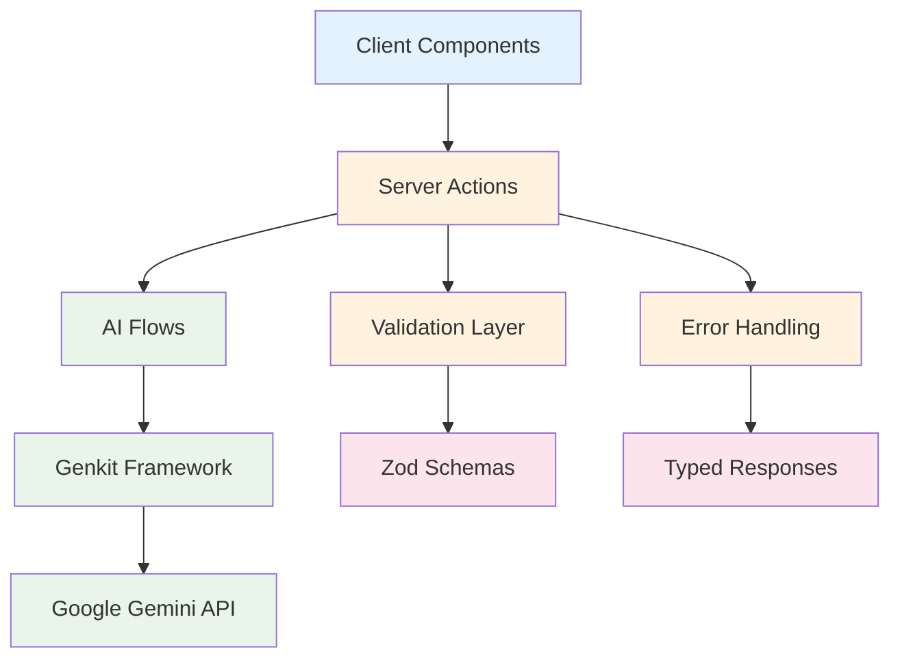

# API Documentation: Strategic Alignment OS

## 📋 Table of Contents

- [Overview](#overview)
- [Authentication](#authentication)
- [Server Actions API](#server-actions-api)
- [AI Flows Reference](#ai-flows-reference)
- [Data Schemas](#data-schemas)
- [Error Handling](#error-handling)
- [Rate Limiting](#rate-limiting)
- [SDK Examples](#sdk-examples)
- [Testing APIs](#testing-apis)

---

## 🎯 Overview

### API Architecture

Strategic Alignment OS uses **Next.js Server Actions** as its primary API layer, providing type-safe, server-side operations with built-in validation and error handling.



### Core Features
- **Type Safety**: Full TypeScript support with Zod validation
- **Server-Side Execution**: All AI operations run server-side for security
- **Structured Responses**: Consistent response formats with error handling
- **Streaming Support**: Real-time AI response streaming (where applicable)
- **Input Validation**: Comprehensive input sanitization and validation

### Base Configuration
- **Framework**: Next.js 15.3.3 Server Actions
- **Validation**: Zod schemas for all inputs/outputs
- **AI Integration**: Google Genkit with Gemini 2.0 Flash
- **Runtime**: Node.js 18+ server environment

---

## 🔐 Authentication

### Authentication Model

Strategic Alignment OS operates with a **client-side only** architecture for privacy. No user authentication is required as all data is stored locally in the browser.

```typescript
// No authentication headers required
// All operations are stateless and privacy-focused
```

### API Security
- **No API Keys Required**: Client-side operations don't expose API keys
- **Server-Side Validation**: All inputs validated on server before AI processing
- **Rate Limiting**: Built-in protection against abuse
- **Input Sanitization**: XSS and injection prevention

---

## ⚡ Server Actions API

### Core Server Actions

#### `generateAnalysis`

Generates comprehensive 7-S framework analysis using AI.

**Signature:**
```typescript
async function generateAnalysis(
  input: Generate7SAnalysisInput
): Promise<Generate7SAnalysisOutput>
```

**Input Schema:**
```typescript
interface Generate7SAnalysisInput {
  strategy: string;      // 1-2000 characters
  structure: string;     // 1-2000 characters  
  systems: string;       // 1-2000 characters
  sharedValues: string;  // 1-2000 characters
  style: string;         // 1-2000 characters
  staff: string;         // 1-2000 characters
  skills: string;        // 1-2000 characters
}
```

**Output Schema:**
```typescript
interface Generate7SAnalysisOutput {
  analysis: string;                    // Markdown-formatted analysis
  recommendations: Recommendation[];   // Prioritized action items
  chartData: ChartDataPoint[];        // Radar chart data (7 elements)
}

interface Recommendation {
  recommendation: string;              // Specific actionable recommendation
  priority: 'High' | 'Medium' | 'Low'; // Priority level
}

interface ChartDataPoint {
  name: string;                        // 7-S element name
  score: number;                       // Alignment score (0-100)
}
```

**Usage Example:**
```typescript
'use client';
import { generateAnalysis } from '@/app/actions';

export function AnalysisForm() {
  const handleSubmit = async (formData: FormData) => {
    try {
      const input = {
        strategy: formData.get('strategy') as string,
        structure: formData.get('structure') as string,
        systems: formData.get('systems') as string,
        sharedValues: formData.get('sharedValues') as string,
        style: formData.get('style') as string,
        staff: formData.get('staff') as string,
        skills: formData.get('skills') as string,
      };

      const result = await generateAnalysis(input);
      console.log('Analysis:', result.analysis);
      console.log('Recommendations:', result.recommendations);
      console.log('Chart Data:', result.chartData);
    } catch (error) {
      console.error('Analysis failed:', error);
    }
  };

  return (
    <form action={handleSubmit}>
      {/* Form fields */}
    </form>
  );
}
```

**Error Responses:**
```typescript
// Validation Error
{
  code: 'VALIDATION_ERROR',
  message: 'Strategy description is required',
  field: 'strategy'
}

// AI Service Error  
{
  code: 'AI_SERVICE_ERROR',
  message: 'AI service temporarily unavailable',
  retryAfter: 30
}

// Timeout Error
{
  code: 'TIMEOUT_ERROR', 
  message: 'Request timed out after 30 seconds'
}
```

---

#### `refineAnalysis`

Refines existing 7-S analysis based on user feedback.

**Signature:**
```typescript
async function refineAnalysis(
  input: Refine7SAnalysisInput
): Promise<Refine7SAnalysisOutput>
```

**Input Schema:**
```typescript
interface Refine7SAnalysisInput {
  analysis: string;                    // Original analysis text
  feedback: string;                    // User feedback for refinement
  recommendations: Recommendation[];   // Original recommendations
  chartData: ChartDataPoint[];        // Original chart data
}
```

**Output Schema:**
```typescript
// Same as Generate7SAnalysisOutput
type Refine7SAnalysisOutput = Generate7SAnalysisOutput;
```

**Usage Example:**
```typescript
const refineAnalysis = async (originalResult, userFeedback) => {
  try {
    const refinedResult = await refineAnalysis({
      analysis: originalResult.analysis,
      feedback: userFeedback,
      recommendations: originalResult.recommendations,
      chartData: originalResult.chartData,
    });
    
    return refinedResult;
  } catch (error) {
    throw new Error(`Refinement failed: ${error.message}`);
  }
};
```

---

#### `generateSwotAnalysis`

Generates comprehensive SWOT analysis with strategic insights.

**Signature:**
```typescript
async function generateSwotAnalysis(
  input: GenerateSwotAnalysisInput
): Promise<GenerateSwotAnalysisOutput>
```

**Input Schema:**
```typescript
interface GenerateSwotAnalysisInput {
  strengths: string;     // Internal strengths (1-2000 characters)
  weaknesses: string;    // Internal weaknesses (1-2000 characters)
  opportunities: string; // External opportunities (1-2000 characters)
  threats: string;       // External threats (1-2000 characters)
}
```

**Output Schema:**
```typescript
interface GenerateSwotAnalysisOutput {
  analysis: string;      // Comprehensive SWOT analysis in markdown
}
```

**Usage Example:**
```typescript
const performSwotAnalysis = async (swotData) => {
  const result = await generateSwotAnalysis({
    strengths: 'Strong technical team, established customer base, innovative products',
    weaknesses: 'Limited marketing reach, high customer acquisition cost',
    opportunities: 'Growing market demand, potential partnerships, international expansion',
    threats: 'Increasing competition, economic uncertainty, regulatory changes'
  });
  
  return result.analysis;
};
```

---

#### `getTemplate`

Retrieves pre-configured industry templates for rapid analysis setup.

**Signature:**
```typescript
async function getTemplate(
  input: PromptFromTemplateInput
): Promise<PromptFromTemplateOutput>
```

**Input Schema:**
```typescript
interface PromptFromTemplateInput {
  templateName: string;  // Available: 'tech-startup', 'traditional-manufacturing', 'non-profit'
}
```

**Output Schema:**
```typescript
interface PromptFromTemplateOutput {
  strategy: string;
  structure: string;
  systems: string;
  sharedValues: string;
  style: string;
  staff: string;
  skills: string;
}
```

**Available Templates:**
- `tech-startup`: Technology companies and startups
- `traditional-manufacturing`: Manufacturing and industrial companies
- `non-profit`: Non-profit organizations and NGOs

**Usage Example:**
```typescript
const loadTemplate = async (templateType) => {
  try {
    const template = await getTemplate({ templateName: templateType });
    
    // Use template data to populate form
    setFormData(template);
  } catch (error) {
    console.error('Template loading failed:', error);
  }
};

// Load tech startup template
await loadTemplate('tech-startup');
```

---

## 🤖 AI Flows Reference

### Genkit Flow Architecture

All AI operations use Google Genkit flows for structured, type-safe AI interactions.

```typescript
// Flow definition pattern
const flowDefinition = ai.defineFlow({
  name: 'flowName',
  inputSchema: InputSchema,
  outputSchema: OutputSchema,
}, async (input) => {
  const { output } = await promptDefinition(input);
  return output;
});
```

### Core AI Flows

#### `generate7SAnalysisFlow`

**Purpose**: Processes 7-S framework data and generates comprehensive analysis

**Configuration:**
```typescript
const generate7SAnalysisFlow = ai.defineFlow({
  name: 'generate7SAnalysisFlow',
  inputSchema: Generate7SAnalysisInputSchema,
  outputSchema: Generate7SAnalysisOutputSchema,
}, async (input) => {
  const { output } = await generate7SAnalysisPrompt(input);
  return output;
});
```

**Prompt Engineering:**
- **System Context**: Management consultant specializing in organizational transformation
- **Task Definition**: Multi-part analysis with specific deliverables
- **Output Structure**: JSON with analysis, recommendations, and chart data
- **Quality Criteria**: Actionable insights with priority classification

#### `generateSwotAnalysisFlow` 

**Purpose**: Processes SWOT data and generates strategic analysis

**Configuration:**
```typescript
const generateSwotAnalysisFlow = ai.defineFlow({
  name: 'generateSwotAnalysisFlow', 
  inputSchema: GenerateSwotAnalysisInputSchema,
  outputSchema: GenerateSwotAnalysisOutputSchema,
}, async (input) => {
  const { output } = await generateSwotAnalysisPrompt(input);
  return output;
});
```

**Analysis Structure:**
1. **Executive Summary**: Strategic position overview
2. **Detailed SWOT Analysis**: In-depth examination of each quadrant
3. **Strategic Implications**: Cross-quadrant analysis (SO, WO, ST, WT)
4. **Strategic Recommendations**: High-level actionable insights

#### `refine7SAnalysisFlow`

**Purpose**: Refines existing analysis based on user feedback

**Refinement Process:**
- Analyzes original output and user feedback
- Re-evaluates all analysis components
- Updates recommendations based on new context
- Adjusts alignment scores if necessary

#### `promptFromTemplateFlow`

**Purpose**: Retrieves industry-specific template data

**Template Data Sources:**
- Static template definitions for rapid prototyping
- Industry-specific examples and best practices
- Customizable starting points for analysis

---

## 📊 Data Schemas

### Validation Schemas (Zod)

#### 7-S Analysis Schemas

```typescript
import { z } from 'zod';

// Input validation
export const Generate7SAnalysisInputSchema = z.object({
  strategy: z.string()
    .min(1, 'Strategy description is required')
    .max(2000, 'Strategy description too long'),
  structure: z.string()
    .min(1, 'Structure description is required')
    .max(2000, 'Structure description too long'),
  systems: z.string()
    .min(1, 'Systems description is required')
    .max(2000, 'Systems description too long'),
  sharedValues: z.string()
    .min(1, 'Shared values description is required')
    .max(2000, 'Shared values description too long'),
  style: z.string()
    .min(1, 'Style description is required')
    .max(2000, 'Style description too long'),
  staff: z.string()
    .min(1, 'Staff description is required')
    .max(2000, 'Staff description too long'),
  skills: z.string()
    .min(1, 'Skills description is required')
    .max(2000, 'Skills description too long'),
});

// Recommendation validation
export const RecommendationSchema = z.object({
  recommendation: z.string()
    .min(10, 'Recommendation too short')
    .max(500, 'Recommendation too long'),
  priority: z.enum(['High', 'Medium', 'Low']),
});

// Chart data validation
export const ChartDataPointSchema = z.object({
  name: z.string(),
  score: z.number()
    .min(0, 'Score cannot be negative')
    .max(100, 'Score cannot exceed 100'),
});

// Output validation
export const Generate7SAnalysisOutputSchema = z.object({
  analysis: z.string()
    .min(100, 'Analysis too short'),
  recommendations: z.array(RecommendationSchema)
    .min(1, 'At least one recommendation required'),
  chartData: z.array(ChartDataPointSchema)
    .length(7, 'Must have exactly 7 chart data points'),
});
```

#### SWOT Analysis Schemas

```typescript
export const GenerateSwotAnalysisInputSchema = z.object({
  strengths: z.string()
    .min(1, 'Strengths description is required')
    .max(2000, 'Strengths description too long'),
  weaknesses: z.string()
    .min(1, 'Weaknesses description is required')
    .max(2000, 'Weaknesses description too long'),
  opportunities: z.string()
    .min(1, 'Opportunities description is required')
    .max(2000, 'Opportunities description too long'),
  threats: z.string()
    .min(1, 'Threats description is required')
    .max(2000, 'Threats description too long'),
});

export const GenerateSwotAnalysisOutputSchema = z.object({
  analysis: z.string()
    .min(200, 'SWOT analysis too short'),
});
```

#### Template Schemas

```typescript
export const PromptFromTemplateInputSchema = z.object({
  templateName: z.enum([
    'tech-startup',
    'traditional-manufacturing', 
    'non-profit'
  ]),
});

export const PromptFromTemplateOutputSchema = z.object({
  strategy: z.string(),
  structure: z.string(),
  systems: z.string(),
  sharedValues: z.string(),
  style: z.string(),
  staff: z.string(),
  skills: z.string(),
});
```

### TypeScript Type Definitions

```typescript
// Exported types for client use
export type Generate7SAnalysisInput = z.infer<typeof Generate7SAnalysisInputSchema>;
export type Generate7SAnalysisOutput = z.infer<typeof Generate7SAnalysisOutputSchema>;
export type GenerateSwotAnalysisInput = z.infer<typeof GenerateSwotAnalysisInputSchema>;
export type GenerateSwotAnalysisOutput = z.infer<typeof GenerateSwotAnalysisOutputSchema>;
export type PromptFromTemplateInput = z.infer<typeof PromptFromTemplateInputSchema>;
export type PromptFromTemplateOutput = z.infer<typeof PromptFromTemplateOutputSchema>;
export type Recommendation = z.infer<typeof RecommendationSchema>;
export type ChartDataPoint = z.infer<typeof ChartDataPointSchema>;

// Additional utility types
export interface APIError {
  code: string;
  message: string;
  field?: string;
  retryAfter?: number;
}

export interface APIResponse<T> {
  success: boolean;
  data?: T;
  error?: APIError;
  timestamp: string;
}
```

---

## ❌ Error Handling

### Error Types

#### Validation Errors
```typescript
interface ValidationError extends APIError {
  code: 'VALIDATION_ERROR';
  field: string;           // Field that failed validation
  message: string;         // Human-readable error message
}

// Example
{
  code: 'VALIDATION_ERROR',
  field: 'strategy', 
  message: 'Strategy description must be between 1 and 2000 characters'
}
```

#### AI Service Errors
```typescript
interface AIServiceError extends APIError {
  code: 'AI_SERVICE_ERROR' | 'AI_TIMEOUT' | 'AI_RATE_LIMIT';
  message: string;
  retryAfter?: number;     // Seconds to wait before retry
}

// Examples
{
  code: 'AI_SERVICE_ERROR',
  message: 'AI service temporarily unavailable'
}

{
  code: 'AI_RATE_LIMIT',
  message: 'Rate limit exceeded',
  retryAfter: 60
}
```

#### Network Errors
```typescript
interface NetworkError extends APIError {
  code: 'NETWORK_ERROR' | 'TIMEOUT_ERROR';
  message: string;
  statusCode?: number;
}
```

### Error Handling Patterns

#### Client-Side Error Handling
```typescript
'use client';
import { useState } from 'react';
import { generateAnalysis } from '@/app/actions';

export function AnalysisComponent() {
  const [error, setError] = useState<string | null>(null);
  const [isLoading, setIsLoading] = useState(false);

  const handleAnalysis = async (formData: FormData) => {
    setIsLoading(true);
    setError(null);

    try {
      const input = extractInputFromForm(formData);
      const result = await generateAnalysis(input);
      // Handle successful result
      handleSuccess(result);
    } catch (err) {
      // Handle different error types
      if (err instanceof Error) {
        setError(err.message);
      } else {
        setError('An unexpected error occurred');
      }
    } finally {
      setIsLoading(false);
    }
  };

  return (
    <div>
      {error && (
        <div className="error-message" role="alert">
          {error}
        </div>
      )}
      {/* Form component */}
    </div>
  );
}
```

#### Server-Side Error Handling
```typescript
// app/actions.ts
import { ZodError } from 'zod';

export async function generateAnalysis(input: unknown) {
  try {
    // Validate input
    const validatedInput = Generate7SAnalysisInputSchema.parse(input);
    
    // Process with AI
    const result = await generate7SAnalysis(validatedInput);
    
    return result;
  } catch (error) {
    if (error instanceof ZodError) {
      // Handle validation errors
      const firstError = error.errors[0];
      throw new Error(`Validation failed: ${firstError.message}`);
    }
    
    if (error instanceof Error && error.message.includes('timeout')) {
      throw new Error('Request timed out. Please try again.');
    }
    
    // Generic error handling
    console.error('Analysis generation failed:', error);
    throw new Error('Analysis generation failed. Please try again.');
  }
}
```

#### Retry Logic
```typescript
async function withRetry<T>(
  operation: () => Promise<T>,
  maxRetries: number = 3,
  delayMs: number = 1000
): Promise<T> {
  let lastError: Error;
  
  for (let attempt = 1; attempt <= maxRetries; attempt++) {
    try {
      return await operation();
    } catch (error) {
      lastError = error as Error;
      
      // Don't retry validation errors
      if (error instanceof ZodError) {
        throw error;
      }
      
      if (attempt < maxRetries) {
        await new Promise(resolve => setTimeout(resolve, delayMs * attempt));
      }
    }
  }
  
  throw lastError!;
}

// Usage
const result = await withRetry(() => generateAnalysis(input));
```

---

## 🚦 Rate Limiting

### Rate Limit Configuration

#### Server-Side Rate Limiting
```typescript
// lib/rate-limit.ts
import { headers } from 'next/headers';

interface RateLimitConfig {
  windowMs: number;      // Time window in milliseconds
  maxRequests: number;   // Maximum requests per window
  message: string;       // Error message when limit exceeded
}

const rateLimitConfig: RateLimitConfig = {
  windowMs: 15 * 60 * 1000,  // 15 minutes
  maxRequests: 10,           // 10 requests per 15 minutes
  message: 'Too many analysis requests. Please wait before trying again.',
};

const requestCounts = new Map<string, { count: number; resetTime: number }>();

export function checkRateLimit(identifier: string): boolean {
  const now = Date.now();
  const windowStart = now - rateLimitConfig.windowMs;
  
  // Clean up old entries
  for (const [key, value] of requestCounts.entries()) {
    if (value.resetTime < now) {
      requestCounts.delete(key);
    }
  }
  
  const current = requestCounts.get(identifier) || {
    count: 0,
    resetTime: now + rateLimitConfig.windowMs
  };
  
  if (current.count >= rateLimitConfig.maxRequests) {
    return false; // Rate limit exceeded
  }
  
  current.count++;
  requestCounts.set(identifier, current);
  return true; // Request allowed
}

export function getRateLimitHeaders(identifier: string) {
  const current = requestCounts.get(identifier);
  const remaining = current 
    ? Math.max(0, rateLimitConfig.maxRequests - current.count)
    : rateLimitConfig.maxRequests;
  
  return {
    'X-RateLimit-Limit': rateLimitConfig.maxRequests.toString(),
    'X-RateLimit-Remaining': remaining.toString(),
    'X-RateLimit-Reset': current?.resetTime.toString() || '0',
  };
}
```

#### Rate Limit Implementation
```typescript
// app/actions.ts
import { checkRateLimit, getRateLimitHeaders } from '@/lib/rate-limit';
import { headers } from 'next/headers';

export async function generateAnalysis(input: Generate7SAnalysisInput) {
  // Get client identifier (IP address or session)
  const headersList = headers();
  const forwardedFor = headersList.get('x-forwarded-for');
  const clientIP = forwardedFor?.split(',')[0] || 'unknown';
  
  // Check rate limit
  if (!checkRateLimit(clientIP)) {
    const rateLimitHeaders = getRateLimitHeaders(clientIP);
    throw new Error(`Rate limit exceeded. Try again in ${Math.ceil(
      (parseInt(rateLimitHeaders['X-RateLimit-Reset']) - Date.now()) / 1000
    )} seconds.`);
  }
  
  // Proceed with analysis...
  return await generate7SAnalysis(input);
}
```

### Client-Side Rate Limiting

```typescript
// hooks/useRateLimit.ts
import { useState, useCallback } from 'react';

interface RateLimitState {
  isLimited: boolean;
  remainingTime: number;
  requestCount: number;
}

export function useRateLimit(maxRequests: number = 5, windowMs: number = 15 * 60 * 1000) {
  const [rateLimitState, setRateLimitState] = useState<RateLimitState>({
    isLimited: false,
    remainingTime: 0,
    requestCount: 0,
  });

  const checkAndTrackRequest = useCallback(() => {
    const now = Date.now();
    const storageKey = 'rate-limit-data';
    
    try {
      const stored = localStorage.getItem(storageKey);
      const data = stored ? JSON.parse(stored) : { requests: [], windowStart: now };
      
      // Clean old requests
      data.requests = data.requests.filter((time: number) => now - time < windowMs);
      
      if (data.requests.length >= maxRequests) {
        const oldestRequest = Math.min(...data.requests);
        const resetTime = oldestRequest + windowMs;
        
        setRateLimitState({
          isLimited: true,
          remainingTime: Math.ceil((resetTime - now) / 1000),
          requestCount: data.requests.length,
        });
        
        return false; // Request blocked
      }
      
      // Add current request
      data.requests.push(now);
      localStorage.setItem(storageKey, JSON.stringify(data));
      
      setRateLimitState({
        isLimited: false,
        remainingTime: 0,
        requestCount: data.requests.length,
      });
      
      return true; // Request allowed
    } catch (error) {
      console.error('Rate limit check failed:', error);
      return true; // Allow on error
    }
  }, [maxRequests, windowMs]);

  return {
    ...rateLimitState,
    checkRequest: checkAndTrackRequest,
  };
}
```

---

## 🛠️ SDK Examples

### React Hook for API Integration

```typescript
// hooks/useAnalysis.ts
import { useState, useCallback } from 'react';
import { generateAnalysis, Generate7SAnalysisInput, Generate7SAnalysisOutput } from '@/app/actions';

interface UseAnalysisResult {
  result: Generate7SAnalysisOutput | null;
  isLoading: boolean;
  error: string | null;
  generateAnalysis: (input: Generate7SAnalysisInput) => Promise<void>;
  clearError: () => void;
  clearResult: () => void;
}

export function useAnalysis(): UseAnalysisResult {
  const [result, setResult] = useState<Generate7SAnalysisOutput | null>(null);
  const [isLoading, setIsLoading] = useState(false);
  const [error, setError] = useState<string | null>(null);

  const handleGenerateAnalysis = useCallback(async (input: Generate7SAnalysisInput) => {
    setIsLoading(true);
    setError(null);
    setResult(null);

    try {
      const analysisResult = await generateAnalysis(input);
      setResult(analysisResult);
    } catch (err) {
      setError(err instanceof Error ? err.message : 'Analysis failed');
    } finally {
      setIsLoading(false);
    }
  }, []);

  const clearError = useCallback(() => setError(null), []);
  const clearResult = useCallback(() => setResult(null), []);

  return {
    result,
    isLoading,
    error,
    generateAnalysis: handleGenerateAnalysis,
    clearError,
    clearResult,
  };
}
```

### Complete Component Example

```typescript
// components/AnalysisGenerator.tsx
'use client';
import { useState } from 'react';
import { useAnalysis } from '@/hooks/useAnalysis';
import { useRateLimit } from '@/hooks/useRateLimit';

export function AnalysisGenerator() {
  const { result, isLoading, error, generateAnalysis, clearError } = useAnalysis();
  const { isLimited, remainingTime, checkRequest } = useRateLimit();
  const [formData, setFormData] = useState({
    strategy: '',
    structure: '',
    systems: '',
    sharedValues: '',
    style: '',
    staff: '',
    skills: '',
  });

  const handleSubmit = async (e: React.FormEvent) => {
    e.preventDefault();
    clearError();

    // Check rate limit
    if (!checkRequest()) {
      return; // Rate limited
    }

    await generateAnalysis(formData);
  };

  const handleInputChange = (field: string, value: string) => {
    setFormData(prev => ({ ...prev, [field]: value }));
  };

  return (
    <div className="analysis-generator">
      <form onSubmit={handleSubmit}>
        {/* Form fields */}
        {Object.entries(formData).map(([field, value]) => (
          <div key={field} className="form-field">
            <label htmlFor={field}>
              {field.charAt(0).toUpperCase() + field.slice(1)}
            </label>
            <textarea
              id={field}
              value={value}
              onChange={(e) => handleInputChange(field, e.target.value)}
              placeholder={`Describe your organization's ${field}...`}
              disabled={isLoading || isLimited}
              required
            />
          </div>
        ))}

        <button 
          type="submit" 
          disabled={isLoading || isLimited}
          className="submit-button"
        >
          {isLoading ? 'Generating Analysis...' : 'Generate Analysis'}
        </button>
      </form>

      {/* Rate limit warning */}
      {isLimited && (
        <div className="rate-limit-warning">
          Rate limit exceeded. Try again in {remainingTime} seconds.
        </div>
      )}

      {/* Error display */}
      {error && (
        <div className="error-message" role="alert">
          {error}
        </div>
      )}

      {/* Results display */}
      {result && (
        <div className="analysis-results">
          <div className="analysis-content">
            <h3>Analysis</h3>
            <div dangerouslySetInnerHTML={{ __html: result.analysis }} />
          </div>

          <div className="recommendations">
            <h3>Recommendations</h3>
            {result.recommendations.map((rec, index) => (
              <div key={index} className={`recommendation priority-${rec.priority.toLowerCase()}`}>
                <span className="priority-badge">{rec.priority}</span>
                <span className="recommendation-text">{rec.recommendation}</span>
              </div>
            ))}
          </div>

          <div className="chart-data">
            <h3>Alignment Scores</h3>
            {result.chartData.map((point) => (
              <div key={point.name} className="score-item">
                <span className="element-name">{point.name}</span>
                <span className="score">{point.score}/100</span>
              </div>
            ))}
          </div>
        </div>
      )}
    </div>
  );
}
```

---

## 🧪 Testing APIs

### Unit Testing Server Actions

```typescript
// __tests__/actions.test.ts
import { generateAnalysis } from '@/app/actions';
import { Generate7SAnalysisInputSchema } from '@/ai/flows/generate-7s-analysis';

// Mock the AI flow
jest.mock('@/ai/flows/generate-7s-analysis', () => ({
  generate7SAnalysis: jest.fn(),
}));

describe('generateAnalysis', () => {
  const validInput = {
    strategy: 'Innovation-driven growth strategy',
    structure: 'Flat, cross-functional teams',
    systems: 'Agile development with CI/CD',
    sharedValues: 'Customer obsession, innovation, quality',
    style: 'Collaborative and data-driven leadership',
    staff: 'Skilled engineers and product managers',
    skills: 'Software development, UX design, data analysis',
  };

  beforeEach(() => {
    jest.clearAllMocks();
  });

  it('should generate analysis for valid input', async () => {
    const mockResponse = {
      analysis: '# Analysis Results\n\nYour organization shows...',
      recommendations: [
        { recommendation: 'Improve team communication', priority: 'High' as const },
      ],
      chartData: [
        { name: 'Strategy', score: 85 },
        { name: 'Structure', score: 78 },
        { name: 'Systems', score: 92 },
        { name: 'Shared Values', score: 88 },
        { name: 'Style', score: 75 },
        { name: 'Staff', score: 82 },
        { name: 'Skills', score: 79 },
      ],
    };

    const mockGenerate7SAnalysis = require('@/ai/flows/generate-7s-analysis').generate7SAnalysis;
    mockGenerate7SAnalysis.mockResolvedValue(mockResponse);

    const result = await generateAnalysis(validInput);

    expect(result).toEqual(mockResponse);
    expect(mockGenerate7SAnalysis).toHaveBeenCalledWith(validInput);
  });

  it('should throw validation error for invalid input', async () => {
    const invalidInput = {
      ...validInput,
      strategy: '', // Empty strategy should fail validation
    };

    await expect(generateAnalysis(invalidInput)).rejects.toThrow('Validation failed');
  });

  it('should handle AI service errors', async () => {
    const mockGenerate7SAnalysis = require('@/ai/flows/generate-7s-analysis').generate7SAnalysis;
    mockGenerate7SAnalysis.mockRejectedValue(new Error('AI service unavailable'));

    await expect(generateAnalysis(validInput)).rejects.toThrow('Analysis generation failed');
  });
});
```

### Integration Testing

```typescript
// __tests__/integration/analysis-flow.test.ts
import { render, screen, fireEvent, waitFor } from '@testing-library/react';
import userEvent from '@testing-library/user-event';
import { AnalysisGenerator } from '@/components/AnalysisGenerator';

// Mock the server actions
jest.mock('@/app/actions', () => ({
  generateAnalysis: jest.fn(),
}));

describe('Analysis Flow Integration', () => {
  const user = userEvent.setup();
  
  beforeEach(() => {
    jest.clearAllMocks();
  });

  it('should complete full analysis workflow', async () => {
    const mockActions = require('@/app/actions');
    mockActions.generateAnalysis.mockResolvedValue({
      analysis: '# Strategic Analysis\n\nResults...',
      recommendations: [
        { recommendation: 'Improve processes', priority: 'High' },
      ],
      chartData: [
        { name: 'Strategy', score: 85 },
        // ... other elements
      ],
    });

    render(<AnalysisGenerator />);

    // Fill out form
    await user.type(screen.getByLabelText(/strategy/i), 'Growth strategy');
    await user.type(screen.getByLabelText(/structure/i), 'Flat teams');
    // ... fill other fields

    // Submit form
    await user.click(screen.getByText('Generate Analysis'));

    // Wait for results
    await waitFor(() => {
      expect(screen.getByText('Strategic Analysis')).toBeInTheDocument();
    });

    // Verify recommendations
    expect(screen.getByText('Improve processes')).toBeInTheDocument();
    expect(screen.getByText('High')).toBeInTheDocument();
  });

  it('should handle API errors gracefully', async () => {
    const mockActions = require('@/app/actions');
    mockActions.generateAnalysis.mockRejectedValue(new Error('Service unavailable'));

    render(<AnalysisGenerator />);

    // Fill form and submit
    await user.type(screen.getByLabelText(/strategy/i), 'Test strategy');
    await user.click(screen.getByText('Generate Analysis'));

    // Verify error display
    await waitFor(() => {
      expect(screen.getByRole('alert')).toHaveTextContent('Service unavailable');
    });
  });
});
```

### API Load Testing

```typescript
// scripts/load-test.ts
import { generateAnalysis } from '@/app/actions';

const testInput = {
  strategy: 'Load test strategy description',
  structure: 'Load test structure description',
  systems: 'Load test systems description',
  sharedValues: 'Load test shared values description',
  style: 'Load test style description',
  staff: 'Load test staff description',
  skills: 'Load test skills description',
};

async function runLoadTest(concurrentRequests: number = 5, iterations: number = 10) {
  console.log(`Starting load test: ${concurrentRequests} concurrent requests, ${iterations} iterations`);
  
  const results = {
    successful: 0,
    failed: 0,
    totalTime: 0,
    times: [] as number[],
  };

  for (let i = 0; i < iterations; i++) {
    const startTime = Date.now();
    
    const requests = Array(concurrentRequests).fill(null).map(async () => {
      try {
        await generateAnalysis(testInput);
        return { success: true };
      } catch (error) {
        return { success: false, error };
      }
    });

    const responses = await Promise.all(requests);
    const iterationTime = Date.now() - startTime;
    
    results.times.push(iterationTime);
    results.totalTime += iterationTime;
    
    responses.forEach(response => {
      if (response.success) {
        results.successful++;
      } else {
        results.failed++;
        console.error('Request failed:', response.error);
      }
    });

    console.log(`Iteration ${i + 1}/${iterations}: ${iterationTime}ms`);
  }

  console.log('\nLoad Test Results:');
  console.log(`Total requests: ${results.successful + results.failed}`);
  console.log(`Successful: ${results.successful}`);
  console.log(`Failed: ${results.failed}`);
  console.log(`Average time: ${Math.round(results.totalTime / iterations)}ms`);
  console.log(`Min time: ${Math.min(...results.times)}ms`);
  console.log(`Max time: ${Math.max(...results.times)}ms`);
}

// Run load test
runLoadTest(3, 5).catch(console.error);
```

---

## 📚 Additional Resources

### Official Documentation
- [Next.js Server Actions](https://nextjs.org/docs/app/api-reference/functions/server-actions)
- [Google Genkit](https://firebase.google.com/docs/genkit)
- [Zod Validation](https://zod.dev/)
- [TypeScript Handbook](https://www.typescriptlang.org/docs/)

### Best Practices
- [API Design Guidelines](https://restfulapi.net/)
- [Error Handling Patterns](https://blog.logrocket.com/error-handling-node-js/)
- [Rate Limiting Strategies](https://blog.logrocket.com/rate-limiting-node-js/)
- [Testing APIs](https://martinfowler.com/articles/practical-test-pyramid.html)

---

*This API documentation provides comprehensive reference material for integrating with and extending the Strategic Alignment OS platform. Regular updates ensure accuracy with evolving platform capabilities.* 