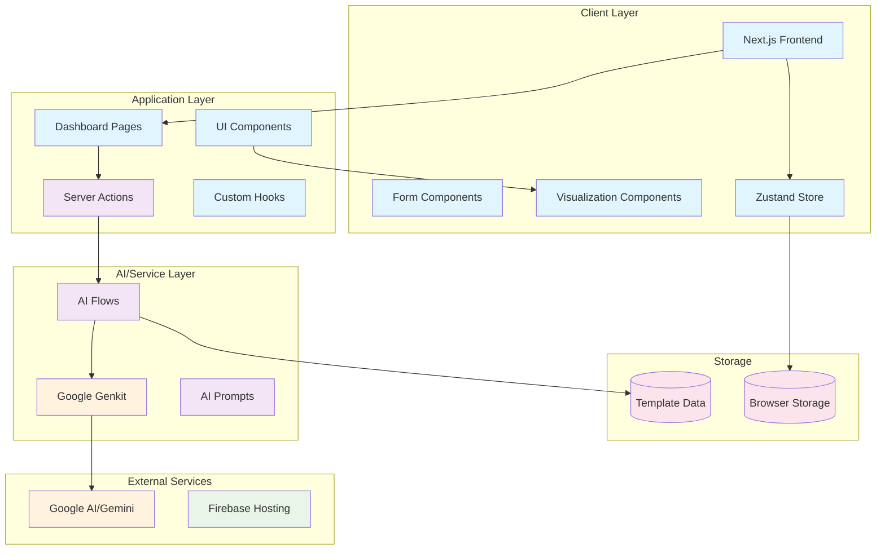
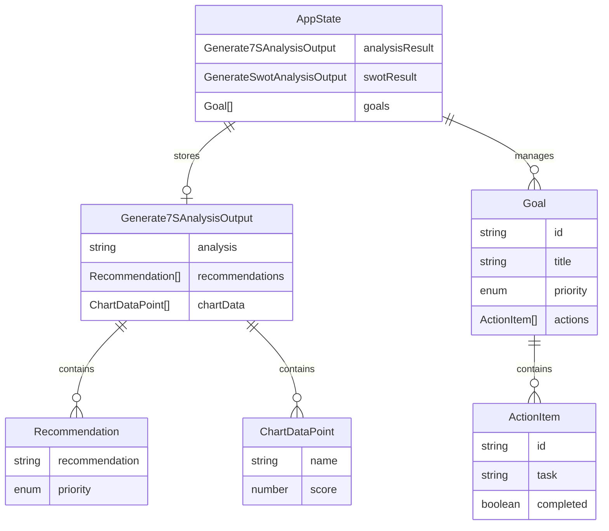
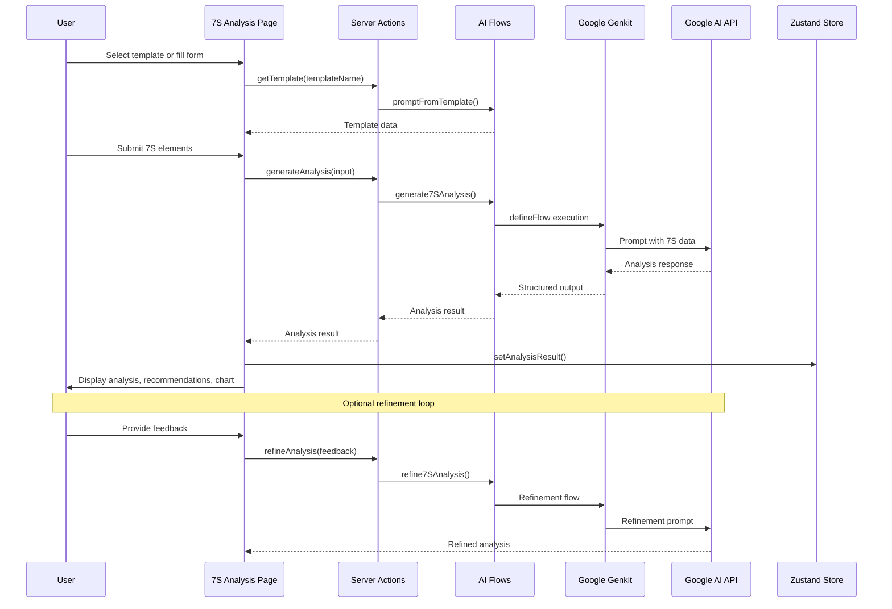
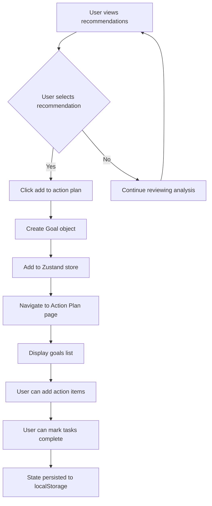
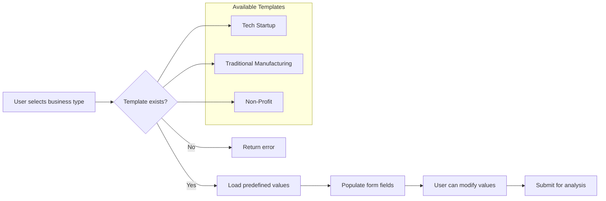
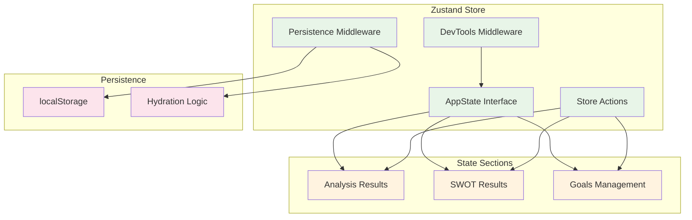
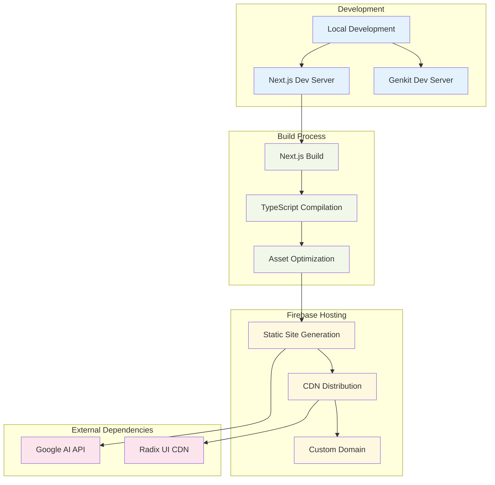

# 7S Analyzer - Architectural Document

## Table of Contents
- [High-Level Application Overview](#high-level-application-overview)
- [System Architecture](#system-architecture)
- [Technology Stack](#technology-stack)
- [Component Architecture](#component-architecture)
- [Data Models](#data-models)
- [Core Workflows](#core-workflows)
- [API Design](#api-design)
- [External Integrations](#external-integrations)
- [State Management](#state-management)
- [Deployment Architecture](#deployment-architecture)

## High-Level Application Overview

### Purpose
The **7S Analyzer** is a strategic organizational analysis platform that leverages AI to help businesses assess and improve their internal alignment using established management frameworks. The application provides intelligent insights through:

- **McKinsey 7-S Framework Analysis**: Evaluates organizational effectiveness across Strategy, Structure, Systems, Shared Values, Style, Staff, and Skills
- **SWOT Analysis**: Assesses Strengths, Weaknesses, Opportunities, and Threats
- **Action Planning**: Converts insights into actionable goals and tasks
- **Template-Based Input**: Pre-configured industry templates for rapid analysis

### Key Value Propositions
1. **AI-Powered Insights**: Uses Google Gemini 2.0 Flash for intelligent analysis generation
2. **Interactive Visualizations**: Radar charts showing organizational alignment scores
3. **Actionable Recommendations**: Prioritized suggestions with goal tracking
4. **Industry Templates**: Pre-built frameworks for common business types
5. **Iterative Refinement**: AI-powered analysis improvement based on user feedback

## System Architecture



## Technology Stack

### Frontend
- **Framework**: Next.js 15.3.3 (React 18.3.1)
- **Styling**: Tailwind CSS 3.4.1 with `tailwindcss-animate`
- **UI Components**: Radix UI primitives + shadcn/ui
- **Icons**: Lucide React
- **Charts**: Recharts
- **Forms**: React Hook Form + Zod validation
- **State Management**: Zustand with persistence

### Backend/AI
- **AI Framework**: Google Genkit 1.14.1
- **AI Model**: Google Gemini 2.0 Flash
- **Runtime**: Node.js with TypeScript 5
- **Validation**: Zod schemas

### Development Tools
- **Build Tool**: Next.js with Turbopack
- **Language**: TypeScript
- **Linting**: ESLint
- **Package Manager**: npm

### Deployment
- **Hosting**: Firebase App Hosting
- **Configuration**: `apphosting.yaml`

## Component Architecture

```mermaid
graph TD
    subgraph "App Router Structure"
        Root[app/layout.tsx]
        Home[app/page.tsx]
        Dashboard[app/(dashboard)/]
    end
    
    subgraph "Dashboard Pages"
        DashHome[dashboard/page.tsx]
        SevenS[seven-s-analysis/page.tsx]
        SWOT[swot-analysis/page.tsx]
        ActionPlan[action-plan/page.tsx]
        DashLayout[layout.tsx]
    end
    
    subgraph "Shared Components"
        Header[layout/header.tsx]
        Sidebar[layout/sidebar.tsx]
        UIComponents[ui/* components]
        Markdown[markdown.tsx]
    end
    
    subgraph "State & Utilities"
        Store[store.ts]
        StateProvider[state-provider.tsx]
        Types[types.ts]
        Utils[utils.ts]
    end
    
    Root --> Home
    Home --> DashHome
    Dashboard --> DashLayout
    DashLayout --> Header
    DashLayout --> Sidebar
    DashLayout --> DashHome
    DashLayout --> SevenS
    DashLayout --> SWOT
    DashLayout --> ActionPlan
    
    SevenS --> UIComponents
    SevenS --> Store
    SevenS --> Markdown
    
    classDef page fill:#e3f2fd
    classDef layout fill:#f1f8e9
    classDef component fill:#fff8e1
    classDef state fill:#fce4ec
    
    class Root,Home,DashHome,SevenS,SWOT,ActionPlan page
    class Dashboard,DashLayout,Header,Sidebar layout
    class UIComponents,Markdown component
    class Store,StateProvider,Types,Utils state
```

## Data Models

### Core Data Types

```typescript
// 7S Framework Elements
export type SevenSElements = {
  strategy: string;
  structure: string;
  systems: string;
  sharedValues: string;
  style: string;
  staff: string;
  skills: string;
};

// SWOT Analysis Elements
export type SwotElements = {
  strengths: string;
  weaknesses: string;
  opportunities: string;
  threats: string;
};

// Analysis Output
interface Generate7SAnalysisOutput {
  analysis: string;                    // Markdown-formatted analysis
  recommendations: Recommendation[];   // Actionable recommendations
  chartData: ChartDataPoint[];        // Radar chart data
}

interface Recommendation {
  recommendation: string;
  priority: 'High' | 'Medium' | 'Low';
}

interface ChartDataPoint {
  name: string;                       // 7S element name
  score: number;                      // Alignment score (0-100)
}

// Goal Management
interface Goal {
  id: string;
  title: string;
  priority: 'High' | 'Medium' | 'Low';
  actions: ActionItem[];
}

interface ActionItem {
  id: string;
  task: string;
  completed: boolean;
}
```

### State Schema



## Core Workflows

### 1. 7S Analysis Generation Workflow



### 2. Action Plan Management Workflow



### 3. Template System Workflow



## API Design

### Server Actions Structure

```typescript
// src/app/actions.ts
export async function generateAnalysis(
  input: Generate7SAnalysisInput
): Promise<Generate7SAnalysisOutput>

export async function refineAnalysis(
  input: Refine7SAnalysisInput
): Promise<Refine7SAnalysisOutput>

export async function getTemplate(
  input: PromptFromTemplateInput
): Promise<PromptFromTemplateOutput>

export async function generateSwotAnalysis(
  input: GenerateSwotAnalysisInput
): Promise<GenerateSwotAnalysisOutput>
```

### AI Flow Architecture

```mermaid
graph LR
    subgraph "AI Flows Layer"
        A[generate-7s-analysis.ts]
        B[generate-swot-analysis.ts]
        C[refine-7s-analysis.ts]
        D[prompt-from-template.ts]
    end
    
    subgraph "Genkit Integration"
        E[ai.definePrompt()]
        F[ai.defineFlow()]
        G[Zod Schemas]
    end
    
    subgraph "Google AI"
        H[Gemini 2.0 Flash]
    end
    
    A --> E
    B --> E
    C --> E
    D --> F
    
    E --> F
    F --> G
    G --> H
    
    classDef flow fill:#e8f5e8
    classDef genkit fill:#fff3e0
    classDef ai fill:#e1f5fe
    
    class A,B,C,D flow
    class E,F,G genkit
    class H ai
```

## External Integrations

### Google AI Integration
- **Service**: Google Gemini 2.0 Flash
- **Library**: `@genkit-ai/googleai`
- **Purpose**: Generate strategic analysis and recommendations
- **Authentication**: API key-based (environment variables)

### Firebase Integration
- **Service**: Firebase App Hosting
- **Configuration**: `apphosting.yaml`
- **Purpose**: Static site hosting and deployment
- **Features**: Automatic builds, custom domains

## State Management

### Zustand Store Architecture



### State Persistence Strategy
- **Storage**: Browser localStorage
- **Key**: `strategic-os-storage`
- **Hydration**: Custom hook to handle Next.js SSR/CSR mismatch
- **Data**: Analysis results, SWOT results, goals and action items

## Deployment Architecture



### Deployment Configuration

```yaml
# apphosting.yaml
runConfig:
  cpu: 1
  memoryMiB: 512
  minInstances: 0
  maxInstances: 10
env:
  - variable: NODE_ENV
    value: production
```

### Build Scripts
- `npm run dev`: Development with Turbopack
- `npm run build`: Production build
- `npm run start`: Production server
- `npm run genkit:dev`: AI development environment

## Security Considerations

### API Security
- Environment variables for sensitive data
- Server-side AI operations only
- No client-side API key exposure

### Data Privacy
- Client-side state management only
- No server-side data persistence
- User data remains in browser storage

### Input Validation
- Zod schemas for all data structures
- Form validation on client and server
- AI input sanitization

## Performance Optimizations

### Frontend
- Next.js App Router for optimal loading
- Turbopack for fast development builds
- Component lazy loading
- Optimized bundle splitting

### AI Operations
- Streaming responses where applicable
- Caching of template data
- Efficient prompt engineering
- Structured output schemas

### State Management
- Selective hydration to prevent mismatches
- Optimistic updates for UI responsiveness
- Minimal re-renders with Zustand

## Future Considerations

### Scalability
- Database integration for multi-user support
- User authentication system
- Analysis history and versioning
- Team collaboration features

### Feature Enhancements
- Additional analysis frameworks
- Custom template creation
- Export functionality (PDF, Excel)
- Integration with business tools

### Technical Improvements
- Real-time collaboration
- Offline capability
- Mobile app development
- Advanced visualization options 