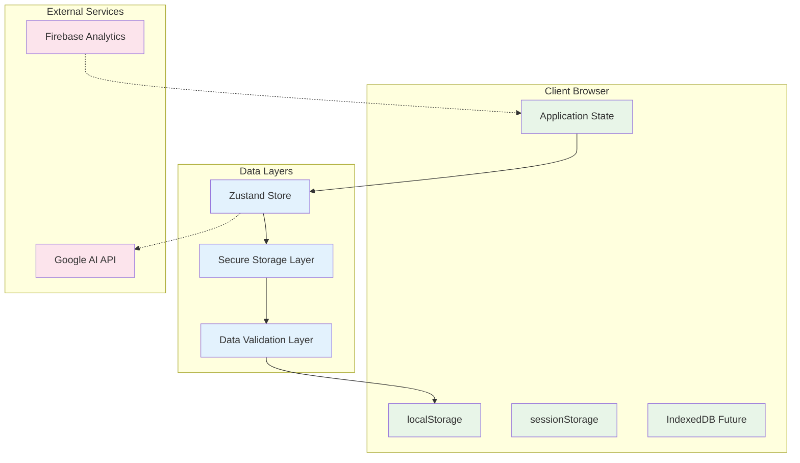
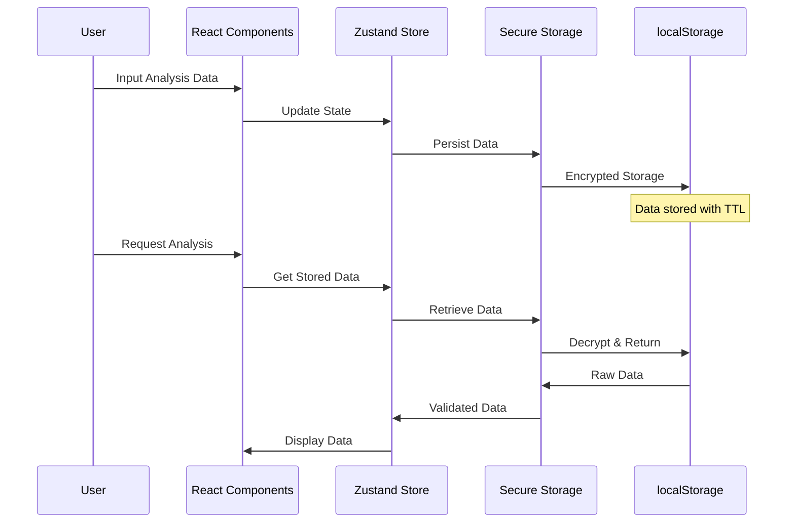
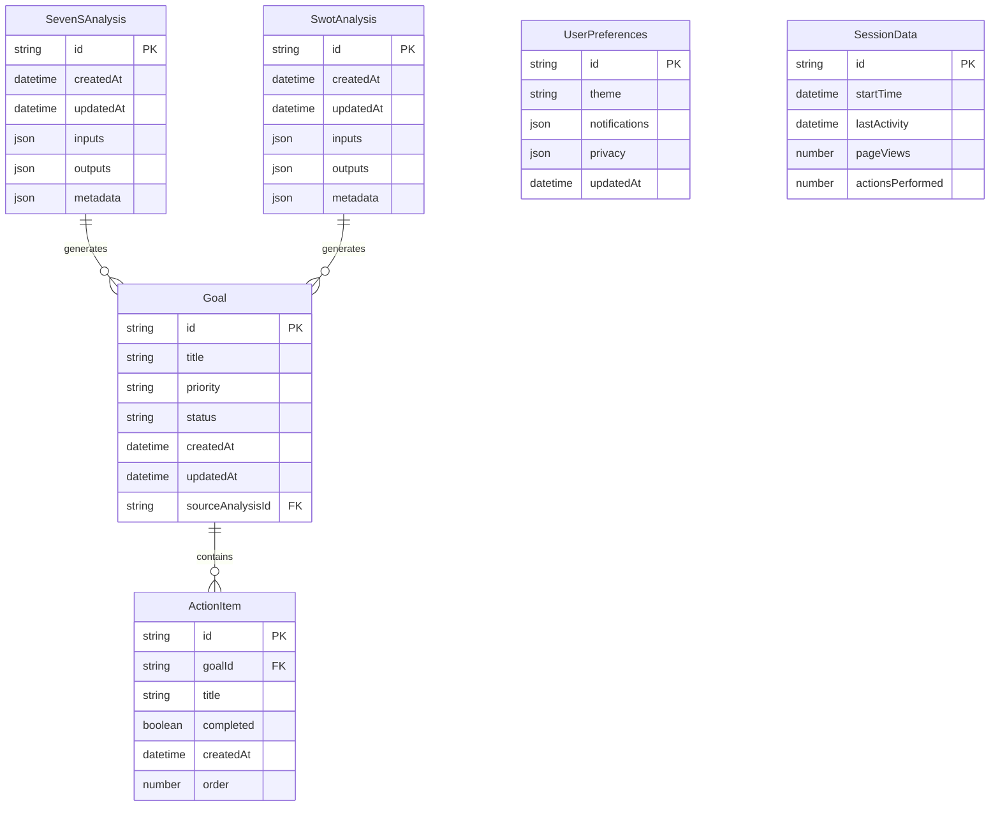

# Database Design: Strategic Alignment OS

## 📋 Table of Contents

- [Overview](#overview)
- [Data Architecture](#data-architecture)
- [Client-Side Storage](#client-side-storage)
- [Data Models](#data-models)
- [Storage Implementation](#storage-implementation)
- [Data Persistence Strategy](#data-persistence-strategy)
- [Data Security](#data-security)
- [Migration & Versioning](#migration--versioning)
- [Performance Optimization](#performance-optimization)
- [Future Database Considerations](#future-database-considerations)

---

## 🎯 Overview

### Database Architecture Philosophy

Strategic Alignment OS implements a **client-side-first data architecture** that prioritizes user privacy and data ownership. The application operates on a **zero server-side persistence** model for user data, ensuring sensitive organizational information never leaves the user's control.

### Key Design Principles

1. **Privacy by Design**: All user data stored locally in browser
2. **Data Minimization**: Only store essential data needed for functionality
3. **User Control**: Users have complete control over their data
4. **Zero Server Persistence**: No user data stored on external servers
5. **Automatic Cleanup**: Implemented data retention and expiration policies

### Architecture Overview



---

## 🏗️ Data Architecture

### Storage Strategy Overview

#### Primary Storage: Browser localStorage
- **User Analysis Data**: 7-S framework inputs and results
- **SWOT Analysis Data**: Analysis inputs and generated insights
- **Goals & Action Plans**: User-created goals and tasks
- **User Preferences**: Application settings and customizations

#### Secondary Storage: Browser sessionStorage
- **Temporary Form Data**: Work-in-progress form inputs
- **Session State**: Current user session information
- **Cache Data**: Temporary AI response caching

#### Future Storage: IndexedDB (Planned)
- **Large Dataset Support**: For enterprise features
- **Offline Capabilities**: Full offline functionality
- **Advanced Querying**: Complex data relationships

### Data Flow Architecture



---

## 💾 Client-Side Storage

### localStorage Implementation

#### Data Structure Design
```typescript
// Core data storage structure
interface StorageSchema {
  version: string;
  timestamp: number;
  data: {
    analysis: {
      sevenS: SevenSAnalysisData[];
      swot: SwotAnalysisData[];
    };
    goals: Goal[];
    preferences: UserPreferences;
    session: SessionData;
  };
  metadata: {
    created: number;
    lastModified: number;
    expiresAt: number;
  };
}

// Analysis data models
interface SevenSAnalysisData {
  id: string;
  timestamp: number;
  inputs: {
    strategy: string;
    structure: string;
    systems: string;
    sharedValues: string;
    style: string;
    staff: string;
    skills: string;
  };
  outputs: {
    analysis: string;
    recommendations: Recommendation[];
    chartData: ChartDataPoint[];
  };
  metadata: {
    version: string;
    templateUsed?: string;
    refinements: number;
  };
}

interface SwotAnalysisData {
  id: string;
  timestamp: number;
  inputs: {
    strengths: string;
    weaknesses: string;
    opportunities: string;
    threats: string;
  };
  outputs: {
    analysis: string;
  };
  metadata: {
    version: string;
    wordCount: number;
  };
}
```

#### Storage Key Management
```typescript
// Storage key constants
export const STORAGE_KEYS = {
  // Primary data stores
  MAIN_DATA: 'strategic-os-storage',
  USER_PREFERENCES: 'strategic-os-preferences',
  SESSION_DATA: 'strategic-os-session',
  
  // Temporary data stores
  FORM_CACHE: 'strategic-os-form-cache',
  AI_RESPONSE_CACHE: 'strategic-os-ai-cache',
  
  // Metadata stores
  DATA_VERSION: 'strategic-os-version',
  LAST_CLEANUP: 'strategic-os-last-cleanup',
  
  // TTL tracking
  TTL_TRACKER: 'strategic-os-ttl',
} as const;

// Storage size limits
export const STORAGE_LIMITS = {
  MAX_ANALYSIS_COUNT: 10,      // Maximum stored analyses
  MAX_GOAL_COUNT: 50,          // Maximum stored goals
  MAX_SESSION_AGE: 24 * 60 * 60 * 1000, // 24 hours
  MAX_CACHE_AGE: 60 * 60 * 1000,        // 1 hour
  MAX_STORAGE_SIZE: 5 * 1024 * 1024,     // 5MB total
} as const;
```

### Secure Storage Implementation

```typescript
// lib/secure-storage.ts
import CryptoJS from 'crypto-js';

export class SecureStorage {
  private static readonly ENCRYPTION_KEY = this.generateEncryptionKey();
  private static readonly VERSION = '1.0';

  static setItem<T>(key: string, value: T, ttlHours: number = 24): boolean {
    try {
      const dataToStore = {
        version: this.VERSION,
        timestamp: Date.now(),
        ttl: ttlHours * 60 * 60 * 1000,
        data: value,
      };

      const encrypted = this.encrypt(JSON.stringify(dataToStore));
      localStorage.setItem(key, encrypted);
      
      this.updateTTLTracker(key, Date.now() + dataToStore.ttl);
      return true;
    } catch (error) {
      console.error('Failed to store data:', error);
      return false;
    }
  }

  static getItem<T>(key: string): T | null {
    try {
      const encrypted = localStorage.getItem(key);
      if (!encrypted) return null;

      const decrypted = this.decrypt(encrypted);
      const storedData = JSON.parse(decrypted);

      // Check TTL
      if (this.isExpired(storedData)) {
        this.removeItem(key);
        return null;
      }

      return storedData.data as T;
    } catch (error) {
      console.error('Failed to retrieve data:', error);
      this.removeItem(key); // Clean up corrupted data
      return null;
    }
  }

  static removeItem(key: string): void {
    localStorage.removeItem(key);
    this.removeTTLTracker(key);
  }

  static clear(): void {
    const keys = Object.values(STORAGE_KEYS);
    keys.forEach(key => this.removeItem(key));
  }

  private static encrypt(data: string): string {
    return CryptoJS.AES.encrypt(data, this.ENCRYPTION_KEY).toString();
  }

  private static decrypt(data: string): string {
    const bytes = CryptoJS.AES.decrypt(data, this.ENCRYPTION_KEY);
    return bytes.toString(CryptoJS.enc.Utf8);
  }

  private static generateEncryptionKey(): string {
    // Generate session-specific key
    const browserFingerprint = this.getBrowserFingerprint();
    const sessionKey = sessionStorage.getItem('session-key') || this.createSessionKey();
    return CryptoJS.SHA256(browserFingerprint + sessionKey).toString();
  }

  private static getBrowserFingerprint(): string {
    return [
      navigator.userAgent,
      navigator.language,
      screen.width + 'x' + screen.height,
      Intl.DateTimeFormat().resolvedOptions().timeZone,
    ].join('|');
  }

  private static createSessionKey(): string {
    const key = Math.random().toString(36).substring(2, 15);
    sessionStorage.setItem('session-key', key);
    return key;
  }
}
```

---

## 📊 Data Models

### Core Entity Models

#### Analysis Entities
```typescript
// 7-S Framework Analysis
export interface SevenSAnalysis {
  id: string;
  createdAt: Date;
  updatedAt: Date;
  inputs: SevenSInputs;
  outputs: SevenSOutputs;
  metadata: AnalysisMetadata;
}

export interface SevenSInputs {
  strategy: string;
  structure: string;
  systems: string;
  sharedValues: string;
  style: string;
  staff: string;
  skills: string;
}

export interface SevenSOutputs {
  analysis: string;               // Markdown analysis
  recommendations: Recommendation[];
  chartData: ChartDataPoint[];
  alignmentScore: number;         // Overall alignment score
}

// SWOT Analysis
export interface SwotAnalysis {
  id: string;
  createdAt: Date;
  updatedAt: Date;
  inputs: SwotInputs;
  outputs: SwotOutputs;
  metadata: AnalysisMetadata;
}

export interface SwotInputs {
  strengths: string;
  weaknesses: string;
  opportunities: string;
  threats: string;
}

export interface SwotOutputs {
  analysis: string;               // Markdown analysis
  strategicInsights: string[];    // Key strategic insights
  actionableItems: string[];      // Immediate actions
}
```

#### Goal Management Entities
```typescript
// Goal and Action Plan
export interface Goal {
  id: string;
  title: string;
  description?: string;
  priority: Priority;
  status: GoalStatus;
  createdAt: Date;
  updatedAt: Date;
  dueDate?: Date;
  completedAt?: Date;
  actions: ActionItem[];
  tags: string[];
  sourceAnalysisId?: string;      // Link to originating analysis
}

export interface ActionItem {
  id: string;
  goalId: string;
  title: string;
  description?: string;
  completed: boolean;
  createdAt: Date;
  completedAt?: Date;
  assignee?: string;
  estimatedHours?: number;
  order: number;
}

export type Priority = 'High' | 'Medium' | 'Low';
export type GoalStatus = 'Not Started' | 'In Progress' | 'Completed' | 'On Hold' | 'Cancelled';
```

#### User & Preference Entities
```typescript
// User Preferences
export interface UserPreferences {
  id: string;
  theme: 'light' | 'dark' | 'auto';
  language: string;
  timezone: string;
  notifications: NotificationSettings;
  privacy: PrivacySettings;
  analytics: AnalyticsSettings;
  createdAt: Date;
  updatedAt: Date;
}

export interface NotificationSettings {
  goalReminders: boolean;
  weeklyReports: boolean;
  systemUpdates: boolean;
}

export interface PrivacySettings {
  dataRetentionDays: number;
  shareUsageData: boolean;
  allowCookies: boolean;
}

export interface AnalyticsSettings {
  trackUsage: boolean;
  trackPerformance: boolean;
  shareAggregatedData: boolean;
}

// Session Management
export interface SessionData {
  id: string;
  startTime: Date;
  lastActivity: Date;
  pageViews: number;
  actionsPerformed: number;
  analysesCreated: number;
  goalsCreated: number;
}
```

### Relationship Models



---

## 🔧 Storage Implementation

### Zustand Store Integration

```typescript
// lib/store.ts - Enhanced with database operations
import { create } from 'zustand';
import { persist } from 'zustand/middleware';
import { SecureStorage } from './secure-storage';

interface DatabaseState {
  // Data entities
  analyses: {
    sevenS: SevenSAnalysis[];
    swot: SwotAnalysis[];
  };
  goals: Goal[];
  preferences: UserPreferences;
  session: SessionData;
  
  // Database operations
  saveAnalysis: (analysis: SevenSAnalysis | SwotAnalysis) => void;
  getAnalysis: (id: string) => SevenSAnalysis | SwotAnalysis | null;
  deleteAnalysis: (id: string) => void;
  
  saveGoal: (goal: Goal) => void;
  updateGoal: (id: string, updates: Partial<Goal>) => void;
  deleteGoal: (id: string) => void;
  
  updatePreferences: (preferences: Partial<UserPreferences>) => void;
  
  // Utility operations
  cleanup: () => void;
  export: () => string;
  import: (data: string) => boolean;
}

const useDatabase = create<DatabaseState>()(
  persist(
    (set, get) => ({
      // Initial state
      analyses: { sevenS: [], swot: [] },
      goals: [],
      preferences: createDefaultPreferences(),
      session: createNewSession(),
      
      // Analysis operations
      saveAnalysis: (analysis) => set((state) => {
        if (analysis.metadata?.type === '7s') {
          return {
            analyses: {
              ...state.analyses,
              sevenS: [...state.analyses.sevenS.slice(-9), analysis as SevenSAnalysis],
            },
          };
        } else {
          return {
            analyses: {
              ...state.analyses,
              swot: [...state.analyses.swot.slice(-9), analysis as SwotAnalysis],
            },
          };
        }
      }),
      
      getAnalysis: (id) => {
        const state = get();
        return [...state.analyses.sevenS, ...state.analyses.swot]
          .find(analysis => analysis.id === id) || null;
      },
      
      deleteAnalysis: (id) => set((state) => ({
        analyses: {
          sevenS: state.analyses.sevenS.filter(a => a.id !== id),
          swot: state.analyses.swot.filter(a => a.id !== id),
        },
      })),
      
      // Goal operations
      saveGoal: (goal) => set((state) => ({
        goals: [...state.goals, goal],
      })),
      
      updateGoal: (id, updates) => set((state) => ({
        goals: state.goals.map(goal => 
          goal.id === id ? { ...goal, ...updates, updatedAt: new Date() } : goal
        ),
      })),
      
      deleteGoal: (id) => set((state) => ({
        goals: state.goals.filter(goal => goal.id !== id),
      })),
      
      // Preferences operations
      updatePreferences: (updates) => set((state) => ({
        preferences: { ...state.preferences, ...updates, updatedAt: new Date() },
      })),
      
      // Utility operations
      cleanup: () => {
        const state = get();
        const cutoffDate = new Date(Date.now() - (30 * 24 * 60 * 60 * 1000)); // 30 days
        
        set({
          analyses: {
            sevenS: state.analyses.sevenS.filter(a => a.createdAt > cutoffDate),
            swot: state.analyses.swot.filter(a => a.createdAt > cutoffDate),
          },
          goals: state.goals.filter(g => g.createdAt > cutoffDate || g.status !== 'Completed'),
        });
      },
      
      export: () => {
        const state = get();
        return JSON.stringify({
          version: '1.0',
          exportDate: new Date().toISOString(),
          data: {
            analyses: state.analyses,
            goals: state.goals,
            preferences: state.preferences,
          },
        });
      },
      
      import: (dataString) => {
        try {
          const importData = JSON.parse(dataString);
          set({
            analyses: importData.data.analyses || { sevenS: [], swot: [] },
            goals: importData.data.goals || [],
            preferences: { ...get().preferences, ...importData.data.preferences },
          });
          return true;
        } catch (error) {
          console.error('Import failed:', error);
          return false;
        }
      },
    }),
    {
      name: 'strategic-os-database',
      storage: {
        getItem: (name) => SecureStorage.getItem(name),
        setItem: (name, value) => SecureStorage.setItem(name, value, 24 * 30), // 30 days
        removeItem: (name) => SecureStorage.removeItem(name),
      },
    }
  )
);

export { useDatabase };
```

---

## 🔄 Data Persistence Strategy

### Data Lifecycle Management

#### Automatic Data Cleanup
```typescript
// lib/data-lifecycle.ts
export class DataLifecycleManager {
  static readonly RETENTION_POLICIES = {
    analysis: 30 * 24 * 60 * 60 * 1000,      // 30 days
    goals: 90 * 24 * 60 * 60 * 1000,         // 90 days (unless active)
    session: 24 * 60 * 60 * 1000,            // 24 hours
    cache: 60 * 60 * 1000,                   // 1 hour
    preferences: 365 * 24 * 60 * 60 * 1000,  // 1 year
  };

  static initializeCleanup(): void {
    // Run cleanup on app start
    this.performCleanup();
    
    // Schedule periodic cleanup
    setInterval(() => {
      this.performCleanup();
    }, 60 * 60 * 1000); // Every hour
  }

  static performCleanup(): void {
    this.cleanupExpiredData();
    this.enforceStorageLimits();
    this.optimizeStorage();
  }

  private static cleanupExpiredData(): void {
    const now = Date.now();
    
    // Clean up expired analyses
    const analyses = SecureStorage.getItem<any>(STORAGE_KEYS.MAIN_DATA);
    if (analyses?.data?.analyses) {
      analyses.data.analyses.sevenS = analyses.data.analyses.sevenS.filter(
        (analysis: any) => now - analysis.createdAt < this.RETENTION_POLICIES.analysis
      );
      analyses.data.analyses.swot = analyses.data.analyses.swot.filter(
        (analysis: any) => now - analysis.createdAt < this.RETENTION_POLICIES.analysis
      );
      
      SecureStorage.setItem(STORAGE_KEYS.MAIN_DATA, analyses, 24 * 30);
    }
    
    // Clean up expired sessions
    const session = SecureStorage.getItem<SessionData>(STORAGE_KEYS.SESSION_DATA);
    if (session && now - session.startTime.getTime() > this.RETENTION_POLICIES.session) {
      SecureStorage.removeItem(STORAGE_KEYS.SESSION_DATA);
    }
    
    // Clean up cache
    SecureStorage.removeItem(STORAGE_KEYS.AI_RESPONSE_CACHE);
    SecureStorage.removeItem(STORAGE_KEYS.FORM_CACHE);
  }

  private static enforceStorageLimits(): void {
    const data = SecureStorage.getItem<any>(STORAGE_KEYS.MAIN_DATA);
    if (!data?.data) return;

    // Limit analysis count
    if (data.data.analyses?.sevenS?.length > STORAGE_LIMITS.MAX_ANALYSIS_COUNT) {
      data.data.analyses.sevenS = data.data.analyses.sevenS
        .sort((a: any, b: any) => b.createdAt - a.createdAt)
        .slice(0, STORAGE_LIMITS.MAX_ANALYSIS_COUNT);
    }

    if (data.data.analyses?.swot?.length > STORAGE_LIMITS.MAX_ANALYSIS_COUNT) {
      data.data.analyses.swot = data.data.analyses.swot
        .sort((a: any, b: any) => b.createdAt - a.createdAt)
        .slice(0, STORAGE_LIMITS.MAX_ANALYSIS_COUNT);
    }

    // Limit goal count
    if (data.data.goals?.length > STORAGE_LIMITS.MAX_GOAL_COUNT) {
      data.data.goals = data.data.goals
        .sort((a: any, b: any) => {
          // Keep active goals, sort by priority and date
          if (a.status === 'Completed' && b.status !== 'Completed') return 1;
          if (a.status !== 'Completed' && b.status === 'Completed') return -1;
          return b.createdAt - a.createdAt;
        })
        .slice(0, STORAGE_LIMITS.MAX_GOAL_COUNT);
    }

    SecureStorage.setItem(STORAGE_KEYS.MAIN_DATA, data, 24 * 30);
  }

  private static optimizeStorage(): void {
    // Check total storage usage
    const totalSize = this.calculateStorageSize();
    
    if (totalSize > STORAGE_LIMITS.MAX_STORAGE_SIZE) {
      console.warn('Storage size limit exceeded, performing aggressive cleanup');
      this.aggressiveCleanup();
    }
  }

  private static calculateStorageSize(): number {
    let totalSize = 0;
    Object.values(STORAGE_KEYS).forEach(key => {
      const item = localStorage.getItem(key);
      if (item) {
        totalSize += item.length * 2; // Approximate size in bytes
      }
    });
    return totalSize;
  }

  private static aggressiveCleanup(): void {
    // Remove oldest data first
    const data = SecureStorage.getItem<any>(STORAGE_KEYS.MAIN_DATA);
    if (data?.data) {
      // Keep only the most recent analyses
      data.data.analyses.sevenS = data.data.analyses.sevenS?.slice(-3) || [];
      data.data.analyses.swot = data.data.analyses.swot?.slice(-3) || [];
      
      // Keep only active goals
      data.data.goals = data.data.goals?.filter((goal: any) => 
        goal.status !== 'Completed' && goal.status !== 'Cancelled'
      ) || [];
      
      SecureStorage.setItem(STORAGE_KEYS.MAIN_DATA, data, 24 * 30);
    }
  }
}
```

### Data Migration System

```typescript
// lib/data-migration.ts
export class DataMigrationManager {
  private static readonly CURRENT_VERSION = '1.0';
  
  static checkAndMigrate(): void {
    const currentVersion = SecureStorage.getItem<string>(STORAGE_KEYS.DATA_VERSION);
    
    if (!currentVersion) {
      this.initializeStorage();
    } else if (currentVersion !== this.CURRENT_VERSION) {
      this.migrateData(currentVersion, this.CURRENT_VERSION);
    }
  }

  private static initializeStorage(): void {
    const initialData = {
      version: this.CURRENT_VERSION,
      data: {
        analyses: { sevenS: [], swot: [] },
        goals: [],
        preferences: createDefaultPreferences(),
        session: createNewSession(),
      },
      metadata: {
        created: Date.now(),
        lastModified: Date.now(),
      },
    };

    SecureStorage.setItem(STORAGE_KEYS.MAIN_DATA, initialData, 24 * 30);
    SecureStorage.setItem(STORAGE_KEYS.DATA_VERSION, this.CURRENT_VERSION, 24 * 365);
  }

  private static migrateData(fromVersion: string, toVersion: string): void {
    console.log(`Migrating data from version ${fromVersion} to ${toVersion}`);
    
    const migrationPath = this.getMigrationPath(fromVersion, toVersion);
    
    migrationPath.forEach(migration => {
      try {
        migration.execute();
        console.log(`Migration ${migration.name} completed successfully`);
      } catch (error) {
        console.error(`Migration ${migration.name} failed:`, error);
        throw new Error(`Data migration failed: ${migration.name}`);
      }
    });

    SecureStorage.setItem(STORAGE_KEYS.DATA_VERSION, toVersion, 24 * 365);
  }

  private static getMigrationPath(from: string, to: string): Migration[] {
    // Define migration steps for different version transitions
    const migrations: { [key: string]: Migration[] } = {
      '0.9_to_1.0': [
        {
          name: 'add_goal_metadata',
          execute: () => this.addGoalMetadata(),
        },
        {
          name: 'restructure_analysis_data',
          execute: () => this.restructureAnalysisData(),
        },
      ],
    };

    const migrationKey = `${from}_to_${to}`;
    return migrations[migrationKey] || [];
  }

  private static addGoalMetadata(): void {
    const data = SecureStorage.getItem<any>(STORAGE_KEYS.MAIN_DATA);
    if (data?.data?.goals) {
      data.data.goals.forEach((goal: any) => {
        if (!goal.metadata) {
          goal.metadata = {
            version: '1.0',
            migrated: true,
            createdAt: goal.createdAt || Date.now(),
          };
        }
      });
      SecureStorage.setItem(STORAGE_KEYS.MAIN_DATA, data, 24 * 30);
    }
  }

  private static restructureAnalysisData(): void {
    const data = SecureStorage.getItem<any>(STORAGE_KEYS.MAIN_DATA);
    if (data?.data?.analyses) {
      // Add new metadata structure to existing analyses
      ['sevenS', 'swot'].forEach(type => {
        if (data.data.analyses[type]) {
          data.data.analyses[type].forEach((analysis: any) => {
            if (!analysis.metadata) {
              analysis.metadata = {
                version: '1.0',
                type: type,
                migrated: true,
              };
            }
          });
        }
      });
      SecureStorage.setItem(STORAGE_KEYS.MAIN_DATA, data, 24 * 30);
    }
  }
}

interface Migration {
  name: string;
  execute: () => void;
}
```

---

## 🔒 Data Security

### Encryption Implementation

```typescript
// lib/encryption.ts
import CryptoJS from 'crypto-js';

export class DataEncryption {
  private static readonly ALGORITHM = 'AES';
  private static readonly KEY_SIZE = 256;
  private static readonly IV_SIZE = 16;

  static encryptSensitiveData(data: any, userKey?: string): string {
    const key = userKey || this.generateUserKey();
    const iv = CryptoJS.lib.WordArray.random(this.IV_SIZE);
    
    const encrypted = CryptoJS.AES.encrypt(JSON.stringify(data), key, {
      iv: iv,
      mode: CryptoJS.mode.CBC,
      padding: CryptoJS.pad.Pkcs7,
    });

    return iv.toString() + ':' + encrypted.toString();
  }

  static decryptSensitiveData(encryptedData: string, userKey?: string): any {
    const key = userKey || this.generateUserKey();
    const [ivString, encrypted] = encryptedData.split(':');
    
    const iv = CryptoJS.enc.Hex.parse(ivString);
    
    const decrypted = CryptoJS.AES.decrypt(encrypted, key, {
      iv: iv,
      mode: CryptoJS.mode.CBC,
      padding: CryptoJS.pad.Pkcs7,
    });

    return JSON.parse(decrypted.toString(CryptoJS.enc.Utf8));
  }

  private static generateUserKey(): string {
    // Generate a key based on browser/session characteristics
    const fingerprint = [
      navigator.userAgent,
      navigator.language,
      screen.width + 'x' + screen.height,
      new Date().getTimezoneOffset(),
    ].join('|');

    return CryptoJS.SHA256(fingerprint).toString();
  }

  static generateDataIntegrityHash(data: any): string {
    return CryptoJS.SHA256(JSON.stringify(data)).toString();
  }

  static verifyDataIntegrity(data: any, hash: string): boolean {
    const currentHash = this.generateDataIntegrityHash(data);
    return currentHash === hash;
  }
}
```

### Privacy Protection

```typescript
// lib/privacy-protection.ts
export class PrivacyProtection {
  static sanitizeForExport(data: any): any {
    // Remove sensitive information before export
    const sanitized = JSON.parse(JSON.stringify(data));
    
    // Remove personally identifiable information
    if (sanitized.preferences) {
      delete sanitized.preferences.email;
      delete sanitized.preferences.name;
    }
    
    // Remove IP addresses and session data
    if (sanitized.session) {
      delete sanitized.session.ipAddress;
      delete sanitized.session.userAgent;
    }
    
    // Anonymize analysis data (optional)
    if (sanitized.analyses) {
      sanitized.analyses = this.anonymizeAnalyses(sanitized.analyses);
    }
    
    return sanitized;
  }

  private static anonymizeAnalyses(analyses: any): any {
    // Replace specific company/personal information with generic terms
    const anonymizedAnalyses = { ...analyses };
    
    ['sevenS', 'swot'].forEach(type => {
      if (anonymizedAnalyses[type]) {
        anonymizedAnalyses[type] = anonymizedAnalyses[type].map((analysis: any) => ({
          ...analysis,
          inputs: this.anonymizeInputs(analysis.inputs),
        }));
      }
    });
    
    return anonymizedAnalyses;
  }

  private static anonymizeInputs(inputs: any): any {
    // This could include replacing company names, personal names, etc.
    // For now, we just ensure data structure is preserved
    return inputs;
  }

  static generatePrivacyReport(): any {
    const data = SecureStorage.getItem<any>(STORAGE_KEYS.MAIN_DATA);
    
    return {
      dataTypes: this.identifyDataTypes(data),
      retentionPeriods: DataLifecycleManager.RETENTION_POLICIES,
      storageSize: this.calculateStorageUsage(),
      lastCleanup: SecureStorage.getItem(STORAGE_KEYS.LAST_CLEANUP),
      encryptionStatus: 'Enabled (AES-256)',
      thirdPartySharing: 'None (client-side storage only)',
    };
  }

  private static identifyDataTypes(data: any): string[] {
    const types = [];
    
    if (data?.data?.analyses?.sevenS?.length > 0) {
      types.push('7-S Framework Analysis Data');
    }
    
    if (data?.data?.analyses?.swot?.length > 0) {
      types.push('SWOT Analysis Data');
    }
    
    if (data?.data?.goals?.length > 0) {
      types.push('Goal and Action Plan Data');
    }
    
    if (data?.data?.preferences) {
      types.push('User Preference Data');
    }
    
    return types;
  }

  private static calculateStorageUsage(): any {
    let totalSize = 0;
    const breakdown: { [key: string]: number } = {};
    
    Object.entries(STORAGE_KEYS).forEach(([name, key]) => {
      const item = localStorage.getItem(key);
      if (item) {
        const size = item.length * 2; // Approximate bytes
        breakdown[name] = size;
        totalSize += size;
      }
    });
    
    return {
      total: totalSize,
      breakdown,
      limit: STORAGE_LIMITS.MAX_STORAGE_SIZE,
      utilizationPercentage: (totalSize / STORAGE_LIMITS.MAX_STORAGE_SIZE) * 100,
    };
  }
}
```

---

## ⚡ Performance Optimization

### Storage Performance

```typescript
// lib/storage-performance.ts
export class StoragePerformance {
  private static cache = new Map<string, { data: any; timestamp: number }>();
  private static readonly CACHE_TTL = 5 * 60 * 1000; // 5 minutes

  static async optimizedGetItem<T>(key: string): Promise<T | null> {
    // Check memory cache first
    const cached = this.cache.get(key);
    if (cached && Date.now() - cached.timestamp < this.CACHE_TTL) {
      return cached.data;
    }

    // Fallback to storage
    const data = SecureStorage.getItem<T>(key);
    
    if (data) {
      this.cache.set(key, { data, timestamp: Date.now() });
    }
    
    return data;
  }

  static optimizedSetItem<T>(key: string, value: T, ttlHours: number = 24): boolean {
    // Update cache
    this.cache.set(key, { data: value, timestamp: Date.now() });
    
    // Async write to storage
    setTimeout(() => {
      SecureStorage.setItem(key, value, ttlHours);
    }, 0);
    
    return true;
  }

  static clearCache(): void {
    this.cache.clear();
  }

  static optimizeStorage(): void {
    // Compress large datasets
    this.compressAnalyses();
    
    // Remove redundant data
    this.deduplicateData();
    
    // Optimize indexes
    this.rebuildIndexes();
  }

  private static compressAnalyses(): void {
    const data = SecureStorage.getItem<any>(STORAGE_KEYS.MAIN_DATA);
    if (!data?.data?.analyses) return;

    // Compress analysis text (simplified example)
    ['sevenS', 'swot'].forEach(type => {
      if (data.data.analyses[type]) {
        data.data.analyses[type].forEach((analysis: any) => {
          if (analysis.outputs?.analysis) {
            // Remove excessive whitespace and optimize markdown
            analysis.outputs.analysis = analysis.outputs.analysis
              .replace(/\n\s*\n/g, '\n\n')
              .trim();
          }
        });
      }
    });

    SecureStorage.setItem(STORAGE_KEYS.MAIN_DATA, data, 24 * 30);
  }

  private static deduplicateData(): void {
    const data = SecureStorage.getItem<any>(STORAGE_KEYS.MAIN_DATA);
    if (!data?.data) return;

    // Remove duplicate goals (same title and description)
    if (data.data.goals) {
      const uniqueGoals = data.data.goals.filter((goal: any, index: number, array: any[]) => {
        return array.findIndex(g => 
          g.title === goal.title && 
          g.description === goal.description &&
          g.status !== 'Completed'
        ) === index;
      });
      
      data.data.goals = uniqueGoals;
    }

    SecureStorage.setItem(STORAGE_KEYS.MAIN_DATA, data, 24 * 30);
  }

  private static rebuildIndexes(): void {
    // Create optimized indexes for faster lookups
    const data = SecureStorage.getItem<any>(STORAGE_KEYS.MAIN_DATA);
    if (!data?.data) return;

    const indexes = {
      analysesByDate: this.createDateIndex(data.data.analyses),
      goalsByPriority: this.createPriorityIndex(data.data.goals),
      goalsByStatus: this.createStatusIndex(data.data.goals),
    };

    SecureStorage.setItem('strategic-os-indexes', indexes, 24);
  }

  private static createDateIndex(analyses: any): any {
    const index: { [key: string]: string[] } = {};
    
    ['sevenS', 'swot'].forEach(type => {
      if (analyses[type]) {
        analyses[type].forEach((analysis: any) => {
          const date = new Date(analysis.createdAt).toDateString();
          if (!index[date]) index[date] = [];
          index[date].push(analysis.id);
        });
      }
    });
    
    return index;
  }

  private static createPriorityIndex(goals: any[]): any {
    const index: { [key: string]: string[] } = {
      High: [],
      Medium: [],
      Low: [],
    };
    
    goals?.forEach(goal => {
      if (index[goal.priority]) {
        index[goal.priority].push(goal.id);
      }
    });
    
    return index;
  }

  private static createStatusIndex(goals: any[]): any {
    const index: { [key: string]: string[] } = {};
    
    goals?.forEach(goal => {
      if (!index[goal.status]) index[goal.status] = [];
      index[goal.status].push(goal.id);
    });
    
    return index;
  }
}
```

---

## 🔮 Future Database Considerations

### Scalability Planning

#### Potential Database Migrations

##### Scenario 1: Multi-User Support
```typescript
// Future: Server-side database integration
interface FutureUserAccount {
  id: string;
  email: string;
  organizationId: string;
  role: 'admin' | 'member' | 'viewer';
  createdAt: Date;
}

interface FutureOrganization {
  id: string;
  name: string;
  subscription: 'free' | 'pro' | 'enterprise';
  settings: OrganizationSettings;
  members: UserAccount[];
}

// Migration strategy: Export current data -> Import to user account
const migrationStrategy = {
  step1: 'Export current localStorage data',
  step2: 'Create user account and organization',
  step3: 'Import data to server-side database',
  step4: 'Maintain client-side caching for performance',
};
```

##### Scenario 2: Enterprise Features
```typescript
// Future: Advanced analytics and reporting
interface AnalyticsDatabase {
  benchmarkData: BenchmarkData[];
  industryAverages: IndustryMetrics;
  historicalTrends: TrendData[];
  comparisonReports: ComparisonReport[];
}

interface BenchmarkData {
  industry: string;
  size: string;
  metrics: {
    averageAlignmentScore: number;
    commonWeaknesses: string[];
    topRecommendations: string[];
  };
}
```

### Technology Evaluation

#### IndexedDB Implementation (Planned)
```typescript
// lib/indexeddb-adapter.ts
export class IndexedDBAdapter {
  private db: IDBDatabase | null = null;
  private readonly DB_NAME = 'StrategicAlignmentOS';
  private readonly DB_VERSION = 1;

  async initialize(): Promise<void> {
    return new Promise((resolve, reject) => {
      const request = indexedDB.open(this.DB_NAME, this.DB_VERSION);
      
      request.onerror = () => reject(request.error);
      request.onsuccess = () => {
        this.db = request.result;
        resolve();
      };
      
      request.onupgradeneeded = (event) => {
        const db = (event.target as IDBOpenDBRequest).result;
        this.createObjectStores(db);
      };
    });
  }

  private createObjectStores(db: IDBDatabase): void {
    // Create object stores for different data types
    const analysisStore = db.createObjectStore('analyses', { keyPath: 'id' });
    analysisStore.createIndex('type', 'type', { unique: false });
    analysisStore.createIndex('createdAt', 'createdAt', { unique: false });
    
    const goalStore = db.createObjectStore('goals', { keyPath: 'id' });
    goalStore.createIndex('priority', 'priority', { unique: false });
    goalStore.createIndex('status', 'status', { unique: false });
    
    const preferenceStore = db.createObjectStore('preferences', { keyPath: 'id' });
  }

  async saveAnalysis(analysis: SevenSAnalysis | SwotAnalysis): Promise<void> {
    const transaction = this.db!.transaction(['analyses'], 'readwrite');
    const store = transaction.objectStore('analyses');
    await store.add(analysis);
  }

  async getAnalyses(type?: string): Promise<(SevenSAnalysis | SwotAnalysis)[]> {
    const transaction = this.db!.transaction(['analyses'], 'readonly');
    const store = transaction.objectStore('analyses');
    
    if (type) {
      const index = store.index('type');
      return await index.getAll(type);
    }
    
    return await store.getAll();
  }
}
```

### Cloud Database Options

#### Firebase Firestore (Future Consideration)
```typescript
// Future: Firestore integration for multi-user support
interface FirestoreSchema {
  users: {
    [userId: string]: {
      profile: UserProfile;
      preferences: UserPreferences;
      subscription: SubscriptionInfo;
    };
  };
  
  organizations: {
    [orgId: string]: {
      info: OrganizationInfo;
      members: string[]; // User IDs
      settings: OrganizationSettings;
    };
  };
  
  analyses: {
    [analysisId: string]: {
      userId: string;
      organizationId: string;
      type: '7s' | 'swot';
      data: SevenSAnalysis | SwotAnalysis;
      permissions: {
        owner: string;
        viewers: string[];
        editors: string[];
      };
    };
  };
}
```

### Migration Strategy

#### Client-to-Server Migration Plan
```typescript
// Migration utility for future server-side implementation
export class MigrationUtility {
  static async exportCurrentData(): Promise<string> {
    const data = {
      version: '1.0',
      exportDate: new Date().toISOString(),
      source: 'client-side-storage',
      data: {
        analyses: SecureStorage.getItem(STORAGE_KEYS.MAIN_DATA),
        preferences: SecureStorage.getItem(STORAGE_KEYS.USER_PREFERENCES),
        goals: SecureStorage.getItem(STORAGE_KEYS.MAIN_DATA)?.data?.goals,
      },
    };

    return JSON.stringify(data, null, 2);
  }

  static async validateExportData(exportString: string): Promise<boolean> {
    try {
      const data = JSON.parse(exportString);
      return data.version && data.data && data.source === 'client-side-storage';
    } catch (error) {
      return false;
    }
  }

  static async clearClientData(): Promise<void> {
    // Only call this after successful server migration
    Object.values(STORAGE_KEYS).forEach(key => {
      SecureStorage.removeItem(key);
    });
  }
}
```

---

*This database design document provides comprehensive guidance for the current client-side data architecture and future scalability considerations. The design prioritizes user privacy while maintaining flexibility for future enhancements.* 