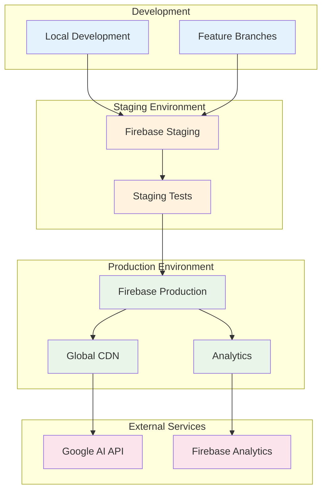

# Deployment Guide: Strategic Alignment OS

## 📋 Table of Contents

- [Overview](#overview)
- [Prerequisites](#prerequisites)
- [Environment Setup](#environment-setup)
- [Firebase Configuration](#firebase-configuration)
- [Local Development Deployment](#local-development-deployment)
- [Staging Deployment](#staging-deployment)
- [Production Deployment](#production-deployment)
- [Environment Variables](#environment-variables)
- [Monitoring & Maintenance](#monitoring--maintenance)
- [Scaling Considerations](#scaling-considerations)
- [Troubleshooting](#troubleshooting)

---

## 🎯 Overview

### Deployment Architecture

Strategic Alignment OS is deployed as a serverless Next.js application on Firebase App Hosting, leveraging Google Cloud infrastructure for global scalability and reliability.



### Key Technologies
- **Hosting Platform**: Firebase App Hosting
- **Framework**: Next.js 15.3.3 with App Router
- **Runtime**: Node.js 18+
- **AI Service**: Google Gemini 2.0 Flash via Genkit
- **CDN**: Firebase Global CDN
- **Analytics**: Firebase Analytics (optional)

---

## ✅ Prerequisites

### Required Software
```bash
# Node.js (version 18 or higher)
node --version  # Should be 18.0.0 or higher
npm --version   # Should be 8.0.0 or higher

# Git
git --version

# Firebase CLI
npm install -g firebase-tools
firebase --version  # Should be 12.0.0 or higher
```

### Required Accounts & Access
- **Google Cloud Platform Account** with billing enabled
- **Firebase Project** with App Hosting enabled
- **Google AI API Key** for Gemini access
- **Git Repository Access** (GitHub/GitLab/etc.)

### System Requirements
- **Operating System**: Windows 10+, macOS 10.15+, Ubuntu 18.04+
- **Memory**: 4GB RAM minimum, 8GB recommended
- **Storage**: 2GB free space for dependencies and builds
- **Network**: Reliable internet connection for deployment

---

## 🔧 Environment Setup

### 1. Install Dependencies

```bash
# Clone the repository
git clone [repository-url]
cd strategic-alignment-os

# Install Node.js dependencies
npm install

# Install Firebase CLI globally
npm install -g firebase-tools

# Login to Firebase
firebase login
```

### 2. Verify Installation

```bash
# Check Node.js and npm versions
node --version && npm --version

# Verify Firebase CLI
firebase --version

# Test local development server
npm run dev
```

### 3. Development Tools Setup

```bash
# Install recommended VS Code extensions
code --install-extension ms-vscode.vscode-typescript-next
code --install-extension bradlc.vscode-tailwindcss
code --install-extension esbenp.prettier-vscode

# Setup Git hooks (optional)
npm install husky --save-dev
npx husky install
```

---

## 🔥 Firebase Configuration

### 1. Create Firebase Project

```bash
# Create new Firebase project (if not exists)
firebase projects:create strategic-alignment-os

# Or use existing project
firebase use [your-project-id]
```

### 2. Enable Required Services

```bash
# Enable App Hosting
firebase hosting:enable

# Enable Analytics (optional)
firebase analytics:enable

# Enable Functions (if using cloud functions)
firebase functions:enable
```

### 3. Configure Firebase App Hosting

Create or update `apphosting.yaml`:

```yaml
# apphosting.yaml
runConfig:
  cpu: 1
  memoryMiB: 512
  minInstances: 0
  maxInstances: 10
  concurrency: 100

env:
  - variable: NODE_ENV
    value: production
  - variable: GOOGLE_AI_API_KEY
    secret: google-ai-api-key
  - variable: NEXT_PUBLIC_APP_URL
    value: https://your-app.web.app

buildConfig:
  runtime: nodejs18
  buildCommand: npm run build
  outputDir: .next
  rootDir: .
```

### 4. Initialize Firebase in Project

```bash
# Initialize Firebase (if not already done)
firebase init

# Select the following options:
# - Hosting: Configure files for Firebase Hosting
# - Functions: Configure cloud functions (optional)

# Configure hosting
# - Use .next as public directory
# - Configure as single-page app: Yes
# - Set up automatic builds: Yes (if using GitHub)
```

---

## 💻 Local Development Deployment

### 1. Environment Variables Setup

Create `.env.local` file:

```bash
# .env.local
NODE_ENV=development
GOOGLE_AI_API_KEY=your_api_key_here
NEXT_PUBLIC_APP_URL=http://localhost:3000
GENKIT_ENV=dev
```

### 2. Start Development Servers

```bash
# Terminal 1: Next.js development server
npm run dev

# Terminal 2: Genkit development server (optional)
npm run genkit:dev

# Terminal 3: Firebase emulators (optional)
firebase emulators:start
```

### 3. Verify Local Setup

```bash
# Check application accessibility
curl http://localhost:3000

# Test API endpoints
curl http://localhost:3000/api/health

# Verify AI functionality (if Genkit running)
curl http://localhost:4000
```

### 4. Local Build Testing

```bash
# Test production build locally
npm run build
npm run start

# Verify build artifacts
ls -la .next/
```

---

## 🧪 Staging Deployment

### 1. Create Staging Environment

```bash
# Create staging project alias
firebase use --add staging

# Configure staging-specific settings
firebase target:apply hosting staging strategic-alignment-os-staging
```

### 2. Staging Environment Variables

Create staging-specific environment configuration:

```bash
# Set staging environment variables
firebase functions:config:set \
  app.env="staging" \
  ai.api_key="staging_api_key"

# Or use Firebase secrets
firebase hosting:secrets:set GOOGLE_AI_API_KEY
```

### 3. Deploy to Staging

```bash
# Build for staging
NODE_ENV=production npm run build

# Deploy to staging
firebase deploy --only hosting:staging

# Verify deployment
curl https://strategic-alignment-os-staging.web.app
```

### 4. Staging Testing

```bash
# Run E2E tests against staging
PLAYWRIGHT_BASE_URL=https://strategic-alignment-os-staging.web.app npm run test:e2e

# Performance testing
npx lighthouse https://strategic-alignment-os-staging.web.app --output html

# Load testing (optional)
npx artillery quick --count 50 --num 10 https://strategic-alignment-os-staging.web.app
```

---

## 🚀 Production Deployment

### 1. Pre-deployment Checklist

```bash
# ✅ All tests passing
npm run test:ci
npm run test:e2e

# ✅ Build successful
npm run build

# ✅ No linting errors
npm run lint:check

# ✅ Type checking passed
npm run type-check

# ✅ Security audit clean
npm audit --audit-level high

# ✅ Environment variables configured
firebase hosting:secrets:access GOOGLE_AI_API_KEY
```

### 2. Production Environment Configuration

```yaml
# Update apphosting.yaml for production
runConfig:
  cpu: 2
  memoryMiB: 1024
  minInstances: 1
  maxInstances: 50
  concurrency: 100

env:
  - variable: NODE_ENV
    value: production
  - variable: GOOGLE_AI_API_KEY
    secret: google-ai-api-key-prod
  - variable: NEXT_PUBLIC_APP_URL
    value: https://strategic-alignment-os.web.app
  - variable: GENKIT_ENV
    value: prod
```

### 3. Production Deployment Steps

```bash
# 1. Switch to production project
firebase use production

# 2. Final build
NODE_ENV=production npm run build

# 3. Preview deployment (optional)
firebase hosting:channel:deploy preview

# 4. Deploy to production
firebase deploy --only hosting

# 5. Verify deployment
curl https://strategic-alignment-os.web.app
```

### 4. Post-deployment Verification

```bash
# Health check
curl https://strategic-alignment-os.web.app/api/health

# Performance verification
npx lighthouse https://strategic-alignment-os.web.app --output json

# Monitor deployment
firebase hosting:channel:list
firebase functions:log --limit 10
```

---

## 🔐 Environment Variables

### Required Environment Variables

#### Development
```bash
NODE_ENV=development
GOOGLE_AI_API_KEY=your_dev_api_key
NEXT_PUBLIC_APP_URL=http://localhost:3000
GENKIT_ENV=dev
```

#### Staging
```bash
NODE_ENV=production
GOOGLE_AI_API_KEY=your_staging_api_key
NEXT_PUBLIC_APP_URL=https://strategic-alignment-os-staging.web.app
GENKIT_ENV=staging
```

#### Production
```bash
NODE_ENV=production
GOOGLE_AI_API_KEY=your_prod_api_key
NEXT_PUBLIC_APP_URL=https://strategic-alignment-os.web.app
GENKIT_ENV=prod
```

### Managing Secrets

#### Firebase Secrets Management
```bash
# Set secrets
firebase hosting:secrets:set GOOGLE_AI_API_KEY

# Access secrets in code
process.env.GOOGLE_AI_API_KEY

# List all secrets
firebase hosting:secrets:access

# Delete secrets
firebase hosting:secrets:destroy GOOGLE_AI_API_KEY
```

#### Environment-Specific Configuration
```typescript
// config/environment.ts
const config = {
  development: {
    apiTimeout: 10000,
    logLevel: 'debug',
    enableDebugMode: true,
  },
  staging: {
    apiTimeout: 30000,
    logLevel: 'info',
    enableDebugMode: false,
  },
  production: {
    apiTimeout: 30000,
    logLevel: 'error',
    enableDebugMode: false,
  },
};

export const getConfig = () => {
  const env = process.env.NODE_ENV || 'development';
  return config[env];
};
```

---

## 📊 Monitoring & Maintenance

### Application Monitoring

#### Firebase Analytics Setup
```bash
# Enable Analytics
firebase analytics:enable

# View analytics dashboard
firebase open analytics
```

#### Performance Monitoring
```javascript
// Add to app/layout.tsx
import { getPerformance } from 'firebase/performance';

const perf = getPerformance();

// Monitor Core Web Vitals
import { getCLS, getFID, getFCP, getLCP, getTTFB } from 'web-vitals';

function sendToAnalytics({ name, delta, value, id }) {
  gtag('event', name, {
    value: Math.round(name === 'CLS' ? delta * 1000 : delta),
    metric_id: id,
    metric_value: value,
    metric_delta: delta,
  });
}

getCLS(sendToAnalytics);
getFID(sendToAnalytics);
getFCP(sendToAnalytics);
getLCP(sendToAnalytics);
getTTFB(sendToAnalytics);
```

#### Error Monitoring
```typescript
// lib/monitoring.ts
export class ErrorMonitor {
  static logError(error: Error, context?: any) {
    console.error('Application Error:', error, context);
    
    // Send to monitoring service
    if (typeof window !== 'undefined' && window.gtag) {
      window.gtag('event', 'exception', {
        description: error.message,
        fatal: false,
        custom_parameters: context,
      });
    }
  }
  
  static logPerformance(metric: string, value: number) {
    console.log(`Performance: ${metric} = ${value}ms`);
    
    if (typeof window !== 'undefined' && window.gtag) {
      window.gtag('event', 'timing_complete', {
        name: metric,
        value: value,
      });
    }
  }
}
```

### Health Checks

#### Application Health Endpoint
```typescript
// app/api/health/route.ts
export async function GET() {
  const healthCheck = {
    status: 'healthy',
    timestamp: new Date().toISOString(),
    version: process.env.npm_package_version,
    environment: process.env.NODE_ENV,
    uptime: process.uptime(),
    memory: process.memoryUsage(),
  };
  
  try {
    // Test AI service connectivity
    const aiTest = await fetch('https://generativelanguage.googleapis.com/v1beta/models', {
      headers: { 'Authorization': `Bearer ${process.env.GOOGLE_AI_API_KEY}` }
    });
    
    healthCheck.services = {
      ai: aiTest.ok ? 'healthy' : 'unhealthy',
    };
  } catch (error) {
    healthCheck.services = { ai: 'error' };
  }
  
  return Response.json(healthCheck);
}
```

#### Monitoring Scripts
```bash
#!/bin/bash
# scripts/health-check.sh

URL="https://strategic-alignment-os.web.app/api/health"
RESPONSE=$(curl -s -o /dev/null -w "%{http_code}" $URL)

if [ $RESPONSE -eq 200 ]; then
    echo "✅ Health check passed"
    exit 0
else
    echo "❌ Health check failed with code: $RESPONSE"
    exit 1
fi
```

### Backup and Recovery

#### Data Backup Strategy
```bash
# Backup Firebase configuration
firebase projects:list > backup/firebase-projects.json
firebase hosting:sites:list > backup/hosting-sites.json

# Backup environment variables
firebase hosting:secrets:access > backup/secrets-backup.txt

# Backup build configuration
cp apphosting.yaml backup/
cp firebase.json backup/
cp package.json backup/
```

#### Recovery Procedures
```bash
# Restore from backup
firebase use [project-id]
firebase hosting:sites:create [site-name]
firebase deploy --only hosting

# Rollback deployment
firebase hosting:rollback

# Emergency maintenance mode
# Create maintenance.html and deploy
echo "Maintenance in progress" > maintenance.html
firebase deploy --only hosting
```

---

## 📈 Scaling Considerations

### Performance Optimization

#### Build Optimization
```javascript
// next.config.ts
const nextConfig = {
  experimental: {
    optimizePackageImports: ['lucide-react', '@radix-ui/react-icons'],
  },
  compiler: {
    removeConsole: process.env.NODE_ENV === 'production',
  },
  images: {
    formats: ['image/webp', 'image/avif'],
    deviceSizes: [640, 750, 828, 1080, 1200, 1920, 2048, 3840],
  },
  webpack: (config) => {
    config.optimization.splitChunks = {
      chunks: 'all',
      cacheGroups: {
        vendor: {
          test: /[\\/]node_modules[\\/]/,
          chunks: 'all',
        },
      },
    };
    return config;
  },
};
```

#### Caching Strategy
```yaml
# firebase.json
{
  "hosting": {
    "public": ".next",
    "headers": [
      {
        "source": "**/*.@(js|css|png|jpg|jpeg|gif|ico|svg|woff|woff2|ttf|eot)",
        "headers": [
          {
            "key": "Cache-Control",
            "value": "max-age=31536000,immutable"
          }
        ]
      },
      {
        "source": "**/*.html",
        "headers": [
          {
            "key": "Cache-Control",
            "value": "max-age=0,no-cache,no-store,must-revalidate"
          }
        ]
      }
    ]
  }
}
```

### Auto-scaling Configuration

#### Firebase App Hosting Scaling
```yaml
# apphosting.yaml
runConfig:
  cpu: 2
  memoryMiB: 2048
  minInstances: 2      # Always keep 2 instances warm
  maxInstances: 100    # Scale up to 100 instances
  concurrency: 80      # 80 concurrent requests per instance
  
  # Auto-scaling triggers
  scalingConfig:
    targetCPUUtilization: 70
    targetMemoryUtilization: 80
```

#### CDN and Edge Optimization
```bash
# Enable global CDN
firebase hosting:channel:deploy production --expires 30d

# Configure edge caching
# Add to firebase.json
{
  "hosting": {
    "rewrites": [
      {
        "source": "/api/**",
        "function": "api"
      }
    ],
    "headers": [
      {
        "source": "/api/**",
        "headers": [
          {
            "key": "Cache-Control",
            "value": "public, max-age=300, s-maxage=600"
          }
        ]
      }
    ]
  }
}
```

### Load Testing

#### Artillery Load Testing
```yaml
# artillery-config.yml
config:
  target: 'https://strategic-alignment-os.web.app'
  phases:
    - duration: 60
      arrivalRate: 10
    - duration: 120
      arrivalRate: 50
    - duration: 60
      arrivalRate: 10

scenarios:
  - name: "Homepage and Analysis"
    flow:
      - get:
          url: "/"
      - get:
          url: "/seven-s-analysis"
      - post:
          url: "/api/generate-analysis"
          json:
            strategy: "Test strategy"
            # ... other fields
```

```bash
# Run load tests
npx artillery run artillery-config.yml
```

---

## 🔧 Troubleshooting

### Common Deployment Issues

#### Build Failures
```bash
# Issue: Build fails with memory errors
# Solution: Increase Node.js memory
export NODE_OPTIONS="--max-old-space-size=4096"
npm run build

# Issue: TypeScript errors during build
# Solution: Fix type errors or temporarily bypass
npm run build -- --no-type-check  # Temporary only

# Issue: Dependency conflicts
# Solution: Clear cache and reinstall
rm -rf node_modules package-lock.json
npm install
```

#### Firebase Deployment Issues
```bash
# Issue: Firebase CLI authentication
firebase logout
firebase login

# Issue: Project permissions
firebase projects:list
firebase use [correct-project-id]

# Issue: Hosting deployment fails
firebase hosting:disable
firebase hosting:enable
firebase deploy --only hosting

# Issue: Environment variables not working
firebase hosting:secrets:access
firebase hosting:secrets:set GOOGLE_AI_API_KEY
```

#### API Integration Issues
```bash
# Issue: Google AI API errors
# Check API key validity
curl -H "Authorization: Bearer $GOOGLE_AI_API_KEY" \
  https://generativelanguage.googleapis.com/v1beta/models

# Issue: CORS errors
# Update next.config.ts with proper headers
headers: async () => [
  {
    source: '/api/:path*',
    headers: [
      { key: 'Access-Control-Allow-Origin', value: '*' },
      { key: 'Access-Control-Allow-Methods', value: 'GET,POST,OPTIONS' },
    ],
  },
]

# Issue: Rate limiting
# Implement exponential backoff in API calls
```

### Performance Issues

#### Slow Load Times
```bash
# Analyze bundle size
npm run build
npx @next/bundle-analyzer

# Check Core Web Vitals
npx lighthouse https://your-domain.com --output html

# Monitor loading performance
# Add to page components:
useEffect(() => {
  const observer = new PerformanceObserver((list) => {
    for (const entry of list.getEntries()) {
      console.log(`${entry.name}: ${entry.startTime}ms`);
    }
  });
  observer.observe({ entryTypes: ['navigation', 'resource'] });
}, []);
```

#### Memory Leaks
```bash
# Monitor memory usage
# Add to development environment:
if (process.env.NODE_ENV === 'development') {
  setInterval(() => {
    const usage = process.memoryUsage();
    console.log('Memory:', usage);
  }, 30000);
}

# Check for memory leaks in browser
# Use Chrome DevTools Memory tab
# Profile heap snapshots before/after operations
```

### Monitoring and Alerts

#### Set Up Alerts
```bash
# Firebase Performance Monitoring alerts
firebase open performance

# Google Cloud Monitoring (for advanced users)
gcloud alpha monitoring policies create \
  --policy-from-file=monitoring-policy.yaml
```

#### Log Analysis
```bash
# View Firebase hosting logs
firebase hosting:channel:list

# Check function logs (if using cloud functions)
firebase functions:log

# Application logs
# Add structured logging:
const logger = {
  info: (message, meta = {}) => console.log(JSON.stringify({ level: 'info', message, ...meta })),
  error: (message, error, meta = {}) => console.error(JSON.stringify({ level: 'error', message, error: error.message, ...meta })),
};
```

---

## 📚 Additional Resources

### Firebase Documentation
- [Firebase App Hosting Guide](https://firebase.google.com/docs/hosting)
- [Firebase CLI Reference](https://firebase.google.com/docs/cli)
- [Performance Monitoring](https://firebase.google.com/docs/perf-mon)

### Next.js Deployment
- [Next.js Deployment Documentation](https://nextjs.org/docs/deployment)
- [Production Best Practices](https://nextjs.org/docs/going-to-production)
- [Performance Optimization](https://nextjs.org/docs/advanced-features/measuring-performance)

### Google Cloud Platform
- [Cloud Run Documentation](https://cloud.google.com/run/docs)
- [Identity and Access Management](https://cloud.google.com/iam/docs)
- [Cloud Monitoring](https://cloud.google.com/monitoring/docs)

---

*This deployment guide provides comprehensive instructions for deploying and maintaining the Strategic Alignment OS platform across all environments. Regular updates ensure alignment with evolving platform capabilities and best practices.* 