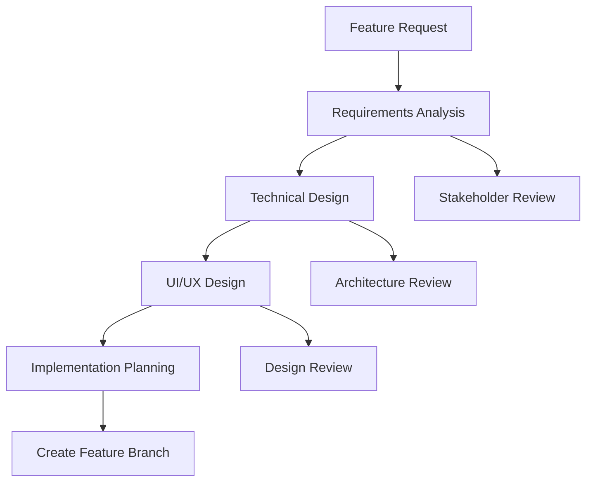
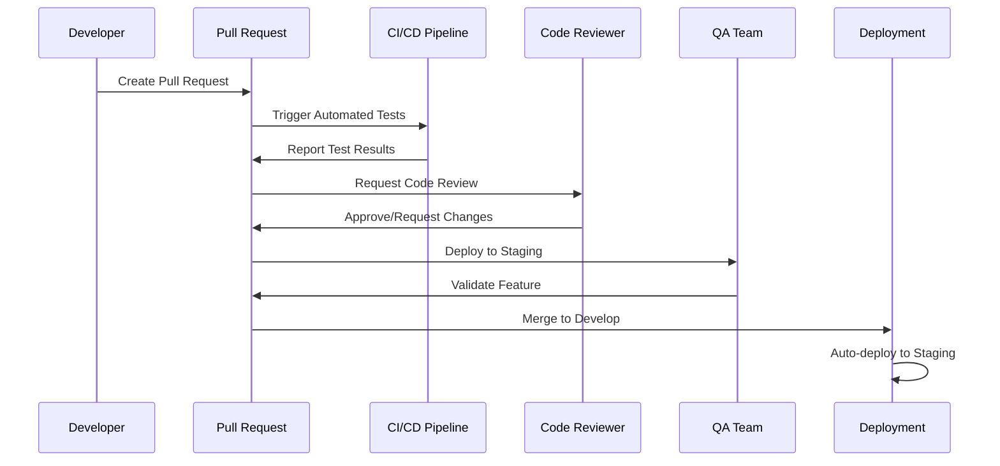
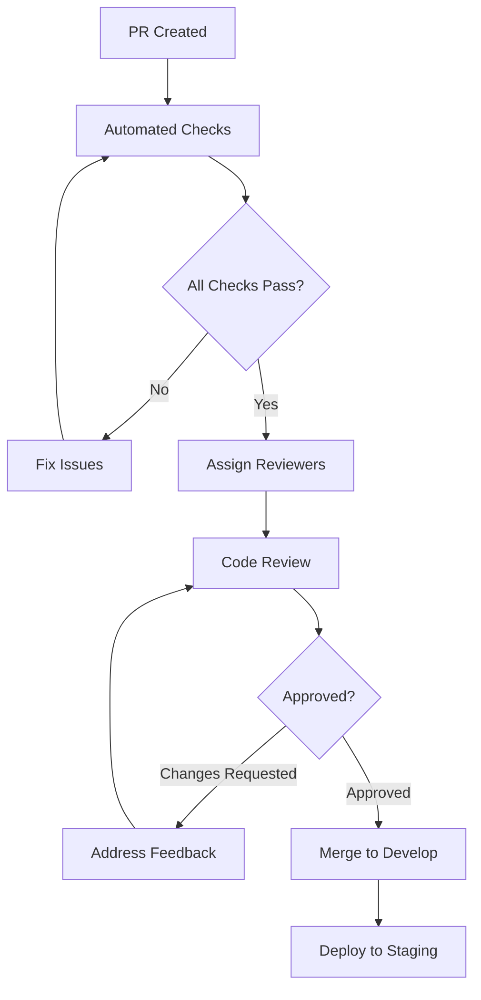
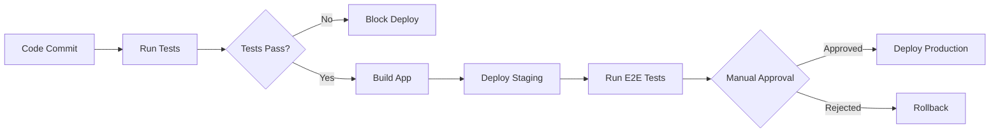

# Development Workflow: Strategic Alignment OS

## 📋 Document Overview

**Project:** Strategic Alignment OS (7S Analyzer)  
**Version:** 1.0  
**Date:** 2024  
**Team Lead:** [Lead Name]  
**Document Status:** Active  

---

## 🎯 Workflow Overview

### Development Philosophy
Our development workflow emphasizes **speed**, **quality**, and **collaboration** while maintaining high standards for code quality and user experience. We follow modern development practices with continuous integration, automated testing, and rapid iteration cycles.

### Core Principles
1. **Feature-Driven Development**: Each feature branch represents a complete user-facing capability
2. **Continuous Integration**: All code is automatically tested and validated
3. **Code Quality First**: Comprehensive review process ensures maintainable codebase
4. **Documentation-Driven**: All features include comprehensive documentation
5. **User-Centric Approach**: Regular user feedback integration and validation

---

## 🌿 Git Workflow & Branching Strategy

### Branch Structure

```mermaid
gitgraph
    commit id: "Initial"
    branch develop
    checkout develop
    commit id: "Setup"
    
    branch feature/7s-analysis
    checkout feature/7s-analysis
    commit id: "Add forms"
    commit id: "Add AI integration"
    commit id: "Add visualization"
    
    checkout develop
    merge feature/7s-analysis
    commit id: "Merge 7S feature"
    
    branch feature/swot-analysis
    checkout feature/swot-analysis
    commit id: "SWOT implementation"
    
    checkout develop
    merge feature/swot-analysis
    
    checkout main
    merge develop
    commit id: "Release v1.0"
```

### Branch Types & Naming

#### Main Branches
- **`main`** - Production-ready code, always deployable
- **`develop`** - Integration branch for features, pre-production testing

#### Supporting Branches
- **Feature Branches**: `feature/[feature-name]`
  - `feature/7s-analysis`
  - `feature/swot-analysis`
  - `feature/action-planning`
  - `feature/ui-improvements`

- **Hotfix Branches**: `hotfix/[issue-description]`
  - `hotfix/ai-timeout-fix`
  - `hotfix/chart-rendering-bug`

- **Release Branches**: `release/[version]`
  - `release/1.0.0`
  - `release/1.1.0`

### Commit Message Standards

#### Conventional Commits Format
```
<type>[optional scope]: <description>

[optional body]

[optional footer(s)]
```

#### Commit Types
- **feat**: New feature implementation
- **fix**: Bug fixes
- **docs**: Documentation updates
- **style**: Code formatting, missing semi colons, etc.
- **refactor**: Code restructuring without functionality changes
- **test**: Adding or updating tests
- **chore**: Build process or auxiliary tool changes

#### Examples
```bash
feat(ai): add 7S analysis generation with Genkit integration

- Implement server action for analysis generation
- Add Zod schemas for input/output validation  
- Integrate Google Gemini API via Genkit
- Add error handling and timeout management

Closes #23

fix(ui): resolve chart rendering issue on mobile devices

- Fix responsive chart container sizing
- Update Recharts configuration for mobile
- Add proper aspect ratio handling

Fixes #45

docs: update API documentation for server actions

- Add JSDoc comments for all server actions
- Update README with development setup
- Add example usage for AI flows
```

---

## 🔄 Development Process

### Feature Development Lifecycle

#### 1. Planning & Design Phase


**Deliverables:**
- Feature specification document
- Technical design proposal
- UI/UX mockups and prototypes
- Implementation timeline and milestones

#### 2. Implementation Phase
```bash
# 1. Create feature branch
git checkout develop
git pull origin develop
git checkout -b feature/new-feature-name

# 2. Implement feature
# - Write code following coding standards
# - Add comprehensive tests
# - Update documentation
# - Regular commits with descriptive messages

# 3. Regular synchronization
git fetch origin
git rebase origin/develop

# 4. Pre-submission checklist
npm run lint:check
npm run type-check
npm run test
npm run build
```

#### 3. Review & Integration Phase


### Daily Development Workflow

#### Morning Routine
1. **Sync with remote**: `git pull origin develop`
2. **Check CI status**: Review overnight build results
3. **Triage issues**: Address any critical bugs or failed tests
4. **Plan daily work**: Review sprint board and prioritize tasks

#### During Development
1. **Feature branch work**: Implement planned features
2. **Regular commits**: Commit early and often with descriptive messages
3. **Continuous testing**: Run tests before each commit
4. **Documentation updates**: Update docs alongside code changes

#### End of Day
1. **Push progress**: Push feature branch to remote
2. **Update tracking**: Update issue status and time logs
3. **Prepare for review**: Create draft PR if feature is near completion

---

## 🔍 Code Review Process

### Review Requirements

#### Automated Checks (Required to Pass)
- ✅ **Type checking**: TypeScript compilation successful
- ✅ **Linting**: ESLint rules compliance  
- ✅ **Testing**: All unit and integration tests pass
- ✅ **Build**: Production build successful
- ✅ **Security**: No high-severity security vulnerabilities

#### Manual Review Criteria

##### Code Quality Checklist
- [ ] **Functionality**: Code works as intended and meets requirements
- [ ] **Readability**: Clear, self-documenting code with appropriate comments
- [ ] **Performance**: No obvious performance bottlenecks
- [ ] **Security**: No security vulnerabilities or data exposure
- [ ] **Testing**: Adequate test coverage for new functionality
- [ ] **Documentation**: Updated docs for API changes or new features

##### Architecture Review
- [ ] **Design Patterns**: Consistent with established patterns
- [ ] **Dependencies**: Justified addition of new dependencies
- [ ] **State Management**: Proper use of Zustand patterns
- [ ] **AI Integration**: Correct Genkit flow implementation
- [ ] **Error Handling**: Comprehensive error management

### Review Process Flow

#### 1. PR Creation
```markdown
## Pull Request Template

### Feature Description
Brief description of the feature or fix

### Changes Made
- List of specific changes
- Files modified
- New dependencies added

### Testing
- [ ] Unit tests added/updated
- [ ] Integration tests pass
- [ ] Manual testing completed
- [ ] Edge cases considered

### Screenshots (if UI changes)
[Add screenshots or GIFs showing the changes]

### Checklist
- [ ] Code follows project style guidelines
- [ ] Self-review completed
- [ ] Documentation updated
- [ ] No breaking changes (or breaking changes documented)
```

#### 2. Review Assignment
- **Auto-assignment**: Based on code ownership and expertise
- **Required reviewers**: Minimum 1 senior developer approval
- **Optional reviewers**: Domain experts for specialized changes

#### 3. Review Process


---

## 🏗️ Build & CI/CD Pipeline

### Continuous Integration Setup

#### GitHub Actions Workflow
```yaml
# .github/workflows/ci.yml
name: CI/CD Pipeline

on:
  push:
    branches: [main, develop]
  pull_request:
    branches: [main, develop]

jobs:
  test:
    runs-on: ubuntu-latest
    steps:
      - uses: actions/checkout@v4
      - uses: actions/setup-node@v4
        with:
          node-version: '18'
          cache: 'npm'
      
      - name: Install dependencies
        run: npm ci
      
      - name: Type check
        run: npm run type-check
      
      - name: Lint check
        run: npm run lint:check
      
      - name: Run tests
        run: npm run test:ci
      
      - name: Build application
        run: npm run build
      
      - name: Security audit
        run: npm audit --audit-level high

  deploy-staging:
    if: github.ref == 'refs/heads/develop'
    needs: test
    runs-on: ubuntu-latest
    steps:
      - uses: actions/checkout@v4
      - name: Deploy to Firebase Staging
        run: |
          npm ci
          npm run build
          npx firebase deploy --only hosting:staging
```

#### Build Scripts Configuration
```json
{
  "scripts": {
    "dev": "next dev --turbopack",
    "build": "next build",
    "start": "next start",
    "lint": "next lint",
    "lint:check": "next lint --max-warnings 0",
    "lint:fix": "next lint --fix",
    "type-check": "tsc --noEmit",
    "test": "jest",
    "test:watch": "jest --watch",
    "test:ci": "jest --ci --coverage --watchAll=false",
    "test:e2e": "playwright test",
    "genkit:dev": "genkit start -- tsx src/ai/dev.ts",
    "genkit:watch": "genkit start -- tsx --watch src/ai/dev.ts"
  }
}
```

### Deployment Strategy

#### Environment Configuration
```bash
# Development
NODE_ENV=development
NEXT_PUBLIC_APP_URL=http://localhost:3000
GENKIT_ENV=dev

# Staging  
NODE_ENV=production
NEXT_PUBLIC_APP_URL=https://staging.strategic-os.web.app
GENKIT_ENV=staging

# Production
NODE_ENV=production
NEXT_PUBLIC_APP_URL=https://strategic-os.web.app
GENKIT_ENV=prod
```

#### Deployment Pipeline


---

## 🧪 Testing Strategy

### Testing Pyramid Implementation

#### Unit Testing (Base Layer)
```typescript
// Example unit test for AI flow
import { generateAnalysis } from '@/app/actions';
import { mockSevenSInput } from '@/test/fixtures';

describe('generateAnalysis', () => {
  it('should generate valid analysis output', async () => {
    const result = await generateAnalysis(mockSevenSInput);
    
    expect(result).toHaveProperty('analysis');
    expect(result).toHaveProperty('recommendations');
    expect(result).toHaveProperty('chartData');
    expect(result.recommendations).toHaveLength.greaterThan(0);
    expect(result.chartData).toHaveLength(7); // 7S elements
  });

  it('should handle invalid input gracefully', async () => {
    const invalidInput = { ...mockSevenSInput, strategy: '' };
    
    await expect(generateAnalysis(invalidInput))
      .rejects.toThrow('Strategy description is required');
  });
});
```

#### Integration Testing (Middle Layer)
```typescript
// Example integration test for form submission
import { render, screen, fireEvent, waitFor } from '@testing-library/react';
import { SevenSAnalysisPage } from '@/app/(dashboard)/seven-s-analysis/page';

describe('7S Analysis Integration', () => {
  it('should complete full analysis workflow', async () => {
    render(<SevenSAnalysisPage />);
    
    // Fill out form
    fireEvent.change(screen.getByLabelText('Strategy'), {
      target: { value: 'Growth through innovation' }
    });
    
    // Submit form
    fireEvent.click(screen.getByText('Generate 7-S Analysis'));
    
    // Wait for results
    await waitFor(() => {
      expect(screen.getByText('Your 7-S Blueprint')).toBeInTheDocument();
    }, { timeout: 30000 });
    
    // Verify analysis display
    expect(screen.getByText('Recommendations')).toBeInTheDocument();
    expect(screen.getByText('Full Analysis')).toBeInTheDocument();
    expect(screen.getByText('Alignment Chart')).toBeInTheDocument();
  });
});
```

#### End-to-End Testing (Top Layer)
```typescript
// Playwright E2E test
import { test, expect } from '@playwright/test';

test('complete user journey', async ({ page }) => {
  await page.goto('/dashboard');
  
  // Navigate to 7S analysis
  await page.click('[data-testid="7s-analysis-card"]');
  
  // Use template
  await page.selectOption('[data-testid="template-select"]', 'tech-startup');
  
  // Customize inputs
  await page.fill('[data-testid="strategy-input"]', 'AI-first development platform');
  
  // Generate analysis
  await page.click('[data-testid="generate-button"]');
  
  // Wait for analysis completion
  await page.waitForSelector('[data-testid="analysis-results"]', { timeout: 30000 });
  
  // Verify results
  await expect(page.locator('[data-testid="recommendations-list"]')).toBeVisible();
  await expect(page.locator('[data-testid="alignment-chart"]')).toBeVisible();
  
  // Add goal to action plan
  await page.click('[data-testid="add-goal-button"]').first();
  await page.click('[data-testid="view-action-plan"]');
  
  // Verify goal was added
  await expect(page.locator('[data-testid="goal-item"]')).toBeVisible();
});
```

### Testing Configuration

#### Jest Configuration
```javascript
// jest.config.js
const nextJest = require('next/jest');

const createJestConfig = nextJest({
  dir: './',
});

const customJestConfig = {
  setupFilesAfterEnv: ['<rootDir>/jest.setup.js'],
  testEnvironment: 'jest-environment-jsdom',
  moduleNameMapping: {
    '^@/(.*)$': '<rootDir>/src/$1',
  },
  collectCoverageFrom: [
    'src/**/*.{ts,tsx}',
    '!src/**/*.d.ts',
    '!src/**/*.stories.tsx',
  ],
  coverageThreshold: {
    global: {
      branches: 70,
      functions: 70,
      lines: 70,
      statements: 70,
    },
  },
};

module.exports = createJestConfig(customJestConfig);
```

#### Playwright Configuration
```typescript
// playwright.config.ts
import { defineConfig } from '@playwright/test';

export default defineConfig({
  testDir: './e2e',
  timeout: 30000,
  expect: {
    timeout: 5000,
  },
  fullyParallel: true,
  forbidOnly: !!process.env.CI,
  retries: process.env.CI ? 2 : 0,
  workers: process.env.CI ? 1 : undefined,
  reporter: 'html',
  use: {
    baseURL: 'http://localhost:3000',
    trace: 'on-first-retry',
    screenshot: 'only-on-failure',
  },
  projects: [
    {
      name: 'chromium',
      use: { ...devices['Desktop Chrome'] },
    },
    {
      name: 'firefox',
      use: { ...devices['Desktop Firefox'] },
    },
    {
      name: 'webkit',
      use: { ...devices['Desktop Safari'] },
    },
  ],
  webServer: {
    command: 'npm run dev',
    port: 3000,
    reuseExistingServer: !process.env.CI,
  },
});
```

---

## 📚 Documentation Standards

### Code Documentation

#### TypeScript Documentation
```typescript
/**
 * Generates a comprehensive 7-S framework analysis using AI
 * 
 * @param input - The 7-S elements data from the user
 * @returns Promise resolving to analysis results with recommendations and chart data
 * 
 * @example
 * ```typescript
 * const result = await generateAnalysis({
 *   strategy: "Growth through innovation",
 *   structure: "Flat, agile teams",
 *   // ... other elements
 * });
 * console.log(result.analysis); // Markdown-formatted analysis
 * ```
 * 
 * @throws {ValidationError} When input data is invalid or incomplete
 * @throws {AIServiceError} When AI service is unavailable or returns invalid response
 */
export async function generateAnalysis(
  input: Generate7SAnalysisInput
): Promise<Generate7SAnalysisOutput> {
  // Implementation...
}
```

#### Component Documentation
```typescript
/**
 * AlignmentChart displays a radar chart showing 7-S framework element scores
 * 
 * @component
 * @param {ChartDataPoint[]} data - Array of 7-S elements with alignment scores (0-100)
 * @param {ChartConfig} config - Chart styling and color configuration
 * 
 * @example
 * ```tsx
 * <AlignmentChart 
 *   data={[
 *     { name: "Strategy", score: 85 },
 *     { name: "Structure", score: 72 },
 *     // ... other elements
 *   ]}
 *   config={{ score: { label: "Alignment", color: "hsl(var(--primary))" } }}
 * />
 * ```
 */
interface AlignmentChartProps {
  data: ChartDataPoint[];
  config: ChartConfig;
}

export const AlignmentChart: React.FC<AlignmentChartProps> = ({ data, config }) => {
  // Component implementation...
};
```

### README Documentation

#### Project README Structure
```markdown
# Strategic Alignment OS

## Quick Start
```bash
npm install
npm run dev
```

## Features
- 7-S Framework Analysis with AI insights
- SWOT Analysis capability  
- Action planning and goal management
- Industry-specific templates

## Development
- [Development Workflow](./development_workflow.md)
- [Technical Specification](./technical_specification.md)
- [Testing Strategy](./testing_strategy.md)

## Architecture
See [Architectural Document](./architectural_document.md) for detailed system overview.

## Contributing
1. Fork the repository
2. Create feature branch: `git checkout -b feature/amazing-feature`
3. Commit changes: `git commit -m 'Add amazing feature'`
4. Push branch: `git push origin feature/amazing-feature`
5. Open Pull Request
```

---

## 🔧 Development Tools & Setup

### Required Tools Installation

#### Development Environment Setup
```bash
# Install Node.js 18+ and npm
# Install Git
# Install VS Code (recommended)

# Clone repository
git clone [repository-url]
cd strategic-alignment-os

# Install dependencies
npm install

# Setup environment variables
cp .env.example .env.local
# Edit .env.local with your API keys

# Start development server
npm run dev

# Start Genkit development server (separate terminal)
npm run genkit:dev
```

#### VS Code Extensions (Recommended)
```json
{
  "recommendations": [
    "ms-vscode.vscode-typescript-next",
    "bradlc.vscode-tailwindcss",
    "esbenp.prettier-vscode",
    "ms-playwright.playwright",
    "formulahendry.auto-rename-tag",
    "christian-kohler.path-intellisense",
    "ms-vscode.vscode-json"
  ]
}
```

### Code Quality Tools Setup

#### Pre-commit Hooks (Husky)
```json
{
  "husky": {
    "hooks": {
      "pre-commit": "lint-staged",
      "commit-msg": "commitlint -E HUSKY_GIT_PARAMS"
    }
  },
  "lint-staged": {
    "*.{ts,tsx}": [
      "eslint --fix",
      "prettier --write"
    ],
    "*.{md,json}": [
      "prettier --write"
    ]
  }
}
```

#### Commit Message Linting
```javascript
// commitlint.config.js
module.exports = {
  extends: ['@commitlint/config-conventional'],
  rules: {
    'type-enum': [
      2,
      'always',
      ['feat', 'fix', 'docs', 'style', 'refactor', 'test', 'chore'],
    ],
    'subject-max-length': [2, 'always', 100],
  },
};
```

---

## 📊 Project Management

### Sprint Planning Process

#### Sprint Duration & Ceremonies
- **Sprint Length**: 2 weeks
- **Sprint Planning**: Every other Monday (2 hours)
- **Daily Standups**: Every weekday (15 minutes)
- **Sprint Review**: Every other Friday (1 hour)
- **Sprint Retrospective**: Every other Friday (1 hour)

#### Story Estimation
- **Planning Poker**: Fibonacci sequence (1, 2, 3, 5, 8, 13)
- **Story Points**: Relative complexity estimation
- **Velocity Tracking**: Team capacity planning

### Issue Management

#### Issue Labels System
- **Type**: `bug`, `feature`, `enhancement`, `documentation`
- **Priority**: `critical`, `high`, `medium`, `low`
- **Status**: `ready`, `in-progress`, `review`, `testing`, `done`
- **Component**: `ui`, `ai`, `backend`, `docs`, `testing`

#### Issue Templates
```markdown
## Bug Report Template

### Description
Brief description of the issue

### Steps to Reproduce
1. Step one
2. Step two
3. Step three

### Expected Behavior
What should happen

### Actual Behavior
What actually happens

### Environment
- Browser: [e.g., Chrome 91]
- Device: [e.g., Desktop, Mobile]
- OS: [e.g., Windows 10]

### Additional Context
Any other context about the problem
```

### Release Management

#### Version Numbering (Semantic Versioning)
- **MAJOR**: Breaking changes (e.g., 2.0.0)
- **MINOR**: New features, backward compatible (e.g., 1.1.0)  
- **PATCH**: Bug fixes, backward compatible (e.g., 1.0.1)

#### Release Process
1. **Feature Freeze**: Stop adding new features
2. **Testing Phase**: Comprehensive QA testing
3. **Release Candidate**: Deploy to staging for final validation
4. **Production Release**: Deploy to production with monitoring
5. **Post-Release**: Monitor metrics and gather feedback

---

## 🚀 Onboarding Process

### New Developer Onboarding

#### Week 1: Environment & Codebase
- [ ] Development environment setup
- [ ] Repository access and clone
- [ ] Run application locally
- [ ] Review architectural documentation
- [ ] Complete first small task (documentation update)

#### Week 2: Feature Development
- [ ] Pair programming session with senior developer
- [ ] Implement first feature (with guidance)
- [ ] Code review process training
- [ ] Testing strategy understanding

#### Week 3: Independent Contribution
- [ ] Solo feature implementation
- [ ] Write and execute tests
- [ ] Complete code review cycle
- [ ] Deploy feature to staging

### Knowledge Transfer

#### Technical Learning Resources
- [Technical Specification](./technical_specification.md)
- [Architectural Document](./architectural_document.md)
- [API Documentation](./api_documentation.md)
- [Testing Guidelines](./testing_strategy.md)

#### Business Context Resources
- [Product Requirements Document](./product_requirements_document.md)
- User persona documentation
- Market analysis and competitive landscape
- Customer feedback and usage analytics

---

*This development workflow serves as the definitive guide for all development activities on the Strategic Alignment OS project. Regular updates ensure the workflow evolves with team needs and industry best practices.* 