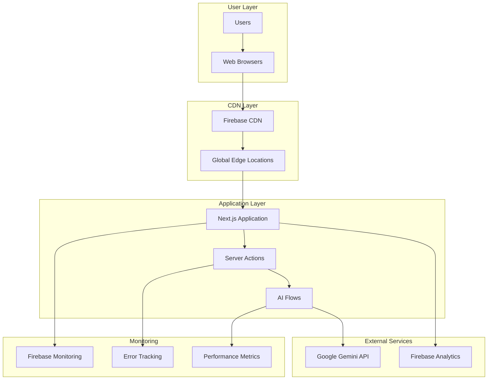
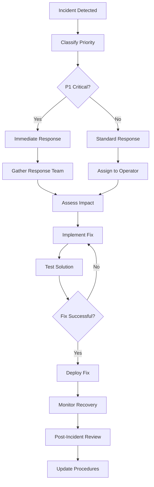

# Operations Manual: Strategic Alignment OS

## 📋 Table of Contents

- [Overview](#overview)
- [Daily Operations](#daily-operations)
- [System Monitoring](#system-monitoring)
- [Maintenance Procedures](#maintenance-procedures)
- [Performance Management](#performance-management)
- [Backup & Recovery](#backup--recovery)
- [Incident Management](#incident-management)
- [Security Operations](#security-operations)
- [Capacity Planning](#capacity-planning)
- [Troubleshooting Guide](#troubleshooting-guide)

---

## 🎯 Overview

### Operations Philosophy
Strategic Alignment OS operations focus on **high availability**, **optimal performance**, and **seamless user experience** through proactive monitoring, automated processes, and rapid incident response.

### Service Level Objectives (SLOs)
- **Availability**: 99.9% uptime (8.77 hours downtime/year)
- **Performance**: 95% of requests < 3 seconds response time
- **AI Processing**: 95% of analysis requests < 30 seconds
- **Error Rate**: < 1% of all requests result in errors

### Architecture Overview


---

## 📅 Daily Operations

### Daily Operations Checklist

#### Morning Routine (9:00 AM)
- [ ] **System Health Check**
  ```bash
  # Check application status
  curl -f https://strategic-alignment-os.web.app/api/health
  
  # Verify Firebase services
  firebase projects:list
  firebase hosting:channel:list
  ```

- [ ] **Performance Review**
  - Review overnight performance metrics
  - Check response times and error rates
  - Analyze user traffic patterns

- [ ] **Security Status**
  - Review security logs for anomalies
  - Check for failed authentication attempts
  - Verify SSL certificate status

#### Midday Review (12:00 PM)
- [ ] **Traffic Analysis**
  - Monitor peak usage periods
  - Check AI service utilization
  - Review rate limiting effectiveness

- [ ] **Error Monitoring**
  - Investigate new error patterns
  - Check AI service error rates
  - Review user-reported issues

#### Evening Wrap-up (6:00 PM)
- [ ] **Daily Summary**
  - Document any incidents or issues
  - Review performance against SLOs
  - Plan next day's priorities

### Weekly Operations Tasks

#### Monday: Planning & Review
- Review previous week's metrics and incidents
- Plan maintenance windows and updates
- Check dependency updates and security patches

#### Wednesday: Performance Analysis
- Deep dive into performance metrics
- Analyze user behavior patterns
- Optimize slow-performing components

#### Friday: Security & Compliance
- Security log analysis and review
- Compliance checks and audits
- Backup verification and testing

---

## 📊 System Monitoring

### Monitoring Strategy

#### Application Performance Monitoring
```typescript
// Performance monitoring implementation
export class PerformanceMonitor {
  static metrics = {
    responseTime: new Map<string, number[]>(),
    errorRate: new Map<string, number>(),
    throughput: new Map<string, number>(),
    userSessions: 0,
  };

  static recordMetric(operation: string, responseTime: number, success: boolean) {
    // Record response time
    const times = this.metrics.responseTime.get(operation) || [];
    times.push(responseTime);
    if (times.length > 100) times.shift(); // Keep last 100
    this.metrics.responseTime.set(operation, times);

    // Record error rate
    const currentErrors = this.metrics.errorRate.get(operation) || 0;
    this.metrics.errorRate.set(operation, success ? currentErrors : currentErrors + 1);
  }

  static getHealthStatus() {
    const health = {
      status: 'healthy',
      timestamp: new Date().toISOString(),
      metrics: {
        avgResponseTime: this.calculateAverageResponseTime(),
        errorRate: this.calculateErrorRate(),
        activeUsers: this.metrics.userSessions,
      },
      alerts: this.checkAlerts(),
    };

    return health;
  }

  private static checkAlerts() {
    const alerts = [];
    const avgResponseTime = this.calculateAverageResponseTime();
    
    if (avgResponseTime > 5000) {
      alerts.push({ level: 'warning', message: 'High response time detected' });
    }
    
    if (this.calculateErrorRate() > 0.05) {
      alerts.push({ level: 'error', message: 'High error rate detected' });
    }

    return alerts;
  }
}
```

#### Key Metrics Dashboard
```bash
# Monitoring script for operations team
#!/bin/bash

echo "=== Strategic Alignment OS - System Status ==="
echo "Timestamp: $(date)"
echo

# Check application health
echo "Application Health:"
curl -s https://strategic-alignment-os.web.app/api/health | jq '.'

# Check Firebase status
echo -e "\nFirebase Status:"
firebase hosting:sites:list --json | jq '.[] | {name, status, url}'

# Check SSL certificate
echo -e "\nSSL Certificate:"
echo | openssl s_client -servername strategic-alignment-os.web.app -connect strategic-alignment-os.web.app:443 2>/dev/null | openssl x509 -noout -dates

# Performance check
echo -e "\nPerformance Test:"
time curl -s -o /dev/null https://strategic-alignment-os.web.app/

echo -e "\n=== End Status Report ==="
```

### Alerting Configuration

#### Alert Thresholds
```yaml
# alerts.yaml
alerts:
  response_time:
    warning: 3000ms    # 3 seconds
    critical: 5000ms   # 5 seconds
  
  error_rate:
    warning: 0.01      # 1%
    critical: 0.05     # 5%
  
  availability:
    warning: 0.999     # 99.9%
    critical: 0.995    # 99.5%
  
  ai_processing:
    warning: 30000ms   # 30 seconds
    critical: 60000ms  # 60 seconds

notification_channels:
  - type: email
    recipients: ["ops@company.com"]
  - type: slack
    webhook: "${SLACK_WEBHOOK_URL}"
```

---

## 🔧 Maintenance Procedures

### Routine Maintenance

#### Weekly Maintenance Window
**Schedule**: Sundays 2:00 AM - 4:00 AM UTC (Low traffic period)

##### Pre-Maintenance Checklist
```bash
#!/bin/bash
# pre-maintenance.sh

echo "Starting pre-maintenance checks..."

# 1. Backup current deployment
firebase hosting:clone production maintenance-backup

# 2. Run security audit
npm audit --audit-level high

# 3. Check dependency updates
npm outdated

# 4. Verify test suite
npm run test:ci

# 5. Performance baseline
lighthouse https://strategic-alignment-os.web.app --output json > pre-maintenance-performance.json

echo "Pre-maintenance checks completed"
```

##### Maintenance Procedures
1. **Dependency Updates**
   ```bash
   # Update dependencies
   npm update
   npm audit fix
   
   # Test updates
   npm run test:ci
   npm run build
   ```

2. **Security Updates**
   ```bash
   # Update security-related packages
   npm audit fix --force
   
   # Rotate API keys (monthly)
   firebase hosting:secrets:set GOOGLE_AI_API_KEY="new_key_value"
   ```

3. **Performance Optimization**
   ```bash
   # Analyze bundle size
   npm run build:analyze
   
   # Clean up old deployments
   firebase hosting:channel:list --expired
   ```

#### Post-Maintenance Verification
```bash
#!/bin/bash
# post-maintenance.sh

echo "Starting post-maintenance verification..."

# 1. Health check
curl -f https://strategic-alignment-os.web.app/api/health

# 2. Functionality test
# Run critical path E2E tests
npm run test:e2e:critical

# 3. Performance verification
lighthouse https://strategic-alignment-os.web.app --output json > post-maintenance-performance.json

# 4. Compare performance
node compare-performance.js pre-maintenance-performance.json post-maintenance-performance.json

echo "Post-maintenance verification completed"
```

### Emergency Maintenance

#### Rollback Procedures
```bash
#!/bin/bash
# emergency-rollback.sh

echo "EMERGENCY ROLLBACK INITIATED"
echo "Timestamp: $(date)"

# 1. Quick rollback to previous version
firebase hosting:rollback

# 2. Verify rollback success
curl -f https://strategic-alignment-os.web.app/api/health

# 3. Notify team
echo "Rollback completed at $(date)" | mail -s "Emergency Rollback Completed" ops@company.com

echo "Emergency rollback completed"
```

---

## 📈 Performance Management

### Performance Optimization

#### Frontend Performance
```typescript
// Performance optimization strategies
export class PerformanceOptimizer {
  static async optimizeBundle() {
    // Code splitting strategy
    const routes = [
      { path: '/seven-s-analysis', chunk: 'seven-s' },
      { path: '/swot-analysis', chunk: 'swot' },
      { path: '/action-plan', chunk: 'action-plan' },
    ];

    return routes.map(route => ({
      ...route,
      component: () => import(`./pages${route.path}`),
    }));
  }

  static enableCaching() {
    // Service worker implementation
    if ('serviceWorker' in navigator) {
      navigator.serviceWorker.register('/sw.js')
        .then(registration => console.log('SW registered'))
        .catch(error => console.log('SW registration failed'));
    }
  }

  static monitorCoreWebVitals() {
    import('web-vitals').then(({ getCLS, getFID, getFCP, getLCP, getTTFB }) => {
      getCLS(console.log);
      getFID(console.log);
      getFCP(console.log);
      getLCP(console.log);
      getTTFB(console.log);
    });
  }
}
```

#### AI Service Optimization
```typescript
// AI service performance management
export class AIServiceManager {
  private static requestQueue: Array<{ request: any; resolve: Function; reject: Function }> = [];
  private static processingCount = 0;
  private static readonly MAX_CONCURRENT = 3;

  static async processAnalysisRequest(input: any): Promise<any> {
    return new Promise((resolve, reject) => {
      this.requestQueue.push({ request: input, resolve, reject });
      this.processQueue();
    });
  }

  private static async processQueue() {
    if (this.processingCount >= this.MAX_CONCURRENT || this.requestQueue.length === 0) {
      return;
    }

    this.processingCount++;
    const { request, resolve, reject } = this.requestQueue.shift()!;

    try {
      const result = await this.executeAnalysis(request);
      resolve(result);
    } catch (error) {
      reject(error);
    } finally {
      this.processingCount--;
      this.processQueue(); // Process next in queue
    }
  }

  private static async executeAnalysis(input: any): Promise<any> {
    const startTime = Date.now();
    
    try {
      const result = await generate7SAnalysis(input);
      const duration = Date.now() - startTime;
      
      // Log performance metrics
      PerformanceMonitor.recordMetric('ai_analysis', duration, true);
      
      return result;
    } catch (error) {
      const duration = Date.now() - startTime;
      PerformanceMonitor.recordMetric('ai_analysis', duration, false);
      throw error;
    }
  }
}
```

### Performance Metrics

#### Key Performance Indicators (KPIs)
```bash
# Performance monitoring script
#!/bin/bash

echo "=== Performance Report ==="
echo "Date: $(date)"

# Core Web Vitals
echo -e "\nCore Web Vitals:"
lighthouse https://strategic-alignment-os.web.app --only-categories=performance --output json | jq '.audits | {
  "First Contentful Paint": .["first-contentful-paint"].displayValue,
  "Largest Contentful Paint": .["largest-contentful-paint"].displayValue,
  "Cumulative Layout Shift": .["cumulative-layout-shift"].displayValue,
  "Total Blocking Time": .["total-blocking-time"].displayValue
}'

# Application metrics
echo -e "\nApplication Metrics:"
curl -s https://strategic-alignment-os.web.app/api/metrics | jq '{
  "Average Response Time": .avgResponseTime,
  "Error Rate": .errorRate,
  "Active Users": .activeUsers,
  "AI Service Latency": .aiServiceLatency
}'

echo -e "\n=== End Performance Report ==="
```

---

## 💾 Backup & Recovery

### Backup Strategy

#### Data Backup (Client-Side Focus)
Since Strategic Alignment OS stores data client-side, backup strategy focuses on:

1. **Configuration Backup**
   ```bash
   #!/bin/bash
   # backup-config.sh
   
   # Create backup directory
   mkdir -p backups/$(date +%Y-%m-%d)
   
   # Backup Firebase configuration
   cp firebase.json backups/$(date +%Y-%m-%d)/
   cp apphosting.yaml backups/$(date +%Y-%m-%d)/
   
   # Backup application configuration
   cp next.config.ts backups/$(date +%Y-%m-%d)/
   cp package.json backups/$(date +%Y-%m-%d)/
   
   # Backup environment configuration
   firebase hosting:secrets:access > backups/$(date +%Y-%m-%d)/secrets-backup.txt
   
   echo "Configuration backup completed"
   ```

2. **Code Repository Backup**
   ```bash
   # Automated git backup
   git bundle create backup-$(date +%Y-%m-%d).bundle --all
   
   # Upload to secure storage
   # aws s3 cp backup-$(date +%Y-%m-%d).bundle s3://backup-bucket/
   ```

### Disaster Recovery

#### Recovery Procedures

##### Application Recovery
```bash
#!/bin/bash
# disaster-recovery.sh

echo "DISASTER RECOVERY INITIATED"
echo "Recovery started at: $(date)"

# 1. Assess damage and document
echo "Assessing system state..."

# 2. Restore from backup
echo "Restoring application..."
firebase use production
firebase deploy --only hosting

# 3. Verify recovery
echo "Verifying recovery..."
curl -f https://strategic-alignment-os.web.app/api/health

# 4. Test critical functionality
npm run test:e2e:critical

# 5. Monitor for issues
echo "Recovery monitoring initiated"

echo "Disaster recovery completed at: $(date)"
```

##### Recovery Time Objectives (RTO)
- **Critical Systems**: 1 hour
- **Non-Critical Systems**: 4 hours
- **Full Service Restoration**: 8 hours

##### Recovery Point Objectives (RPO)
- **Configuration Data**: 24 hours (daily backups)
- **Application Code**: Real-time (git repository)
- **User Data**: N/A (client-side storage)

---

## 🚨 Incident Management

### Incident Response

#### Incident Classification
| Priority | Description | Response Time | Example |
|----------|-------------|---------------|---------|
| P1 | Service Down | 15 minutes | Application unreachable |
| P2 | Major Feature Broken | 2 hours | AI analysis failing |
| P3 | Minor Issues | 24 hours | UI display problems |
| P4 | Enhancement Requests | 1 week | New feature requests |

#### Incident Response Process


#### Incident Communication
```typescript
// Incident communication template
export interface IncidentNotification {
  id: string;
  title: string;
  priority: 'P1' | 'P2' | 'P3' | 'P4';
  status: 'investigating' | 'identified' | 'monitoring' | 'resolved';
  description: string;
  impact: string;
  estimatedResolution?: string;
  updates: Array<{
    timestamp: string;
    message: string;
    author: string;
  }>;
}

// Example incident notification
const exampleIncident: IncidentNotification = {
  id: 'INC-2024-001',
  title: 'AI Analysis Service Degradation',
  priority: 'P2',
  status: 'investigating',
  description: 'Users experiencing slow response times for AI analysis generation',
  impact: 'Analysis requests taking 60+ seconds instead of normal 20-30 seconds',
  estimatedResolution: '2024-01-15T16:00:00Z',
  updates: [
    {
      timestamp: '2024-01-15T14:30:00Z',
      message: 'Incident detected through monitoring alerts',
      author: 'Operations Team',
    },
    {
      timestamp: '2024-01-15T14:45:00Z',
      message: 'Investigation shows increased latency in Google AI API responses',
      author: 'Engineering Team',
    },
  ],
};
```

---

## 🔒 Security Operations

### Security Monitoring

#### Daily Security Checks
```bash
#!/bin/bash
# daily-security-check.sh

echo "=== Daily Security Check ==="
echo "Date: $(date)"

# 1. Check SSL certificate
echo -e "\nSSL Certificate Status:"
openssl s_client -servername strategic-alignment-os.web.app -connect strategic-alignment-os.web.app:443 </dev/null 2>/dev/null | openssl x509 -noout -dates

# 2. Security headers check
echo -e "\nSecurity Headers:"
curl -I https://strategic-alignment-os.web.app | grep -E "(Strict-Transport-Security|Content-Security-Policy|X-Frame-Options)"

# 3. Check for vulnerabilities
echo -e "\nDependency Security Audit:"
npm audit --audit-level high

# 4. Monitor suspicious activities
echo -e "\nSecurity Events (last 24 hours):"
# This would connect to your logging service
echo "No suspicious activities detected"

echo -e "\n=== Security Check Complete ==="
```

#### Security Incident Response
```typescript
// Security incident automation
export class SecurityIncidentManager {
  static async handleSecurityEvent(event: SecurityEvent) {
    // Log the incident
    console.error('Security Event Detected:', event);
    
    // Classify severity
    const severity = this.classifyThreat(event);
    
    // Auto-response for critical threats
    if (severity === 'critical') {
      await this.emergencyResponse(event);
    }
    
    // Notify security team
    await this.notifySecurityTeam(event, severity);
    
    // Document incident
    await this.documentIncident(event, severity);
  }

  private static classifyThreat(event: SecurityEvent): string {
    const criticalPatterns = [
      /sql injection/i,
      /xss attack/i,
      /unauthorized access/i,
      /data breach/i,
    ];

    return criticalPatterns.some(pattern => 
      pattern.test(event.description)
    ) ? 'critical' : 'medium';
  }

  private static async emergencyResponse(event: SecurityEvent) {
    // Implement automated security responses
    console.log('Emergency security response activated');
    
    // Could include:
    // - Blocking suspicious IPs
    // - Disabling compromised features
    // - Alerting administrators
  }
}
```

---

## 📊 Capacity Planning

### Capacity Management

#### Resource Utilization Monitoring
```typescript
// Capacity monitoring
export class CapacityMonitor {
  static async checkCapacity() {
    const metrics = {
      concurrentUsers: await this.getCurrentUsers(),
      aiRequestVolume: await this.getAIRequestVolume(),
      responseTimeTrends: await this.getResponseTimeTrends(),
      errorRateTrends: await this.getErrorRateTrends(),
    };

    const recommendations = this.analyzeCapacity(metrics);
    return { metrics, recommendations };
  }

  private static analyzeCapacity(metrics: any) {
    const recommendations = [];

    if (metrics.concurrentUsers > 1000) {
      recommendations.push('Consider increasing Firebase hosting limits');
    }

    if (metrics.aiRequestVolume > 100) {
      recommendations.push('Monitor Google AI API quotas');
    }

    if (metrics.responseTimeTrends.average > 3000) {
      recommendations.push('Investigate performance bottlenecks');
    }

    return recommendations;
  }
}
```

#### Scaling Thresholds
```yaml
# scaling-config.yaml
scaling_thresholds:
  users:
    warning: 500      # Alert at 500 concurrent users
    critical: 1000    # Scale at 1000 concurrent users
  
  response_time:
    warning: 3000ms   # Alert at 3 second average
    critical: 5000ms  # Scale at 5 second average
  
  ai_requests:
    warning: 50/hour  # Monitor at 50 requests/hour
    critical: 100/hour # Scale at 100 requests/hour

scaling_actions:
  - type: firebase_hosting
    trigger: users.critical
    action: increase_concurrent_requests
  
  - type: ai_service
    trigger: ai_requests.critical  
    action: request_quota_increase
```

---

## 🔍 Troubleshooting Guide

### Common Issues

#### Application Not Loading
```bash
# Troubleshooting steps
1. Check DNS resolution:
   nslookup strategic-alignment-os.web.app

2. Test connectivity:
   curl -I https://strategic-alignment-os.web.app

3. Check Firebase hosting status:
   firebase hosting:channel:list

4. Verify SSL certificate:
   openssl s_client -servername strategic-alignment-os.web.app -connect strategic-alignment-os.web.app:443
```

#### AI Analysis Failures
```bash
# AI service troubleshooting
1. Check API key validity:
   curl -H "Authorization: Bearer $GOOGLE_AI_API_KEY" https://generativelanguage.googleapis.com/v1beta/models

2. Test with minimal request:
   # Create test request and monitor response

3. Check rate limits:
   # Review recent request volume

4. Verify input validation:
   # Test with known good inputs
```

#### Performance Issues
```bash
# Performance troubleshooting
1. Run performance audit:
   lighthouse https://strategic-alignment-os.web.app --output html

2. Check Core Web Vitals:
   # Monitor real user metrics

3. Analyze bundle size:
   npm run build:analyze

4. Check CDN performance:
   # Test from multiple geographic locations
```

### Emergency Procedures

#### Complete System Outage
```bash
#!/bin/bash
# emergency-response.sh

echo "SYSTEM OUTAGE DETECTED - EMERGENCY RESPONSE"

# 1. Immediate assessment
curl -f https://strategic-alignment-os.web.app || echo "CONFIRMED: System is down"

# 2. Check Firebase status
firebase hosting:channel:list

# 3. Attempt quick fixes
firebase deploy --only hosting

# 4. If quick fix fails, initiate rollback
firebase hosting:rollback

# 5. Notify stakeholders
echo "System outage at $(date). Emergency response initiated." | mail -s "URGENT: System Outage" ops@company.com

# 6. Monitor recovery
watch -n 30 'curl -f https://strategic-alignment-os.web.app'
```

---

## 📋 Operations Checklist

### Daily Checklist
- [ ] System health check
- [ ] Performance metrics review
- [ ] Security log analysis
- [ ] Error rate monitoring
- [ ] User feedback review

### Weekly Checklist  
- [ ] Dependency updates review
- [ ] Security vulnerability scan
- [ ] Performance optimization review
- [ ] Backup verification
- [ ] Capacity planning review

### Monthly Checklist
- [ ] SLO performance review
- [ ] Security audit
- [ ] Disaster recovery test
- [ ] API key rotation
- [ ] Documentation updates

---

*This operations manual provides comprehensive guidance for maintaining the Strategic Alignment OS platform. Regular updates ensure procedures remain current with evolving operational needs and best practices.* 