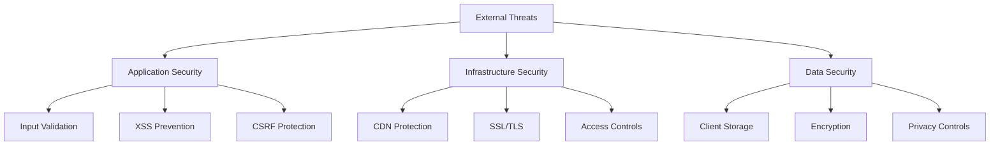

# Security Documentation: Strategic Alignment OS

## 📋 Table of Contents

- [Security Overview](#security-overview)
- [Architecture Security](#architecture-security)
- [Data Protection](#data-protection)
- [Application Security](#application-security)
- [Infrastructure Security](#infrastructure-security)
- [Incident Response](#incident-response)
- [Compliance & Privacy](#compliance--privacy)
- [Security Monitoring](#security-monitoring)

---

## 🎯 Security Overview

### Security Philosophy
Strategic Alignment OS implements a **privacy-first, client-side architecture** that minimizes data exposure and maximizes user privacy through **zero server-side data persistence** for user content.

### Core Security Principles
1. **Privacy by Design**: User data stored only in browser localStorage
2. **Defense in Depth**: Multiple security layers across all components
3. **Zero Trust**: All inputs validated and sanitized regardless of source
4. **Minimal Attack Surface**: Serverless architecture with limited exposure points

### Threat Model


---

## 🏗️ Architecture Security

### Security Layers

#### Layer 1: Network Security
- **TLS 1.3 Encryption**: All communications encrypted in transit
- **CDN Protection**: Firebase CDN with DDoS protection
- **HSTS Headers**: Enforce HTTPS connections
- **SSL Certificate Management**: Automatic renewal

#### Layer 2: Application Security
- **Input Validation**: Comprehensive Zod schema validation
- **Output Encoding**: Safe rendering with DOMPurify
- **CSRF Protection**: Built-in Next.js protection
- **Rate Limiting**: Request throttling per IP/session

#### Layer 3: Data Security
- **Client-Side Storage**: No server-side user data persistence
- **Data Encryption**: AES-256 encryption for sensitive data
- **Automatic Cleanup**: TTL-based data expiration
- **Privacy Controls**: User control over data deletion

---

## 🔐 Data Protection

### Data Classification Matrix
| Data Type | Storage | Encryption | Retention | Access |
|-----------|---------|------------|-----------|--------|
| User Analysis | Browser localStorage | AES-256 | 30 days | User only |
| System Logs | Firebase Logging | TLS in transit | 90 days | Admin only |
| API Keys | Firebase Secrets | Encrypted at rest | Indefinite | System only |
| Analytics | Firebase Analytics | Aggregated only | 14 months | Team access |

### Secure Storage Implementation
```typescript
// lib/secure-storage.ts
export class SecureStorage {
  private static readonly ENCRYPTION_KEY = this.generateKey();
  
  static setItem<T>(key: string, value: T, ttlHours: number = 24): boolean {
    try {
      const dataToStore = {
        timestamp: Date.now(),
        ttl: ttlHours * 60 * 60 * 1000,
        data: value,
      };
      
      const encrypted = CryptoJS.AES.encrypt(
        JSON.stringify(dataToStore), 
        this.ENCRYPTION_KEY
      ).toString();
      
      localStorage.setItem(key, encrypted);
      return true;
    } catch (error) {
      console.error('Storage encryption failed:', error);
      return false;
    }
  }

  static getItem<T>(key: string): T | null {
    try {
      const encrypted = localStorage.getItem(key);
      if (!encrypted) return null;

      const decrypted = CryptoJS.AES.decrypt(encrypted, this.ENCRYPTION_KEY);
      const storedData = JSON.parse(decrypted.toString(CryptoJS.enc.Utf8));

      // Check TTL
      if (Date.now() - storedData.timestamp > storedData.ttl) {
        this.removeItem(key);
        return null;
      }

      return storedData.data as T;
    } catch (error) {
      this.removeItem(key); // Clean up corrupted data
      return null;
    }
  }

  private static generateKey(): string {
    const fingerprint = [
      navigator.userAgent,
      navigator.language,
      screen.width + 'x' + screen.height,
    ].join('|');
    
    return CryptoJS.SHA256(fingerprint).toString();
  }
}
```

---

## 🛡️ Application Security

### Input Validation & Sanitization
```typescript
// Enhanced validation with security focus
export const SecureAnalysisInputSchema = z.object({
  strategy: z.string()
    .min(1, 'Required')
    .max(2000, 'Too long')
    .regex(/^[^<>]*$/, 'Invalid characters')
    .transform(value => value.trim()),
  // ... other fields
}).refine(data => {
  const totalLength = Object.values(data).join('').length;
  return totalLength <= 10000;
}, { message: 'Total input exceeds limit' });

// Content sanitization
export function sanitizeInput(input: string): string {
  return input
    .trim()
    .replace(/[<>]/g, '')
    .replace(/javascript:/gi, '')
    .slice(0, 2000);
}
```

### XSS Prevention
```typescript
// Content Security Policy
const securityHeaders = [
  {
    key: 'Content-Security-Policy',
    value: [
      "default-src 'self'",
      "script-src 'self' 'unsafe-eval'",
      "style-src 'self' 'unsafe-inline'",
      "connect-src 'self' https://generativelanguage.googleapis.com",
      "frame-ancestors 'none'",
    ].join('; '),
  },
  {
    key: 'X-Content-Type-Options',
    value: 'nosniff',
  },
  {
    key: 'X-Frame-Options',
    value: 'DENY',
  },
  {
    key: 'Strict-Transport-Security',
    value: 'max-age=31536000; includeSubDomains',
  },
];

// Safe content rendering
export function SafeMarkdown({ content }: { content: string }) {
  const sanitizedContent = DOMPurify.sanitize(marked(content), {
    ALLOWED_TAGS: ['h1', 'h2', 'h3', 'p', 'br', 'strong', 'em', 'ul', 'ol', 'li'],
    ALLOWED_ATTR: ['class'],
  });

  return <div dangerouslySetInnerHTML={{ __html: sanitizedContent }} />;
}
```

### Rate Limiting
```typescript
// Rate limiting implementation
interface RateLimitConfig {
  windowMs: number;
  maxRequests: number;
  blockDuration: number;
}

export class RateLimiter {
  private static limits = new Map([
    ['analysis', { windowMs: 60 * 60 * 1000, maxRequests: 5, blockDuration: 300000 }],
    ['default', { windowMs: 15 * 60 * 1000, maxRequests: 10, blockDuration: 60000 }],
  ]);

  private static requests = new Map<string, number[]>();
  private static blocked = new Map<string, number>();

  static checkLimit(identifier: string, operation: string = 'default'): boolean {
    const now = Date.now();
    const config = this.limits.get(operation)!;

    // Check if blocked
    const blockUntil = this.blocked.get(identifier);
    if (blockUntil && now < blockUntil) return false;

    // Clean old requests
    const userRequests = this.requests.get(identifier) || [];
    const validRequests = userRequests.filter(time => now - time < config.windowMs);

    if (validRequests.length >= config.maxRequests) {
      this.blocked.set(identifier, now + config.blockDuration);
      return false;
    }

    validRequests.push(now);
    this.requests.set(identifier, validRequests);
    return true;
  }
}
```

---

## 🏢 Infrastructure Security

### Firebase Security Configuration
```yaml
# firebase.rules
rules_version = '2';

service firebase.storage {
  match /b/{bucket}/o {
    match /{allPaths=**} {
      allow read, write: if false; // No file storage needed
    }
  }
}

service cloud.firestore {
  match /databases/{database}/documents {
    match /{document=**} {
      allow read, write: if false; // No Firestore needed
    }
  }
}
```

### API Key Security
```typescript
// Secret management
export class SecretManager {
  static async getSecret(name: string): Promise<string> {
    const secret = process.env[name];
    if (!secret) {
      throw new Error(`Secret ${name} not found`);
    }
    return secret;
  }

  static validateApiKey(apiKey: string): boolean {
    return /^[A-Za-z0-9_-]{39}$/.test(apiKey);
  }
}

// API request validation
export async function validateAPIRequest(request: Request): Promise<boolean> {
  const origin = request.headers.get('origin');
  const allowedOrigins = process.env.ALLOWED_ORIGINS?.split(',') || [];
  
  if (origin && !allowedOrigins.includes(origin)) {
    return false;
  }

  const contentLength = request.headers.get('content-length');
  if (contentLength && parseInt(contentLength) > 1024 * 1024) {
    return false; // 1MB limit
  }

  return true;
}
```

---

## 🚨 Incident Response

### Incident Classification
| Priority | Description | Response Time | Example |
|----------|-------------|---------------|---------|
| Critical | Data breach, service compromise | Immediate | Unauthorized access |
| High | Security vulnerability, attack attempt | 2 hours | XSS attempt, DDoS |
| Medium | Suspicious activity, failed requests | 24 hours | Rate limit exceeded |
| Low | Policy violations, minor issues | 72 hours | Invalid input attempts |

### Incident Response Procedures
```bash
#!/bin/bash
# incident-response.sh

echo "SECURITY INCIDENT DETECTED - $(date)"

# 1. Immediate containment
firebase hosting:disable  # If needed

# 2. Assessment
firebase functions:log --limit 100 > incident-logs.txt

# 3. Communication
echo "Security incident at $(date)" | mail -s "SECURITY ALERT" security@company.com

# 4. Documentation
echo "Incident Report - $(date)" > incident-report.txt
echo "Type: [TO BE FILLED]" >> incident-report.txt
echo "Impact: [TO BE FILLED]" >> incident-report.txt
```

### Automated Security Monitoring
```typescript
// Security event detection
export class SecurityMonitor {
  private static events: SecurityEvent[] = [];

  static logSecurityEvent(event: {
    type: string;
    severity: 'low' | 'medium' | 'high' | 'critical';
    details: any;
  }): void {
    const securityEvent = {
      ...event,
      timestamp: new Date().toISOString(),
      id: crypto.randomUUID(),
    };

    this.events.push(securityEvent);

    if (event.severity === 'critical' || event.severity === 'high') {
      this.triggerAlert(securityEvent);
    }

    console.log('Security Event:', securityEvent);
  }

  private static triggerAlert(event: SecurityEvent): void {
    // Send to monitoring service
    if (typeof window === 'undefined') {
      // Server-side alert
      console.error('SECURITY ALERT:', event);
    }
  }

  static getSecurityReport() {
    return {
      totalEvents: this.events.length,
      criticalEvents: this.events.filter(e => e.severity === 'critical').length,
      recentEvents: this.events.slice(-10),
    };
  }
}
```

---

## 📋 Compliance & Privacy

### GDPR Compliance
```typescript
// Privacy compliance manager
export class PrivacyManager {
  static recordConsent(consentData: {
    analytics: boolean;
    functional: boolean;
  }): void {
    const consent = {
      ...consentData,
      timestamp: new Date().toISOString(),
      version: '1.0',
    };

    SecureStorage.setItem('user-consent', consent, 24 * 365);
  }

  static processDataDeletionRequest(): void {
    // Clear all user data
    const keysToDelete = [
      'strategic-os-storage',
      'user-consent',
      'user-preferences',
    ];

    keysToDelete.forEach(key => {
      SecureStorage.removeItem(key);
    });

    localStorage.clear();
    sessionStorage.clear();
  }

  static generatePrivacyReport() {
    return {
      dataStored: Object.keys(localStorage),
      consentStatus: SecureStorage.getItem('user-consent'),
      retentionPeriods: {
        'analysis-data': '30 days',
        'user-preferences': '1 year',
      },
      dataProcessingPurposes: [
        'Providing strategic analysis services',
        'Improving user experience',
      ],
    };
  }
}
```

### Data Processing Agreement
```typescript
export const DataProcessingAgreement = {
  version: '1.0',
  lastUpdated: '2024-01-01',
  
  purposes: [
    'Providing strategic analysis services',
    'Improving service quality',
  ],
  
  legalBases: ['Legitimate interest', 'User consent'],
  
  dataTypes: [
    'Organizational analysis inputs',
    'Generated analysis results',
    'User preferences',
  ],
  
  retentionPeriods: {
    'analysis-data': '30 days',
    'user-preferences': '1 year',
  },
  
  recipients: ['Google AI services'],
  
  transfers: {
    'Google AI API': {
      country: 'United States',
      safeguards: 'Google Cloud security measures',
    },
  },
};
```

---

## 📊 Security Monitoring

### Daily Security Checks
```bash
#!/bin/bash
# daily-security-check.sh

echo "=== Daily Security Check - $(date) ==="

# SSL certificate check
openssl s_client -servername strategic-alignment-os.web.app \
  -connect strategic-alignment-os.web.app:443 </dev/null 2>/dev/null | \
  openssl x509 -noout -dates

# Security headers check
curl -I https://strategic-alignment-os.web.app | \
  grep -E "(Strict-Transport-Security|Content-Security-Policy|X-Frame-Options)"

# Dependency audit
npm audit --audit-level high

echo "=== Security Check Complete ==="
```

### Security Metrics Dashboard
```typescript
// Security dashboard component
export function SecurityDashboard() {
  const [metrics, setMetrics] = useState<any>(null);

  useEffect(() => {
    const report = SecurityMonitor.getSecurityReport();
    setMetrics(report);
  }, []);

  return (
    <div className="security-dashboard">
      <h2>Security Status</h2>
      
      <div className="metrics-grid">
        <div className="metric">
          <h3>Total Events</h3>
          <span>{metrics?.totalEvents || 0}</span>
        </div>
        
        <div className="metric critical">
          <h3>Critical Events</h3>
          <span>{metrics?.criticalEvents || 0}</span>
        </div>
      </div>

      <div className="recent-events">
        <h3>Recent Security Events</h3>
        {metrics?.recentEvents?.map((event: any, index: number) => (
          <div key={index} className={`event ${event.severity}`}>
            <span>{event.type}</span>
            <span>{event.timestamp}</span>
          </div>
        ))}
      </div>
    </div>
  );
}
```

---

## 🔧 Security Best Practices

### Development Security Guidelines
```typescript
// Security coding checklist

// ✅ Input Validation
function validateInput(input: unknown): boolean {
  return typeof input === 'string' && 
         input.length > 0 && 
         input.length <= 2000 &&
         !/[<>]/.test(input);
}

// ✅ Output Encoding
function safeRender(content: string): string {
  return DOMPurify.sanitize(content);
}

// ✅ Error Handling
function handleError(error: Error): void {
  SecurityMonitor.logSecurityEvent({
    type: 'application_error',
    severity: 'medium',
    details: { message: error.message },
  });
}

// ✅ Secret Management
function getApiKey(): string {
  const apiKey = process.env.GOOGLE_AI_API_KEY;
  if (!apiKey) {
    throw new Error('API key not configured');
  }
  return apiKey;
}
```

### Security Review Checklist
**Pre-deployment Security:**
- [ ] All inputs validated and sanitized
- [ ] Output properly encoded (XSS prevention)
- [ ] No hardcoded secrets
- [ ] Error handling doesn't expose sensitive info
- [ ] Rate limiting implemented
- [ ] CSP configured and tested
- [ ] HTTPS enforced with security headers
- [ ] Dependencies scanned for vulnerabilities

### Emergency Contacts
```yaml
Security Team:
  Primary: security@company.com
  Phone: +1-XXX-XXX-XXXX
  
Technical Team:
  CTO: cto@company.com
  Lead Dev: dev-lead@company.com
  
External:
  Security Consultant: consultant@firm.com
  Legal: legal@lawfirm.com
```

---

*This security documentation provides essential protection guidelines for the Strategic Alignment OS platform. Regular security reviews and updates ensure protection against evolving threats.* 