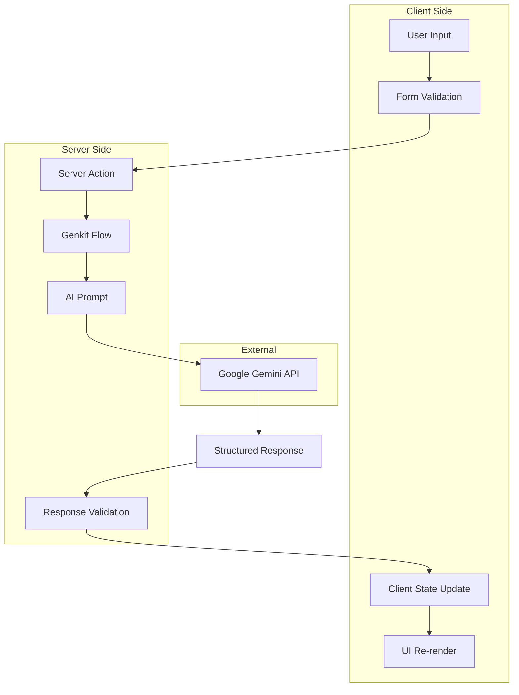

# Technical Specification: Strategic Alignment OS

## 📋 Document Overview

**Project:** Strategic Alignment OS (7S Analyzer)  
**Version:** 1.0  
**Date:** 2024  
**Technical Lead:** [Tech Lead Name]  
**Document Status:** Draft  

---

## 🎯 Technical Overview

### System Architecture Summary
The Strategic Alignment OS is built as a modern, serverless Next.js application with AI-powered analysis capabilities. The system leverages Google's Genkit framework for AI operations and maintains a client-side architecture for data privacy and scalability.

### Core Technology Decisions
- **Frontend Framework**: Next.js 15.3.3 with App Router for optimal performance and SEO
- **AI Framework**: Google Genkit for structured AI operations and prompt management
- **State Management**: Zustand for lightweight, performant client-side state
- **Hosting**: Firebase App Hosting for serverless deployment and global CDN
- **Language**: TypeScript for type safety and developer experience

---

## 🏗️ System Architecture

### Architecture Patterns
- **JAMstack Architecture**: JavaScript, APIs, and Markup for performance and security
- **Component-Based Design**: Modular React components with clear separation of concerns
- **Server Actions Pattern**: Next.js server actions for secure AI operations
- **Client-Side State Management**: Browser-only data persistence for privacy

### Data Flow Architecture



---

## 🔧 Technical Implementation

### Frontend Implementation

#### Component Architecture
```typescript
// Component Hierarchy
src/
├── app/                          # Next.js App Router
│   ├── (dashboard)/             # Route groups
│   │   ├── layout.tsx           # Dashboard layout
│   │   ├── dashboard/page.tsx   # Dashboard home
│   │   ├── seven-s-analysis/    # 7S analysis feature
│   │   ├── swot-analysis/       # SWOT analysis feature
│   │   └── action-plan/         # Action planning feature
│   ├── actions.ts               # Server actions
│   ├── globals.css              # Global styles
│   └── layout.tsx               # Root layout
├── components/                  # Reusable components
│   ├── layout/                  # Layout components
│   ├── ui/                      # Base UI components (shadcn)
│   └── markdown.tsx             # Markdown renderer
├── lib/                         # Utilities and configuration
│   ├── store.ts                 # Zustand state management
│   ├── types.ts                 # TypeScript definitions
│   └── utils.ts                 # Utility functions
└── hooks/                       # Custom React hooks
```

#### State Management Specification
```typescript
// Zustand Store Interface
interface AppState {
  // Analysis Results
  analysisResult: Generate7SAnalysisOutput | null;
  swotResult: GenerateSwotAnalysisOutput | null;
  
  // Goal Management
  goals: Goal[];
  
  // State Actions
  setAnalysisResult: (result: Generate7SAnalysisOutput | null) => void;
  setSwotResult: (result: GenerateSwotAnalysisOutput | null) => void;
  addGoal: (goal: Goal) => void;
  removeGoal: (index: number) => void;
  updateGoal: (index: number, goal: Goal) => void;
}

// Persistence Configuration
const persistConfig = {
  name: 'strategic-os-storage',
  storage: createJSONStorage(() => localStorage),
  partialize: (state) => ({
    analysisResult: state.analysisResult,
    swotResult: state.swotResult,
    goals: state.goals,
  }),
};
```

### Backend/AI Implementation

#### Server Actions Specification
```typescript
// Server Action Signatures
export async function generateAnalysis(
  input: Generate7SAnalysisInput
): Promise<Generate7SAnalysisOutput>;

export async function refineAnalysis(
  input: Refine7SAnalysisInput
): Promise<Refine7SAnalysisOutput>;

export async function getTemplate(
  input: PromptFromTemplateInput
): Promise<PromptFromTemplateOutput>;

export async function generateSwotAnalysis(
  input: GenerateSwotAnalysisInput
): Promise<GenerateSwotAnalysisOutput>;
```

#### AI Flow Architecture
```typescript
// Genkit Flow Configuration
export const ai = genkit({
  plugins: [googleAI()],
  model: 'googleai/gemini-2.0-flash',
  telemetry: {
    instrumentation: 'googleai',
    logger: 'genkit',
  },
});

// Flow Definition Pattern
const flowDefinition = ai.defineFlow({
  name: 'flowName',
  inputSchema: InputSchema,
  outputSchema: OutputSchema,
}, async (input) => {
  const { output } = await promptDefinition(input);
  return output;
});
```

#### Prompt Engineering Specification
```typescript
// Prompt Structure
const promptDefinition = ai.definePrompt({
  name: 'promptName',
  input: { schema: InputSchema },
  output: { schema: OutputSchema },
  prompt: `
    System Context: [Role and expertise definition]
    
    Task Definition: [Specific task requirements]
    
    Input Data: [Structured input presentation]
    
    Output Requirements: [Format and structure specifications]
    
    Quality Criteria: [Success metrics and validation]
  `,
});
```

---

## 📊 Data Models & Schemas

### Core Data Types

#### 7S Framework Models
```typescript
// Input Schema
export const Generate7SAnalysisInputSchema = z.object({
  strategy: z.string().min(1).max(2000),
  structure: z.string().min(1).max(2000),
  systems: z.string().min(1).max(2000),
  sharedValues: z.string().min(1).max(2000),
  style: z.string().min(1).max(2000),
  staff: z.string().min(1).max(2000),
  skills: z.string().min(1).max(2000),
});

// Output Schema
export const Generate7SAnalysisOutputSchema = z.object({
  analysis: z.string().describe('Markdown-formatted analysis'),
  recommendations: z.array(RecommendationSchema),
  chartData: z.array(ChartDataPointSchema),
});

// Recommendation Schema
export const RecommendationSchema = z.object({
  recommendation: z.string().min(10).max(500),
  priority: z.enum(['High', 'Medium', 'Low']),
});

// Chart Data Schema
export const ChartDataPointSchema = z.object({
  name: z.string(),
  score: z.number().min(0).max(100),
});
```

#### SWOT Analysis Models
```typescript
export const GenerateSwotAnalysisInputSchema = z.object({
  strengths: z.string().min(1).max(2000),
  weaknesses: z.string().min(1).max(2000),
  opportunities: z.string().min(1).max(2000),
  threats: z.string().min(1).max(2000),
});

export const GenerateSwotAnalysisOutputSchema = z.object({
  analysis: z.string().describe('Comprehensive SWOT analysis in markdown'),
});
```

#### Goal Management Models
```typescript
export interface Goal {
  id: string;
  title: string;
  priority: 'High' | 'Medium' | 'Low';
  actions: ActionItem[];
  createdAt?: Date;
  updatedAt?: Date;
}

export interface ActionItem {
  id: string;
  task: string;
  completed: boolean;
  createdAt?: Date;
  completedAt?: Date;
}
```

---

## 🔌 API Specifications

### Internal API Design

#### Server Actions Interface
```typescript
// Type-safe server action definitions
type ServerActionResult<T> = Promise<T>;

interface APIError {
  code: string;
  message: string;
  details?: any;
}

// Error handling wrapper
export async function withErrorHandling<T>(
  action: () => Promise<T>
): Promise<T | APIError> {
  try {
    return await action();
  } catch (error) {
    return {
      code: 'INTERNAL_ERROR',
      message: error instanceof Error ? error.message : 'Unknown error',
      details: error,
    };
  }
}
```

#### Request/Response Patterns
```typescript
// Standard Response Wrapper
interface APIResponse<T> {
  success: boolean;
  data?: T;
  error?: APIError;
  timestamp: string;
}

// Analysis Request Flow
const analysisFlow = async (input: SevenSInput) => {
  const validatedInput = inputSchema.parse(input);
  const result = await aiFlow(validatedInput);
  const validatedOutput = outputSchema.parse(result);
  return validatedOutput;
};
```

### External API Integration

#### Google AI Integration
```typescript
// AI Service Configuration
const aiConfig = {
  model: 'googleai/gemini-2.0-flash',
  apiKey: process.env.GOOGLE_AI_API_KEY,
  timeout: 30000,
  retryConfig: {
    maxRetries: 3,
    retryDelay: 1000,
    exponentialBackoff: true,
  },
};

// Request Monitoring
interface AIRequestMetrics {
  requestId: string;
  timestamp: Date;
  duration: number;
  tokenUsage: {
    input: number;
    output: number;
  };
  success: boolean;
  error?: string;
}
```

---

## 🎨 UI/UX Implementation

### Design System Specification

#### Component Library Structure
```typescript
// Base Component Props
interface BaseComponentProps {
  className?: string;
  children?: React.ReactNode;
  'data-testid'?: string;
}

// Button Component Variants
const buttonVariants = cva(
  "inline-flex items-center justify-center rounded-md text-sm font-medium",
  {
    variants: {
      variant: {
        default: "bg-primary text-primary-foreground hover:bg-primary/90",
        destructive: "bg-destructive text-destructive-foreground hover:bg-destructive/90",
        outline: "border border-input bg-background hover:bg-accent",
        secondary: "bg-secondary text-secondary-foreground hover:bg-secondary/80",
        ghost: "hover:bg-accent hover:text-accent-foreground",
        link: "text-primary underline-offset-4 hover:underline",
      },
      size: {
        default: "h-10 px-4 py-2",
        sm: "h-9 rounded-md px-3",
        lg: "h-11 rounded-md px-8",
        icon: "h-10 w-10",
      },
    },
    defaultVariants: {
      variant: "default",
      size: "default",
    },
  }
);
```

#### Responsive Design Implementation
```css
/* Tailwind Responsive Breakpoints */
/* sm: 640px */
/* md: 768px */
/* lg: 1024px */
/* xl: 1280px */
/* 2xl: 1536px */

/* Grid Layout Patterns */
.dashboard-grid {
  @apply grid grid-cols-1 gap-4 md:grid-cols-2 lg:grid-cols-3;
}

.analysis-layout {
  @apply grid grid-cols-1 gap-8 lg:grid-cols-5;
}

.form-section {
  @apply lg:col-span-2;
}

.results-section {
  @apply lg:col-span-3;
}
```

### Chart Implementation Specification
```typescript
// Recharts Configuration
interface ChartConfig {
  score: {
    label: string;
    color: string;
  };
}

// Radar Chart Component
const AlignmentChart: React.FC<{
  data: ChartDataPoint[];
  config: ChartConfig;
}> = ({ data, config }) => (
  <ChartContainer config={config} className="mx-auto aspect-square h-[350px]">
    <RadarChart data={data}>
      <ChartTooltip 
        cursor={false} 
        content={<ChartTooltipContent indicator="line" />} 
      />
      <PolarAngleAxis dataKey="name" />
      <PolarGrid />
      <Radar
        dataKey="score"
        fill="hsl(var(--primary))"
        fillOpacity={0.6}
        stroke="hsl(var(--primary))"
      />
    </RadarChart>
  </ChartContainer>
);
```

---

## 🔒 Security Implementation

### Data Security Measures

#### Client-Side Security
```typescript
// Input Sanitization
const sanitizeInput = (input: string): string => {
  return input
    .trim()
    .replace(/<script\b[^<]*(?:(?!<\/script>)<[^<]*)*<\/script>/gi, '')
    .replace(/javascript:/gi, '')
    .slice(0, 2000); // Enforce length limits
};

// XSS Prevention
const SecureMarkdown: React.FC<{ content: string }> = ({ content }) => {
  const sanitizedContent = DOMPurify.sanitize(content);
  return <ReactMarkdown>{sanitizedContent}</ReactMarkdown>;
};
```

#### Server-Side Security
```typescript
// Rate Limiting Implementation
const rateLimiter = rateLimit({
  windowMs: 15 * 60 * 1000, // 15 minutes
  max: 100, // Limit each IP to 100 requests per windowMs
  message: 'Too many requests from this IP',
});

// Environment Variable Validation
const envSchema = z.object({
  GOOGLE_AI_API_KEY: z.string().min(1),
  NODE_ENV: z.enum(['development', 'production', 'test']),
});

const env = envSchema.parse(process.env);
```

### Privacy Implementation
```typescript
// Data Retention Policy
interface DataRetentionConfig {
  analysisResults: number; // Days to retain in localStorage
  goals: number;
  userPreferences: number;
}

const retentionConfig: DataRetentionConfig = {
  analysisResults: 30,
  goals: 90,
  userPreferences: 365,
};

// Privacy-First Storage
const privacyStorage = {
  set: (key: string, value: any, ttl: number) => {
    const item = {
      value,
      timestamp: Date.now(),
      ttl: ttl * 24 * 60 * 60 * 1000, // Convert days to ms
    };
    localStorage.setItem(key, JSON.stringify(item));
  },
  
  get: (key: string) => {
    const item = localStorage.getItem(key);
    if (!item) return null;
    
    const parsed = JSON.parse(item);
    if (Date.now() - parsed.timestamp > parsed.ttl) {
      localStorage.removeItem(key);
      return null;
    }
    
    return parsed.value;
  },
};
```

---

## ⚡ Performance Optimization

### Frontend Performance

#### Code Splitting Strategy
```typescript
// Dynamic imports for route-based splitting
const SevenSAnalysis = dynamic(() => import('./seven-s-analysis/page'), {
  loading: () => <AnalysisPageSkeleton />,
});

const SwotAnalysis = dynamic(() => import('./swot-analysis/page'), {
  loading: () => <SwotPageSkeleton />,
});

// Component-level splitting for heavy components
const ChartComponent = dynamic(() => import('@/components/chart'), {
  ssr: false,
  loading: () => <ChartSkeleton />,
});
```

#### Bundle Optimization
```typescript
// next.config.ts optimization
const nextConfig: NextConfig = {
  experimental: {
    optimizePackageImports: ['lucide-react', '@radix-ui/react-icons'],
  },
  compiler: {
    removeConsole: process.env.NODE_ENV === 'production',
  },
  images: {
    formats: ['image/webp', 'image/avif'],
  },
};
```

#### Caching Strategy
```typescript
// Service Worker for caching
const CACHE_NAME = 'strategic-os-v1';
const STATIC_ASSETS = [
  '/',
  '/dashboard',
  '/seven-s-analysis',
  '/swot-analysis',
  '/action-plan',
];

// Cache-first strategy for static assets
self.addEventListener('fetch', (event) => {
  if (STATIC_ASSETS.includes(new URL(event.request.url).pathname)) {
    event.respondWith(
      caches.match(event.request)
        .then(response => response || fetch(event.request))
    );
  }
});
```

### Backend Performance

#### AI Request Optimization
```typescript
// Request deduplication
const requestCache = new Map<string, Promise<any>>();

const dedupedRequest = async (key: string, fn: () => Promise<any>) => {
  if (requestCache.has(key)) {
    return requestCache.get(key);
  }
  
  const promise = fn();
  requestCache.set(key, promise);
  
  // Clean up after completion
  promise.finally(() => {
    setTimeout(() => requestCache.delete(key), 5000);
  });
  
  return promise;
};

// Timeout handling
const withTimeout = <T>(promise: Promise<T>, timeoutMs: number): Promise<T> => {
  return Promise.race([
    promise,
    new Promise<never>((_, reject) =>
      setTimeout(() => reject(new Error('Request timeout')), timeoutMs)
    ),
  ]);
};
```

---

## 🏗️ Build & Deployment

### Build Configuration

#### Next.js Configuration
```typescript
// next.config.ts
const nextConfig: NextConfig = {
  typescript: {
    ignoreBuildErrors: false, // Strict type checking
  },
  eslint: {
    ignoreDuringBuilds: false, // Enforce linting
  },
  experimental: {
    typedRoutes: true, // Type-safe routing
    serverActions: true, // Enable server actions
  },
  env: {
    CUSTOM_KEY: process.env.CUSTOM_KEY,
  },
};
```

#### Build Optimization
```json
{
  "scripts": {
    "build": "next build",
    "build:analyze": "ANALYZE=true next build",
    "build:production": "NODE_ENV=production next build",
    "type-check": "tsc --noEmit",
    "lint:check": "next lint",
    "test:build": "npm run type-check && npm run lint:check && npm run build"
  }
}
```

### Deployment Architecture

#### Firebase App Hosting Configuration
```yaml
# apphosting.yaml
runConfig:
  cpu: 1
  memoryMiB: 512
  minInstances: 0
  maxInstances: 10
  concurrency: 100

env:
  - variable: NODE_ENV
    value: production
  - variable: GOOGLE_AI_API_KEY
    secret: google-ai-api-key

buildConfig:
  runtime: nodejs18
  buildCommand: npm run build
  outputDir: .next
```

#### Environment Management
```bash
# Environment Variables
GOOGLE_AI_API_KEY=your_api_key_here
NODE_ENV=production
NEXT_PUBLIC_APP_URL=https://your-app.web.app
GENKIT_ENV=prod
```

---

## 📊 Monitoring & Observability

### Application Monitoring

#### Error Tracking
```typescript
// Error boundary implementation
class ErrorBoundary extends React.Component {
  constructor(props) {
    super(props);
    this.state = { hasError: false };
  }

  static getDerivedStateFromError(error) {
    return { hasError: true };
  }

  componentDidCatch(error, errorInfo) {
    console.error('Application error:', error, errorInfo);
    // Send to monitoring service
    this.trackError(error, errorInfo);
  }

  trackError(error: Error, errorInfo: any) {
    // Integration with monitoring service
    if (typeof window !== 'undefined') {
      // Client-side error tracking
      window.gtag?.('event', 'exception', {
        description: error.message,
        fatal: false,
      });
    }
  }
}
```

#### Performance Monitoring
```typescript
// Web Vitals tracking
import { getCLS, getFID, getFCP, getLCP, getTTFB } from 'web-vitals';

const sendToAnalytics = (metric) => {
  // Send metrics to analytics service
  console.log(metric);
};

getCLS(sendToAnalytics);
getFID(sendToAnalytics);
getFCP(sendToAnalytics);
getLCP(sendToAnalytics);
getTTFB(sendToAnalytics);
```

### AI Operations Monitoring
```typescript
// AI request metrics
interface AIMetrics {
  requestId: string;
  operation: string;
  inputTokens: number;
  outputTokens: number;
  latency: number;
  success: boolean;
  error?: string;
}

const trackAIRequest = (metrics: AIMetrics) => {
  console.log('AI Request:', metrics);
  // Send to monitoring dashboard
};
```

---

## 🔧 Development Tools

### Development Environment Setup

#### Required Tools
```json
{
  "engines": {
    "node": ">=18.0.0",
    "npm": ">=8.0.0"
  },
  "devDependencies": {
    "@types/node": "^20",
    "@types/react": "^18",
    "@types/react-dom": "^18",
    "typescript": "^5",
    "eslint": "^8",
    "prettier": "^3",
    "genkit-cli": "^1.14.1"
  }
}
```

#### VS Code Configuration
```json
// .vscode/settings.json
{
  "typescript.preferences.importModuleSpecifier": "relative",
  "editor.formatOnSave": true,
  "editor.defaultFormatter": "esbenp.prettier-vscode",
  "editor.codeActionsOnSave": {
    "source.fixAll.eslint": true
  },
  "files.exclude": {
    "**/.next": true,
    "**/node_modules": true
  }
}
```

### Code Quality Tools

#### ESLint Configuration
```json
{
  "extends": [
    "next/core-web-vitals",
    "@typescript-eslint/recommended",
    "prettier"
  ],
  "rules": {
    "@typescript-eslint/no-unused-vars": "error",
    "@typescript-eslint/no-explicit-any": "warn",
    "prefer-const": "error",
    "no-console": "warn"
  }
}
```

#### Prettier Configuration
```json
{
  "semi": true,
  "trailingComma": "es5",
  "singleQuote": true,
  "printWidth": 80,
  "tabWidth": 2,
  "useTabs": false
}
```

---

## 📚 Technical Dependencies

### Core Dependencies
```json
{
  "dependencies": {
    "next": "15.3.3",
    "react": "^18.3.1",
    "react-dom": "^18.3.1",
    "typescript": "^5",
    "genkit": "^1.14.1",
    "@genkit-ai/googleai": "^1.14.1",
    "zustand": "^4.5.4",
    "zod": "^3.24.2",
    "tailwindcss": "^3.4.1",
    "lucide-react": "^0.475.0",
    "recharts": "^2.15.1"
  }
}
```

### Dependency Management Strategy
- **Major Version Updates**: Quarterly review and testing
- **Security Updates**: Immediate application and testing
- **Patch Updates**: Bi-weekly automated updates
- **Lock File Management**: Commit package-lock.json for reproducible builds

---

*This technical specification serves as the definitive guide for implementing, maintaining, and extending the Strategic Alignment OS platform. Regular updates ensure alignment with evolving requirements and technology standards.* 