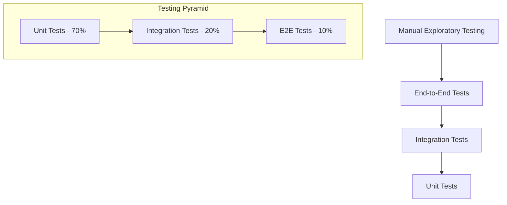

# Testing Strategy: Strategic Alignment OS

## 📋 Document Overview

**Project:** Strategic Alignment OS (7S Analyzer)  
**Version:** 1.0  
**Date:** 2024  
**QA Lead:** [QA Lead Name]  
**Document Status:** Active  

---

## 🎯 Testing Overview

### Testing Philosophy
Our testing strategy ensures **reliability**, **performance**, and **user satisfaction** through comprehensive automated and manual testing approaches. We follow a risk-based testing methodology that prioritizes critical user journeys and business-critical functionality.

### Testing Objectives
1. **Functional Validation**: Ensure all features work as specified
2. **AI Quality Assurance**: Validate AI-generated content quality and consistency
3. **Performance Optimization**: Maintain fast response times and smooth UX
4. **Cross-Platform Compatibility**: Support all target browsers and devices
5. **Security Validation**: Protect user data and prevent vulnerabilities

---

## 🏗️ Testing Pyramid Strategy

### Testing Pyramid Implementation



#### Layer 1: Unit Testing (70% of tests)
**Scope**: Individual functions, components, and modules
**Tools**: Jest, React Testing Library
**Coverage Target**: 80% line coverage

**Test Categories:**
- Pure function testing (utilities, helpers)
- Component unit tests (props, state, events)
- Hook testing (custom hooks behavior)
- Service function testing (API calls, data transformation)

#### Layer 2: Integration Testing (20% of tests)  
**Scope**: Feature workflows and component interactions
**Tools**: Jest, React Testing Library, MSW (Mock Service Worker)
**Coverage Target**: Critical user paths

**Test Categories:**
- Form submission workflows
- AI service integration
- State management integration
- Component interaction patterns

#### Layer 3: End-to-End Testing (10% of tests)
**Scope**: Complete user journeys
**Tools**: Playwright
**Coverage Target**: Primary user flows

**Test Categories:**
- Complete analysis workflows
- Cross-browser compatibility
- Performance validation
- Visual regression testing

---

## 🧪 Test Types & Implementation

### Unit Testing Strategy

#### Component Testing Standards
```typescript
// Example: Button component test
import { render, screen, fireEvent } from '@testing-library/react';
import { Button } from '@/components/ui/button';

describe('Button Component', () => {
  it('renders with correct text', () => {
    render(<Button>Click me</Button>);
    expect(screen.getByRole('button', { name: 'Click me' })).toBeInTheDocument();
  });

  it('handles click events', () => {
    const handleClick = jest.fn();
    render(<Button onClick={handleClick}>Click me</Button>);
    
    fireEvent.click(screen.getByRole('button'));
    expect(handleClick).toHaveBeenCalledTimes(1);
  });

  it('applies variant styles correctly', () => {
    render(<Button variant="destructive">Delete</Button>);
    expect(screen.getByRole('button')).toHaveClass('bg-destructive');
  });

  it('handles disabled state', () => {
    render(<Button disabled>Disabled</Button>);
    expect(screen.getByRole('button')).toBeDisabled();
  });
});
```

#### Hook Testing Patterns
```typescript
// Example: Custom hook test
import { renderHook, act } from '@testing-library/react';
import { useAppStore } from '@/lib/store';

describe('useAppStore Hook', () => {
  it('should set analysis result', () => {
    const { result } = renderHook(() => useAppStore());
    const mockAnalysis = { analysis: 'Test', recommendations: [], chartData: [] };

    act(() => {
      result.current.setAnalysisResult(mockAnalysis);
    });

    expect(result.current.analysisResult).toEqual(mockAnalysis);
  });

  it('should add goal to store', () => {
    const { result } = renderHook(() => useAppStore());
    const mockGoal = { id: '1', title: 'Test Goal', priority: 'High', actions: [] };

    act(() => {
      result.current.addGoal(mockGoal);
    });

    expect(result.current.goals).toContain(mockGoal);
  });
});
```

#### Service Function Testing
```typescript
// Example: Server action test
import { generateAnalysis } from '@/app/actions';
import { mockSevenSInput, mockAIResponse } from '@/test/fixtures';

// Mock the AI service
jest.mock('@/ai/flows/generate-7s-analysis', () => ({
  generate7SAnalysis: jest.fn(),
}));

describe('generateAnalysis Server Action', () => {
  beforeEach(() => {
    jest.clearAllMocks();
  });

  it('should return valid analysis for valid input', async () => {
    const mockGenerate7SAnalysis = require('@/ai/flows/generate-7s-analysis').generate7SAnalysis;
    mockGenerate7SAnalysis.mockResolvedValue(mockAIResponse);

    const result = await generateAnalysis(mockSevenSInput);

    expect(result).toEqual(mockAIResponse);
    expect(mockGenerate7SAnalysis).toHaveBeenCalledWith(mockSevenSInput);
  });

  it('should handle AI service errors', async () => {
    const mockGenerate7SAnalysis = require('@/ai/flows/generate-7s-analysis').generate7SAnalysis;
    mockGenerate7SAnalysis.mockRejectedValue(new Error('AI service unavailable'));

    await expect(generateAnalysis(mockSevenSInput)).rejects.toThrow('AI service unavailable');
  });
});
```

### Integration Testing Strategy

#### Feature Workflow Testing
```typescript
// Example: 7S Analysis workflow test
import { render, screen, fireEvent, waitFor } from '@testing-library/react';
import userEvent from '@testing-library/user-event';
import { SevenSAnalysisPage } from '@/app/(dashboard)/seven-s-analysis/page';
import { AppStateProvider } from '@/lib/state-provider';

// Mock server actions
jest.mock('@/app/actions', () => ({
  generateAnalysis: jest.fn(),
  getTemplate: jest.fn(),
}));

describe('7S Analysis Integration', () => {
  const renderWithProvider = (ui: React.ReactElement) => {
    return render(
      <AppStateProvider>
        {ui}
      </AppStateProvider>
    );
  };

  it('should complete template-based analysis workflow', async () => {
    const user = userEvent.setup();
    const mockActions = require('@/app/actions');
    
    // Mock template data
    mockActions.getTemplate.mockResolvedValue({
      strategy: 'Growth strategy',
      structure: 'Flat organization',
      // ... other template fields
    });

    // Mock analysis result
    mockActions.generateAnalysis.mockResolvedValue({
      analysis: '# Analysis Results',
      recommendations: [
        { recommendation: 'Improve team structure', priority: 'High' }
      ],
      chartData: [
        { name: 'Strategy', score: 85 },
        { name: 'Structure', score: 70 },
        // ... other elements
      ]
    });

    renderWithProvider(<SevenSAnalysisPage />);

    // Select template
    await user.selectOptions(
      screen.getByDisplayValue('Select a business type'),
      'tech-startup'
    );

    // Wait for template to load
    await waitFor(() => {
      expect(screen.getByDisplayValue('Growth strategy')).toBeInTheDocument();
    });

    // Customize input
    await user.clear(screen.getByLabelText(/strategy/i));
    await user.type(screen.getByLabelText(/strategy/i), 'AI-first platform');

    // Submit analysis
    await user.click(screen.getByText('Generate 7-S Analysis'));

    // Wait for analysis to complete
    await waitFor(() => {
      expect(screen.getByText('Recommended Goals')).toBeInTheDocument();
    }, { timeout: 10000 });

    // Verify results display
    expect(screen.getByText('Improve team structure')).toBeInTheDocument();
    expect(screen.getByText('High')).toBeInTheDocument();
  });
});
```

#### State Management Integration Testing
```typescript
// Example: Zustand store integration test
import { renderHook, act } from '@testing-library/react';
import { useAppStore } from '@/lib/store';
import { AppStateProvider } from '@/lib/state-provider';

describe('Store Integration', () => {
  const wrapper = ({ children }: { children: React.ReactNode }) => (
    <AppStateProvider>{children}</AppStateProvider>
  );

  it('should persist state to localStorage', () => {
    const { result } = renderHook(() => useAppStore(), { wrapper });
    const mockGoal = { id: '1', title: 'Test', priority: 'High', actions: [] };

    act(() => {
      result.current.addGoal(mockGoal);
    });

    // Check localStorage persistence
    const stored = localStorage.getItem('strategic-os-storage');
    expect(stored).toBeTruthy();
    
    const parsedState = JSON.parse(stored!);
    expect(parsedState.state.goals).toContain(mockGoal);
  });
});
```

### End-to-End Testing Strategy

#### Critical User Journey Tests
```typescript
// Example: Complete user journey E2E test
import { test, expect } from '@playwright/test';

test.describe('Strategic Analysis User Journey', () => {
  test('complete 7S analysis with goal creation', async ({ page }) => {
    // Navigate to application
    await page.goto('/dashboard');
    
    // Start 7S analysis
    await page.click('[data-testid="7s-analysis-card"]');
    await expect(page).toHaveURL('/seven-s-analysis');

    // Use template
    await page.selectOption('[data-testid="template-select"]', 'tech-startup');
    
    // Wait for template to load and verify
    await expect(page.locator('[data-testid="strategy-input"]')).toHaveValue(/.*innovation.*/);

    // Customize strategy input
    await page.fill('[data-testid="strategy-input"]', 'AI-powered business platform');

    // Generate analysis
    await page.click('[data-testid="generate-button"]');
    
    // Wait for loading to complete
    await expect(page.locator('[data-testid="loading-spinner"]')).toBeVisible();
    await expect(page.locator('[data-testid="loading-spinner"]')).not.toBeVisible({ timeout: 30000 });

    // Verify analysis results
    await expect(page.locator('[data-testid="analysis-results"]')).toBeVisible();
    await expect(page.locator('[data-testid="recommendations-tab"]')).toBeVisible();
    await expect(page.locator('[data-testid="chart-tab"]')).toBeVisible();

    // View chart
    await page.click('[data-testid="chart-tab"]');
    await expect(page.locator('[data-testid="alignment-chart"]')).toBeVisible();

    // Add recommendation to action plan
    await page.click('[data-testid="recommendations-tab"]');
    await page.click('[data-testid="add-goal-button"]').first();
    
    // Verify toast notification
    await expect(page.locator('[data-testid="toast"]')).toContainText('Goal Added');

    // Navigate to action plan
    await page.click('[data-testid="action-plan-link"]');
    await expect(page).toHaveURL('/action-plan');

    // Verify goal was added
    await expect(page.locator('[data-testid="goal-item"]')).toBeVisible();
    
    // Add action item to goal
    await page.click('[data-testid="add-action-button"]');
    await page.fill('[data-testid="action-input"]', 'Define team roles and responsibilities');
    await page.press('[data-testid="action-input"]', 'Enter');

    // Verify action item was added
    await expect(page.locator('[data-testid="action-item"]')).toContainText('Define team roles');

    // Mark action as complete
    await page.click('[data-testid="action-checkbox"]');
    await expect(page.locator('[data-testid="action-item"]')).toHaveClass(/completed/);
  });

  test('SWOT analysis workflow', async ({ page }) => {
    await page.goto('/swot-analysis');
    
    // Fill SWOT inputs
    await page.fill('[data-testid="strengths-input"]', 'Strong technical team');
    await page.fill('[data-testid="weaknesses-input"]', 'Limited market presence');
    await page.fill('[data-testid="opportunities-input"]', 'Growing AI market');
    await page.fill('[data-testid="threats-input"]', 'Large competitors');

    // Generate SWOT analysis
    await page.click('[data-testid="generate-swot-button"]');
    
    // Wait for results
    await expect(page.locator('[data-testid="swot-results"]')).toBeVisible({ timeout: 30000 });
    
    // Verify analysis content
    await expect(page.locator('[data-testid="swot-analysis"]')).toContainText('Executive Summary');
    await expect(page.locator('[data-testid="swot-analysis"]')).toContainText('Strategic Implications');
  });
});
```

#### Cross-Browser Testing
```typescript
// Playwright configuration for multiple browsers
import { defineConfig, devices } from '@playwright/test';

export default defineConfig({
  projects: [
    {
      name: 'chromium',
      use: { ...devices['Desktop Chrome'] },
    },
    {
      name: 'firefox',
      use: { ...devices['Desktop Firefox'] },
    },
    {
      name: 'webkit',
      use: { ...devices['Desktop Safari'] },
    },
    {
      name: 'mobile-chrome',
      use: { ...devices['Pixel 5'] },
    },
    {
      name: 'mobile-safari',
      use: { ...devices['iPhone 12'] },
    },
  ],
});
```

---

## 🤖 AI-Specific Testing

### AI Output Quality Testing

#### Content Quality Validation
```typescript
// AI output quality tests
describe('AI Analysis Quality', () => {
  it('should generate analysis with required sections', async () => {
    const result = await generateAnalysis(mockInput);
    
    // Check for required content sections
    expect(result.analysis).toMatch(/## Strategic Analysis/);
    expect(result.analysis).toMatch(/## Key Findings/);
    expect(result.analysis).toMatch(/## Critical Gaps/);
    
    // Validate recommendations
    expect(result.recommendations).toHaveLength.greaterThanOrEqual(3);
    result.recommendations.forEach(rec => {
      expect(rec.recommendation).toHaveLength.greaterThan(10);
      expect(['High', 'Medium', 'Low']).toContain(rec.priority);
    });
    
    // Validate chart data
    expect(result.chartData).toHaveLength(7);
    result.chartData.forEach(point => {
      expect(point.score).toBeGreaterThanOrEqual(0);
      expect(point.score).toBeLessThanOrEqual(100);
    });
  });

  it('should provide consistent analysis for similar inputs', async () => {
    const input1 = { ...mockInput, strategy: 'Growth strategy' };
    const input2 = { ...mockInput, strategy: 'Growth-focused strategy' };
    
    const [result1, result2] = await Promise.all([
      generateAnalysis(input1),
      generateAnalysis(input2)
    ]);
    
    // Results should be similar for similar inputs
    expect(Math.abs(result1.chartData[0].score - result2.chartData[0].score)).toBeLessThan(20);
  });
});
```

#### AI Performance Testing
```typescript
// AI service performance tests
describe('AI Performance', () => {
  it('should respond within acceptable timeframe', async () => {
    const startTime = Date.now();
    
    await generateAnalysis(mockInput);
    
    const duration = Date.now() - startTime;
    expect(duration).toBeLessThan(30000); // 30 second timeout
  });

  it('should handle concurrent requests', async () => {
    const requests = Array(5).fill(null).map(() => generateAnalysis(mockInput));
    
    const results = await Promise.all(requests);
    
    results.forEach(result => {
      expect(result).toHaveProperty('analysis');
      expect(result).toHaveProperty('recommendations');
      expect(result).toHaveProperty('chartData');
    });
  });
});
```

### Error Handling Testing
```typescript
// AI error scenarios
describe('AI Error Handling', () => {
  it('should handle API timeout gracefully', async () => {
    // Mock API timeout
    jest.spyOn(global, 'fetch').mockImplementation(() => 
      new Promise((_, reject) => 
        setTimeout(() => reject(new Error('Request timeout')), 100)
      )
    );

    await expect(generateAnalysis(mockInput)).rejects.toThrow('Request timeout');
  });

  it('should handle invalid API responses', async () => {
    // Mock invalid response
    jest.spyOn(global, 'fetch').mockResolvedValue({
      ok: false,
      status: 500,
      statusText: 'Internal Server Error',
    } as Response);

    await expect(generateAnalysis(mockInput)).rejects.toThrow();
  });
});
```

---

## 📊 Performance Testing

### Load Testing Strategy

#### Frontend Performance Testing
```typescript
// Performance testing with Lighthouse CI
describe('Performance Tests', () => {
  it('should meet Core Web Vitals thresholds', async () => {
    const page = await browser.newPage();
    await page.goto('http://localhost:3000');
    
    const metrics = await page.evaluate(() => {
      return new Promise((resolve) => {
        new PerformanceObserver((list) => {
          const entries = list.getEntries();
          resolve({
            FCP: entries.find(e => e.name === 'first-contentful-paint')?.startTime,
            LCP: entries.find(e => e.entryType === 'largest-contentful-paint')?.startTime,
            CLS: entries.reduce((acc, e) => e.entryType === 'layout-shift' ? acc + e.value : acc, 0),
          });
        }).observe({ entryTypes: ['paint', 'largest-contentful-paint', 'layout-shift'] });
      });
    });
    
    expect(metrics.FCP).toBeLessThan(2000); // 2 seconds
    expect(metrics.LCP).toBeLessThan(2500); // 2.5 seconds
    expect(metrics.CLS).toBeLessThan(0.1);  // 0.1 CLS score
  });
});
```

#### API Performance Testing
```typescript
// Load testing for server actions
describe('Server Action Performance', () => {
  it('should handle multiple concurrent analysis requests', async () => {
    const concurrentRequests = 10;
    const requests = Array(concurrentRequests).fill(null).map(() => 
      generateAnalysis(mockInput)
    );
    
    const startTime = Date.now();
    const results = await Promise.all(requests);
    const totalTime = Date.now() - startTime;
    
    // All requests should succeed
    expect(results).toHaveLength(concurrentRequests);
    results.forEach(result => {
      expect(result).toHaveProperty('analysis');
    });
    
    // Average response time should be reasonable
    const avgResponseTime = totalTime / concurrentRequests;
    expect(avgResponseTime).toBeLessThan(5000); // 5 seconds average
  });
});
```

### Memory & Resource Testing
```typescript
// Memory leak detection
describe('Memory Usage', () => {
  it('should not have memory leaks in analysis workflow', async () => {
    const initialMemory = process.memoryUsage();
    
    // Run multiple analysis cycles
    for (let i = 0; i < 10; i++) {
      await generateAnalysis(mockInput);
      // Force garbage collection if available
      if (global.gc) {
        global.gc();
      }
    }
    
    const finalMemory = process.memoryUsage();
    const memoryIncrease = finalMemory.heapUsed - initialMemory.heapUsed;
    
    // Memory increase should be minimal (less than 50MB)
    expect(memoryIncrease).toBeLessThan(50 * 1024 * 1024);
  });
});
```

---

## 🔐 Security Testing

### Input Validation Testing
```typescript
// Security testing for user inputs
describe('Input Security', () => {
  it('should sanitize XSS attempts in analysis inputs', async () => {
    const maliciousInput = {
      ...mockInput,
      strategy: '<script>alert("xss")</script>Legitimate strategy content'
    };
    
    const result = await generateAnalysis(maliciousInput);
    
    // Should not contain script tags
    expect(result.analysis).not.toMatch(/<script.*?>.*?<\/script>/);
    expect(result.analysis).toContain('Legitimate strategy content');
  });

  it('should handle oversized inputs gracefully', async () => {
    const oversizedInput = {
      ...mockInput,
      strategy: 'x'.repeat(10000) // 10KB string
    };
    
    // Should either process with truncation or reject gracefully
    try {
      const result = await generateAnalysis(oversizedInput);
      expect(result).toBeDefined();
    } catch (error) {
      expect(error.message).toMatch(/input.*too.*large|size.*limit/i);
    }
  });

  it('should reject empty or invalid inputs', async () => {
    const invalidInputs = [
      { ...mockInput, strategy: '' },
      { ...mockInput, structure: '   ' },
      { ...mockInput, systems: null },
    ];
    
    for (const invalidInput of invalidInputs) {
      await expect(generateAnalysis(invalidInput as any))
        .rejects.toThrow(/required|invalid/i);
    }
  });
});
```

### Data Privacy Testing
```typescript
// Privacy and data handling tests
describe('Data Privacy', () => {
  it('should not log sensitive user data', async () => {
    const consoleSpy = jest.spyOn(console, 'log');
    const sensitiveInput = {
      ...mockInput,
      sharedValues: 'Confidential company values and secrets'
    };
    
    await generateAnalysis(sensitiveInput);
    
    // Check that sensitive data is not logged
    const logCalls = consoleSpy.mock.calls.flat().join(' ');
    expect(logCalls).not.toContain('Confidential company values');
    
    consoleSpy.mockRestore();
  });

  it('should clear data from localStorage after TTL', () => {
    const mockSetItem = jest.spyOn(Storage.prototype, 'setItem');
    const mockGetItem = jest.spyOn(Storage.prototype, 'getItem');
    
    // Test localStorage TTL logic
    const testData = { value: 'test', timestamp: Date.now() - 31 * 24 * 60 * 60 * 1000 }; // 31 days old
    mockGetItem.mockReturnValue(JSON.stringify(testData));
    
    const result = localStorage.getItem('strategic-os-storage');
    // Implementation should return null for expired data
    expect(result).toBeNull();
    
    mockSetItem.mockRestore();
    mockGetItem.mockRestore();
  });
});
```

---

## 📱 Accessibility Testing

### WCAG Compliance Testing
```typescript
// Accessibility testing with jest-axe
import { axe, toHaveNoViolations } from 'jest-axe';

expect.extend(toHaveNoViolations);

describe('Accessibility Tests', () => {
  it('should have no accessibility violations on dashboard', async () => {
    render(<DashboardPage />);
    const results = await axe(document.body);
    expect(results).toHaveNoViolations();
  });

  it('should have proper keyboard navigation', async () => {
    render(<SevenSAnalysisPage />);
    
    // Test tab order
    const focusableElements = screen.getAllByRole('button')
      .concat(screen.getAllByRole('textbox'));
    
    expect(focusableElements.length).toBeGreaterThan(0);
    
    // Each element should be keyboard accessible
    focusableElements.forEach(element => {
      expect(element).not.toHaveAttribute('tabIndex', '-1');
    });
  });

  it('should have proper ARIA labels', () => {
    render(<AlignmentChart data={mockChartData} config={mockConfig} />);
    
    expect(screen.getByRole('img')).toHaveAttribute('aria-label');
    expect(screen.getByRole('img')).toHaveAccessibleDescription();
  });
});
```

### Screen Reader Testing
```typescript
// Screen reader compatibility tests
describe('Screen Reader Support', () => {
  it('should announce form errors properly', async () => {
    render(<SevenSAnalysisForm />);
    
    const strategyInput = screen.getByLabelText(/strategy/i);
    fireEvent.blur(strategyInput); // Trigger validation
    
    const errorMessage = await screen.findByRole('alert');
    expect(errorMessage).toBeInTheDocument();
    expect(errorMessage).toHaveAttribute('aria-live', 'polite');
  });

  it('should have proper heading hierarchy', () => {
    render(<SevenSAnalysisPage />);
    
    const headings = screen.getAllByRole('heading');
    const headingLevels = headings.map(h => parseInt(h.tagName.charAt(1)));
    
    // Should start with h1 and not skip levels
    expect(headingLevels[0]).toBe(1);
    for (let i = 1; i < headingLevels.length; i++) {
      expect(headingLevels[i] - headingLevels[i-1]).toBeLessThanOrEqual(1);
    }
  });
});
```

---

## 📈 Test Coverage & Reporting

### Coverage Requirements

#### Minimum Coverage Thresholds
```javascript
// jest.config.js coverage thresholds
module.exports = {
  collectCoverageFrom: [
    'src/**/*.{ts,tsx}',
    '!src/**/*.d.ts',
    '!src/**/*.stories.tsx',
    '!src/**/index.ts',
  ],
  coverageThreshold: {
    global: {
      branches: 70,
      functions: 70,
      lines: 70,
      statements: 70,
    },
    './src/components/': {
      branches: 80,
      functions: 80,
      lines: 80,
      statements: 80,
    },
    './src/lib/': {
      branches: 85,
      functions: 85,
      lines: 85,
      statements: 85,
    },
  },
};
```

#### Coverage Reporting
```bash
# Generate coverage reports
npm run test:coverage

# Coverage report formats
- HTML: coverage/lcov-report/index.html
- LCOV: coverage/lcov.info
- JSON: coverage/coverage-final.json
- Text Summary: Console output
```

### Test Reporting Dashboard
```typescript
// Custom test reporter for detailed insights
class CustomTestReporter {
  onTestResult(test, testResult) {
    const report = {
      testPath: test.path,
      duration: testResult.perfStats.end - testResult.perfStats.start,
      status: testResult.numFailingTests > 0 ? 'failed' : 'passed',
      coverage: testResult.coverage,
      timestamp: new Date().toISOString(),
    };
    
    // Send to monitoring dashboard
    this.sendToMetrics(report);
  }
  
  onRunComplete(contexts, results) {
    const summary = {
      totalTests: results.numTotalTests,
      passed: results.numPassedTests,
      failed: results.numFailedTests,
      duration: results.testResults.reduce((acc, result) => 
        acc + (result.perfStats.end - result.perfStats.start), 0
      ),
      coverage: results.coverageMap?.getCoverageSummary(),
    };
    
    console.log('Test Summary:', summary);
  }
}
```

---

## 🚀 Testing in CI/CD Pipeline

### Automated Testing Pipeline
```yaml
# GitHub Actions testing workflow
name: Test Suite

on: [push, pull_request]

jobs:
  test:
    runs-on: ubuntu-latest
    steps:
      - uses: actions/checkout@v4
      - uses: actions/setup-node@v4
        with:
          node-version: '18'
          cache: 'npm'
      
      - name: Install dependencies
        run: npm ci
      
      - name: Run unit tests
        run: npm run test:ci
      
      - name: Run integration tests  
        run: npm run test:integration
      
      - name: Upload coverage reports
        uses: codecov/codecov-action@v3
        with:
          file: ./coverage/lcov.info
  
  e2e:
    runs-on: ubuntu-latest
    steps:
      - uses: actions/checkout@v4
      - uses: actions/setup-node@v4
        with:
          node-version: '18'
          cache: 'npm'
      
      - name: Install dependencies
        run: npm ci
      
      - name: Install Playwright browsers
        run: npx playwright install --with-deps
      
      - name: Build application
        run: npm run build
      
      - name: Run E2E tests
        run: npm run test:e2e
      
      - name: Upload test artifacts
        uses: actions/upload-artifact@v3
        if: failure()
        with:
          name: playwright-report
          path: playwright-report/
```

### Quality Gates
```bash
# Pre-merge quality requirements
- Unit test coverage > 70%
- Integration tests pass 100%
- E2E critical path tests pass 100%
- No high-severity security vulnerabilities
- Performance benchmarks met
- Accessibility tests pass
```

---

## 🔄 Testing Maintenance

### Test Data Management
```typescript
// Centralized test fixtures
export const mockSevenSInput = {
  strategy: 'Innovation-driven growth strategy',
  structure: 'Flat, cross-functional teams',
  systems: 'Agile development with CI/CD',
  sharedValues: 'Customer obsession, innovation, quality',
  style: 'Collaborative and data-driven leadership',
  staff: 'Skilled engineers and product managers',
  skills: 'Software development, UX design, data analysis',
};

export const mockAnalysisOutput = {
  analysis: '# Strategic Analysis\n\n## Executive Summary\n\nYour organization shows strong alignment...',
  recommendations: [
    { recommendation: 'Strengthen cross-team communication', priority: 'High' },
    { recommendation: 'Invest in advanced analytics capabilities', priority: 'Medium' },
    { recommendation: 'Formalize innovation processes', priority: 'Low' },
  ],
  chartData: [
    { name: 'Strategy', score: 85 },
    { name: 'Structure', score: 78 },
    { name: 'Systems', score: 92 },
    { name: 'Shared Values', score: 88 },
    { name: 'Style', score: 75 },
    { name: 'Staff', score: 82 },
    { name: 'Skills', score: 79 },
  ],
};
```

### Test Environment Management
```typescript
// Environment-specific test configuration
const testConfig = {
  development: {
    apiTimeout: 10000,
    mockAI: true,
    enableDebugLogs: true,
  },
  staging: {
    apiTimeout: 30000,
    mockAI: false,
    enableDebugLogs: false,
  },
  production: {
    apiTimeout: 30000,
    mockAI: false,
    enableDebugLogs: false,
  },
};

export const getTestConfig = () => {
  const env = process.env.NODE_ENV || 'development';
  return testConfig[env];
};
```

---

*This testing strategy ensures comprehensive quality assurance for the Strategic Alignment OS platform through systematic testing approaches, automated validation, and continuous quality monitoring.* 